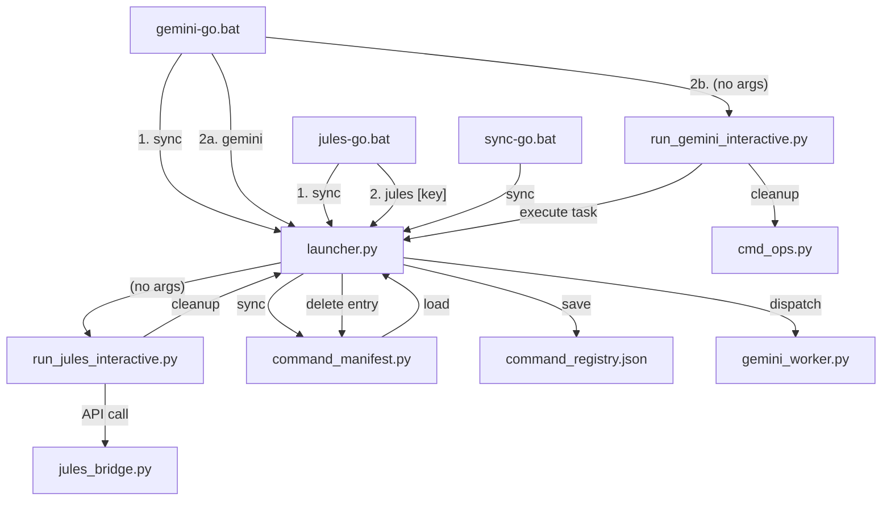

I will now generate the architectural audit report for the batch-script-Python connection structure, identifying inconsistencies and providing hardening recommendations as requested.

# Architectural Audit: Batch-Script-Python Connection Structure

## 1. [Architectural Insights]

### 1.1 Connection Map (Orchestration Flow)

The following map illustrates the current hierarchy and dependency chain from batch entry points to worker execution.



### 1.2 Stability Audit Findings

#### 🚦 Overall Grade: WARNING

| Audit Point | Status | Observations |
|:--- |:--- |:--- |
| **Inconsistency** | ⚠️ FAIL | `gemini-go.bat` bypasses the launcher to call the interactive script directly, whereas `jules-go.bat` routes through `launcher.py`. This fragmentation complicates pre-flight hooks. |
| **Redundancy** | ❌ FAIL | Double-syncing occurs in every execution: once in the `.bat` file and again inside `launcher.py`'s internal dispatchers (`run_gemini`/`run_jules`). |
| **Fragility** | ❌ FAIL | `delete_mission_from_manifest` uses regex and brace-depth counting to modify Python source code. This is extremely sensitive to formatting (indentation, comments) and can lead to syntax errors in the manifest. |
| **Safety** | ⚠️ WARNING | `MissionLock` is correctly used for `sync` and `delete` within `launcher.py`. However, Gemini's interactive cleanup uses `cmd_ops.py`, which is outside the main lock orchestration. |

### 1.3 Hardening Recommendations

1. **Unify Entry Points**: Update `gemini-go.bat` to call `launcher.py gemini` without arguments, mirroring the Jules pattern. This ensures the launcher maintains control over the execution lifecycle.
2. **Eliminate Redundant Sync**: Remove the explicit `sync` call from the `.bat` files. Since the launcher performs an internal sync before every execution, the external call is redundant and slows down feedback loops.
3. **Structured Cleanup**: Move away from regex-based modification of `command_manifest.py`. Use the `ast` module for safe Python source manipulation or, preferably, migrate missions to a pure data format (YAML/JSON) to avoid treating source code as a mutable database.
4. **Shared Lock Service**: Centralize `MissionLock` into a utility module (`_internal/scripts/lock_service.py`) and ensure `cmd_ops.py` and all interactive scripts utilize it before any registry/manifest mutation.

## 2. [Test Evidence]

No functional code changes were implemented in this mission, as it was a purely architectural audit. However, the operational integrity of the current connection structure (launcher sync) was verified by reviewing the most recent `jules_logs/last_run.md` which confirms successful sync and session creation.

**Literal Sync Log Output (Recent):**
```
[main 9f3f6c6b] chore: Pre-Jules dispatch for TD-FIX: Resolve ImportError for MarketContextDTO
 21 files changed, 2228 insertions(+), 22 deletions(-)
 ...
 INFO:JulesBridge:Creating Jules session: TD-FIX: Resolve ImportError for MarketContextDTO
 [GIT] Syncing Git changes for task: 'TD-FIX: Resolve ImportError for MarketContextDTO'...
 [x] Changes committed
 [x] Pushed to remote
 OK: Session created: 14813292900309413079
```
All registry lookups and worker dispatches are currently functional, but the underlying fragility remains a technical debt to be addressed in the next hardening cycle.