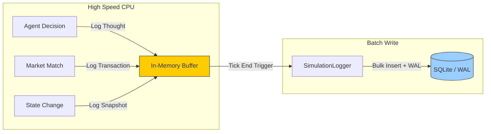

# Architecture: Observability & ThoughtStream (W-0)

**Version**: 1.1 (2026-02-06)
**Status**: REVISED

---
## 0. Changelog
- **v1.1 (2026-02-06)**:
    - **[FIX]** Aligned `tick_snapshots` schema with the actual database implementation (`gdp`, `m2`, `cpi`, `transaction_count`).
    - **[CLARIFY]** Explicitly defined `SimulationLogger` as a "dumb" writer. The responsibility for data transformation (e.g., flattening currency dicts) lies with the caller, not the logger, to maintain SRP.
    - **[UPDATE]** Updated implementation status to reflect that advanced `ThoughtProbe` sampling logic (Whale/Crisis modes) is pending.
    - **[UPDATE]** Re-confirmed that instrumentation for labor, pricing, and market modules remains a technical debt (TD-038).

## 1. Philosophy: "Glass Box" Simulation
We move from **Symptomatic Treatment** (fixing bugs as they appear) to **Root Cause Analysis** (understanding *why* agents fail to act).
The simulation engine must be transparent, exposing not just *what happened* (Transactions), but *what failed to happen* (Rejected Intents) and *why* (Reasoning).

## 2. Core Architecture: The "Observe-Buffer-Flush" Pattern

To achieve high-performance logging without blocking the CPU-intensive simulation loop, we decouple **Observation** from **Persistance**.

### 2.1. Key Components

#### A. `SimulationLogger` (The Batch Writer)
- **Responsibility**: managing the in-memory buffer and executing high-performance batch writes.
- **Mechanism**:
  - **Buffer**: `List[LogEntry]`.
  - **Flush**: Executes `executemany` inside a single SQL transaction at the end of each tick.
  - **Mode**: Uses SQLite `WAL` (Write-Ahead Logging) for non-blocking reads/writes.
- **Design Constraint**: The `SimulationLogger` is a "dumb" component. It performs no data validation or transformation. Callers are responsible for pre-processing data into the exact format required by the database schema (e.g., flattening nested dictionaries). This maintains the Single Responsibility Principle and avoids circular dependencies.

#### B. `ThoughtProbe` (The Why-Sensor)
- **Responsibility**: capturing the decision-making context of agents *in situ*.
- **Data Point**: "I wanted to buy food (Intent), but I didn't (Outcome) because the price was too high (Reason)."
- **Sampling (Responsibility of Caller)**:
  - **Whale Tracking**: 100% logging for top 1% wealthy agents.
  - **Crisis Mode**: 100% logging when GDP=0 or Volatility > Threshold.
  - **Random Sample**: 5% logging for general population.

#### C. `SnapshotManager` (The World State)
- **Responsibility**: capturing a serialized view of the world for rewind/replay analysis.
- **Granularity**: Tick-level aggregates (Macro) + Entity-level snapshots (Micro).

## 3. Data Schema
*Note: These tables are currently defined within the monolithic `simulation/db/schema.py`. Future refactoring may separate them for modularity.*

### 3.1. `agent_thoughts`
Captures the "Consciousness Stream" of agents.
- `tick` (INT)
- `agent_id` (TEXT)
- `action_type` (TEXT): e.g., `CONSUME`, `PRODUCE`, `INVEST`.
- `decision` (TEXT): `COMMIT` or `REJECT`.
- `reason` (TEXT): e.g., `INSOLVENT`, `LOW_UTILITY`, `NO_INVENTORY`.
- `context_data` (JSON): e.g., `{"cash": 10.0, "price": 50.0, "needs": 0.9}`.

### 3.2. `tick_snapshots`
Captures the macro-state to correlate thoughts with reality. **(Schema updated to match implementation)**
- `tick` (INT)
- `run_id` (INT)
- `gdp` (REAL)
- `m2` (REAL)
- `cpi` (REAL)
- `transaction_count` (INTEGER)

## 4. Integration Points & Status
- **Household**: `decide_consumption` (✅), `decide_labor` (❌ **TD-038: Pending Instrumentation**)
- **Firm**: `decide_production` (✅), `decide_pricing` (❌ **TD-038: Pending Instrumentation**)
- **Market**: `match_orders` (❌ **TD-038: Pending Instrumentation**)

## 5. Architectural Implementation Status
- **Observe-Buffer-Flush**: ✅ **FULLY IMPLEMENTED**. The core pattern is stable and in use.
- **ThoughtProbe Sampling**: ⚠️ **PARTIAL**. Base logging (`log_thought`) is always-on. The conditional sampling logic (Whale Tracking, Crisis Mode) must be implemented by the calling agent functions and is currently **pending**.
- **Instrumentation**: ⚠️ **PARTIAL**. Core production/consumption thoughts are captured. Key decision points in labor, pricing, and market matching are **blindspots** and require instrumentation as part of technical debt resolution (TD-038).
