# Architecture Detail: Phased Orchestration (The Implemented Sequence)

## 1. 개요 (Overview)
본 시뮬레이션의 모든 상태 변경은 **구현된 시퀀스(The Implemented Sequence)**라 불리는 다단계 프로세스를 엄격히 준수합니다. 이는 `tick_orchestrator.py`에 정의된 실제 실행 순서로, 기존 설계('The Sacred Sequence')에서 진화한 형태입니다. 핵심적인 변화는 각 페이즈(Phase) 실행 직후 상태를 즉시 동기화하는 **"실행-동기화(Execute-Sync)"** 루프를 도입하여, 상태 변경의 원자성과 예측 가능성을 새로운 방식으로 보장합니다.

## 2. 시퀀스 다이어그램 (Sequence Diagram)

```mermaid
graph TD
    subgraph TickOrchestrator [The Conductor: Execute-Sync Loop]
        direction LR
        
        Start[Tick Start] --> P0[Pre-Sequence]
        P0 --> P_PROD[Production]
        P_PROD --> P1[Decision]
        P1 --> P4_BANKRUPTCY[Lifecycle: Bankruptcy]
        P4_BANKRUPTCY --> P4_HOUSING[Lifecycle: Housing Saga]
        P4_HOUSING --> P4_LIQUIDATION[Lifecycle: Systemic Liquidation]
        P4_LIQUIDATION --> P2[Matching]
        P2 --> P3_SUB_DEBT[Tx-Decomposition: Bank & Debt]
        P3_SUB_DEBT --> P3_SUB_PROD[Tx-Decomposition: Firm Prod & Salaries]
        P3_SUB_PROD --> P3_SUB_GOV[Tx-Decomposition: Gov Programs]
        P3_SUB_GOV --> P3_SUB_TAX[Tx-Decomposition: Taxation Intents]
        P3_SUB_TAX --> P3_SUB_MONETARY[Tx-Decomposition: Monetary Processing]
        P3_SUB_MONETARY --> P3_FINAL[Transaction: Final Settlement]
        P3_FINAL --> P_CONSUMPTION[Lifecycle: Consumption]
        P_CONSUMPTION --> P5[Post-Sequence]
        P5 --> End[Tick End]
        
        %% Styling
        style Start fill:#f9f,stroke:#333,stroke-width:2px
        style P4_BANKRUPTCY fill:#ff9,stroke:#333,stroke-width:4px
        style P2 fill:#ccf,stroke:#333,stroke-width:2px
        style End fill:#f9f,stroke:#333,stroke-width:2px
    end
```

## 3. 상세 단계 설명 (Detailed Phase Descriptions)

**핵심 변경점**: 각 페이즈는 `SimulationState` DTO를 수정하며, 페이즈 종료 직후 `_drain_and_sync_state` 메서드가 호출되어 변경 사항(`effects_queue`, `transactions` 등)을 즉시 `WorldState`에 반영합니다. 페이즈는 더 이상 순수 함수(Pure Function)가 아니며, 실행 즉시 전역 상태에 영향을 미칩니다.

### Phase 0: 전처리 (Preprocessing)
- **Actor**: `Phase0_PreSequence`
- **Action**: 시스템 안정화, 예정된 이벤트 실행, 초기 상태 스냅샷 저장.

### Phase 0.5: 생산 (Production)
- **Actor**: `Phase_Production`
- **Action**: 실물 재화 생산량을 결정합니다. 이는 에이전트들이 의사결정을 내리기 전에 시장의 총 공급량을 확정하기 위함입니다.

### Phase 1: 결정 (Decisions)
- **Actor**: `Phase1_Decision`
- **Action**: 모든 에이전트(가계, 기업 등)가 현재 시장 상태를 기반으로 행동(`Order`, `Intent`)을 결정합니다.

### Phase 4 (Reordered): 라이프사이클 Part 1 (Lifecycle)
- **Actor**: `Phase_Bankruptcy`, `Phase_HousingSaga`, `Phase_SystemicLiquidation`
- **Action**: 파산, 주택담보대출 연체 처리 등 에이전트의 생존과 관련된 구조적 변경을 **시장 매칭 전에** 처리합니다.
- **Rationale (Critical)**: 이는 경제적 현실을 반영한 중대한 변경입니다. 파산한 에이전트는 시장에 참여할 수 없으므로, 그들의 주문(Order)은 매칭 단계 이전에 시스템에서 제거되어야 합니다. 이로 인해 기존의 "인지-계약-집행" 순서는 "인지-**정리(선제적)**-계약-집행"으로 변경되었습니다.

### Phase 2: 매칭 (Matching)
- **Actor**: `Phase2_Matching`
- **Action**: 살아남은 에이전트들의 `Order`들을 매칭하여 `Transaction` 객체를 생성합니다.

### Phase 3 (Decomposed): 거래 처리 (Transaction Processing)
- **Actors**: `Phase_BankAndDebt`, `Phase_FirmProductionAndSalaries`, `Phase_GovernmentPrograms`, `Phase_TaxationIntents`, `Phase_MonetaryProcessing`, `Phase3_Transaction`
- **Action**: 단일 책임 원칙(SRP)에 따라, 기존의 거대한 거래(Transaction) 페이즈가 여러 개의 세분화된 단계로 분해되었습니다. 부채 처리, 임금 지급, 정부 지출, 세금 의향 생성, 통화 정책 반영 등이 순차적으로 실행된 후, 마지막 `Phase3_Transaction`에서 모든 거래가 최종 정산됩니다. 이 구조는 화폐 공급량 검증(`MONEY_SUPPLY_CHECK`)의 정확성을 보장하는 데 필수적입니다.

### Phase (Late Lifecycle): 소비 (Consumption)
- **Actor**: `Phase_Consumption`
- **Action**: 모든 소득과 이전이 확정된 후, 최종적인 재화 소비 활동을 처리합니다.

### Phase 5: 후처리 (Post-Sequence)
- **Actor**: `Phase5_PostSequence`
- **Action**: 학습 보상 계산, 통계 지표 집계, 다음 틱을 위한 데이터 정리 및 버퍼 플러시를 수행합니다.

## 4. 아키텍처적 의의 (Architectural Significance)

### 4.1. God Object와 "실행-동기화" 루프 (God Object & The "Execute-Sync" Loop)
이전의 "DTO 폭포수" 모델은 폐기되었습니다. 현재 아키텍처는 `WorldState`라는 중앙 집중적 "God Object"와, 각 페이즈가 수정하는 가변적인 `SimulationState` "God DTO"에 의존합니다.

가장 중요한 아키텍처적 제약은 **`_drain_and_sync_state`** 메서드입니다. 이 메서드는 **모든 페이즈 실행 직후 호출**되어, 페이즈가 생성한 임시 데이터(ex: `effects_queue`, `transactions`)를 `WorldState`에 즉시 병합하고 DTO의 큐를 비웁니다. 이 "실행-동기화" 루프는 페이즈 간 상태 공유의 새로운 '기본 진실(Ground Truth)'이며, 더 이상 상태가 틱의 마지막에만 업데이트된다고 가정할 수 없습니다.

### 4.2. 경제적 인과관계의 재정의 (Redefined Economic Causality)
'신성한 시퀀스'의 "인지 → 계약 → 집행 → 정리" 원칙은 다음과 같이 재정의되었습니다.
**"인지 → 선제적 정리(파산) → 계약(매칭) → 분해된 집행(세부 거래) → 최종 정리(소비 및 후처리)"**
특히, **파산 처리(`Phase_Bankruptcy`)가 시장 매칭(`Phase2_Matching`)보다 먼저** 오는 것은 시스템의 경제적 논리에 근본적인 변화를 의미하며, 모든 테스트와 분석은 이 새로운 인과관계를 따라야 합니다.

### 4.3. "순결성 게이트" 원칙의 폐기 (Deprecation of the "Purity Gate")
"Phase 1에서는 상태를 직접 수정하지 않는다"는 기존 원칙은 더 이상 유효하지 않습니다. 모든 페이즈는 `SimulationState` DTO를 통해 `WorldState`에 즉시 영향을 미치는 부수 효과(Side-effect)를 가집니다. 각 페이즈는 독립적이고 순수한 함수가 아니라, 하나의 거대한 트랜잭션 내의 상호 의존적인 단계들로 이해되어야 합니다.
