# Architecture Detail: Phased Orchestration (The Sacred Sequence)

## 1. 개요
본 시뮬레이션의 모든 상태 변경은 **신성한 시퀀스(The Sacred Sequence)**라 불리는 8단계 프로세스를 엄격히 준수합니다. 이는 상태 변경의 예측 가능성을 보장하고, 제로섬(Zero-Sum) 오류와 타이밍 버그를 방지하기 위한 핵심 메커니즘입니다.

## 2. 시퀀스 다이어그램

```mermaid
graph TD
    subgraph TickOrchestrator [The Conductor]
        P0[Phase 0: Pre-Sequence] -->|Events & Stabilization| P_PROD
        P_PROD[Phase: Production] -->|Real Economy Output| P1
        P1[Phase 1: Decision] -->|AI Logic| P2
        P2[Phase 2: Matching] -->|Order Book| P3
        P3[Phase 3: Transaction] -->|Settlement & Clearing| P4
        P4[Phase 4: Lifecycle] -->|Birth, Death, Bankruptcy| P5
        P5[Phase 5: Post-Sequence] -->|Learning & Stats| End
    end

    style P_PROD fill:#f9f,stroke:#333,stroke-width:4px
```

## 3. 상세 단계 설명

### Phase 0: 전처리 (Preprocessing)
- **Actor**: `TickOrchestrator`
- **Action**: 시스템 안정화, 예정된 이벤트 실행, 초기 상태 스냅샷 저장.
- **Context**: 시뮬레이션 환경의 초기 상태를 확정하는 단계입니다.

### Phase 0.5: 생산 (Production)
- **Actor**: `Phase_Production`
- **Action**: 인적 자본 지수(HCI) 계산, 신기술 도입 결정, 실물 재합 생산.
- **Rationale**: 에이전트가 의사결정을 내리기 전에 시장에 공급될 재화의 물리적 양이 먼저 결정되어야 합니다.

### Phase 1: 결정 (Decisions)
- **Actor**: `Agent` (Household, Firm, Govt, Bank)
- **Action**: 현재 상태(`MarketSnapshotDTO`)를 기반으로 행동을 결정하고 `Order` 혹은 `Intent` 객체를 반환.
- **Rule**: **이 단계에서는 절대로 상태를 직접 수정하지 않습니다.** (Purity Gate 원칙 준수)

### Phase 2: 매칭 (Matching)
- **Actor**: `Market` (Commodity, Labor, Stock)
- **Action**: 생성된 `Order`들을 매칭하여 `Transaction` 객체를 생성.
- **Context**: 수요와 공급이 만나 가격이 결정되고 교환 계약이 체결되는 단계입니다.

### Phase 3: 처리 (Transactions)
- **Actor**: `TransactionManager` -> `SettlementSystem`
- **Action**: 모든 `Transaction`을 실행하여 자산 이동 및 세금을 정산.
- **Rule**: 모든 가치 이동은 반드시 이 단계에서 **원자적(Atomic)**으로 처리됩니다.

### Phase 4: 라이프사이클 (Lifecycle)
- **Actor**: `AgentLifecycleManager`
- **Action**: 에이전트의 탄생, 파산, 사망, 상속 처리.
- **Rationale**: 모든 경제적 정산이 끝난 후 시스템의 구조적 변경을 수행합니다.

### Phase 5: 후처리 (Post-Sequence)
- **Actor**: `SystemEffectsManager`, `LearningUpdate`
- **Action**: 학습 보상(Reward) 계산, 지표 집계, 버퍼 플러시.
- **Context**: 시뮬레이션 결과를 기록하고 AI 모델을 갱신합니다.

## 4. 아키텍처적 의의
이 시퀀스는 단순히 실행 순서를 정하는 것이 아니라 **"인지(Phase 1) - 계약(Phase 2) - 집행(Phase 3) - 정리(Phase 4)"**라는 경제적 인과관계를 코드로 구현한 것입니다. 각 단계는 이전 단계의 결과물을 DTO 형태로만 전달받아 독립성을 유지합니다.
