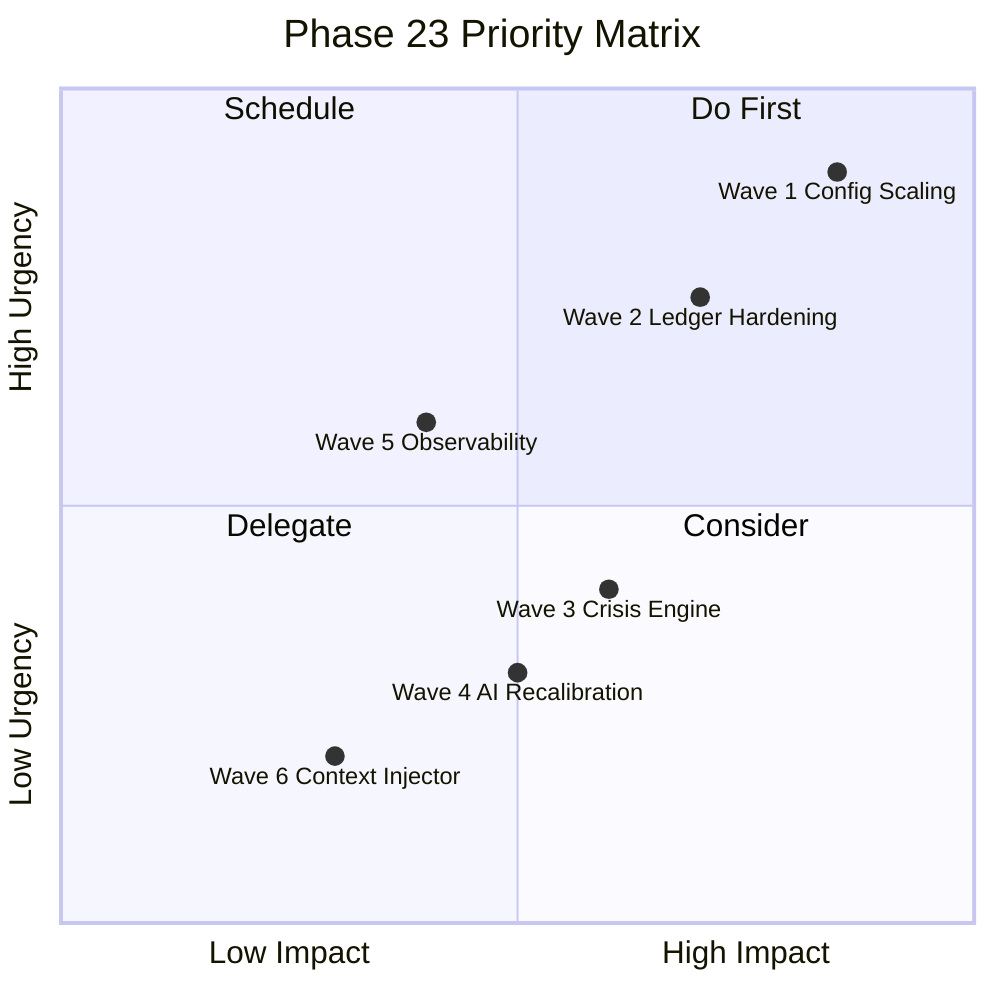

# 🗺️ Phase 23 Roadmap: Simulation Stabilization & Economic Balancing
> Phase 22 (Grand Tech-Debt Liquidation) 완료 후 진행할 구체적 과제 목록입니다.

---

## 🎯 목표
Phase 22에서 구조적 버그(OMO, Zero-Sum, Zombie Timer)를 해결했으므로, Phase 23은 **시뮬레이션이 경제적으로 의미 있는 결과를 산출**하도록 밸런싱과 잔존 기술 부채를 정리합니다.

---

## Wave 1: Configuration Scaling (상수 비례 스케일링)

### 문제
`INITIAL_MONEY_SUPPLY`가 10M → 100M으로 10배 상향되었으나, 기존 하드코딩된 절대값 상수들이 구 스케일에 맞춰져 있어 경제 밸런스가 깨질 수 있음.

### 작업 항목
| ID | 파일 | 상수/로직 | 현재 값 | 예상 조정 | 비고 |
|:---|:-----|:---------|:--------|:---------|:-----|
| S-01 | `config/defaults.py` | `STARTUP_COST` | 확인 필요 | 10x 비례 | 기업 창업 비용 |
| S-02 | `config/defaults.py` | `HOUSEHOLD_MIN_ASSETS_FOR_INVESTMENT` | 확인 필요 | 10x 비례 | 투자 최소 자산 |
| S-03 | `config/defaults.py` | `BANKRUPTCY_THRESHOLD` 관련 | 확인 필요 | 10x 비례 | 파산 임계값 |
| S-04 | `modules/government/engines/fiscal_engine.py` | `DEBT_CEILING_RATIO` | 1.5 | 검토 필요 | 세율 5% 환경에서 적정한지 |
| S-05 | `simulation/systems/central_bank_system.py` | Bond Price (`9999 * 100`) | 999,900 | 검토 필요 | 100M 경제에서 적정한지 |

### 검증 방법
- `operation_forensics.py --ticks 100` 실행 → `SETTLEMENT_FAIL` 0건, `FIRM_INACTIVE` < 2건 확인

---

## Wave 2: Monetary Ledger Hardening (통화 장부 강건화)

### 문제
`MonetaryLedger`가 Agent ID를 String/Int 혼용으로 비교하여 브리틀(brittle)함. 또한 이자/수수료 등 직접 잔액 증감이 Transaction 없이 발생하는 케이스 잔존.

### 작업 항목
| ID | 파일 | 문제 | 해결 |
|:---|:-----|:-----|:-----|
| M-01 | `monetary_ledger.py:L56-59` | String/Int ID 비교 | `AgentID` 타입 통일 + `isinstance` 검증 |
| M-02 | `monetary_ledger.py` | Transaction-Only 추적 | 이자/수수료 발생 시 `interest_accrual` TX 타입 발행 |
| M-03 | `tick_orchestrator.py` | M2 검증 로직 | 허용 오차를 0.1% → 0.01%로 강화 |

### 관련 기술 부채
- `TD-ECON-M2-INV-BUG` → 해결됨, 그러나 후속 강화 필요
- `TD-INT-BANK-ROLLBACK` → Bank rollback 시 `hasattr` 의존

---

## Wave 3: Crisis Engine Completion (위기 엔진 완성)

### 문제
`modules/household/engines/crisis_engine.py`의 현재 구현이 주식 매도만 처리하며, 본격적인 위기 대응(긴급 복지 신청, 자산 매각 우선순위, 대출 신청)이 미구현.

### 작업 항목
| ID | 기능 | 설명 |
|:---|:-----|:-----|
| C-01 | Panic Selling 우선순위 | 비필수 자산 → 주식 → 부동산 순서 |
| C-02 | Emergency Welfare Request | `FiscalEngine`에 긴급 복지 신청 연동 |
| C-03 | Debt Restructuring Signal | 가계 부채 재구조화 시그널 → `BankSystem` 연동 |

### 선행 조건
- Wave 1 (상수 비례 스케일링) 완료 후 진행

---

## Wave 4: AI Q-Table Recalibration (AI 학습 재보정)

### 문제
`HouseholdAI`의 Q-table이 OMO 하이퍼인플레이션 환경에서 학습된 상태. 새로운 경제 환경(정상 인플레이션, 5% 세율)에서 부적절한 행동 패턴이 발생할 수 있음.

### 작업 항목
| ID | 기능 | 설명 |
|:---|:-----|:-----|
| Q-01 | State Discretization 재검토 | `firm_ai.py:L74-75`의 Cash Level 이산화 범위 조정 |
| Q-02 | Exploration Rate Tuning | 초기 exploration rate 상향 → 새 환경 적응 가속 |
| Q-03 | Reward Function Audit | 보상 함수가 새 Penny 스케일에 맞는지 검토 |
| Q-04 | 200틱 학습 Burn-in | 초기 200틱을 "학습 구간"으로 지정 → 통계 수집용 |

### 검증 방법
- 500틱 시뮬레이션 → 가계 평균 자산이 단조감소하지 않는지 확인

---

## Wave 5: Runtime Observability (런타임 관찰성)

### 문제
현재 `diagnostic_raw.csv`와 `diagnostic_refined.md`는 사후 분석용. 실시간 경제 지표 대시보드 부재.

### 작업 항목
| ID | 기능 | 설명 |
|:---|:-----|:-----|
| O-01 | Economic Dashboard CSV | 틱별 GDP, M2, 실업률, 물가지수 자동 기록 |
| O-02 | Anomaly Alert System | M2 Delta > 1% 시 즉시 경고 발생 |
| O-03 | Agent Census Report | 틱별 활성 가계/기업/은행 수 추적 |

---

## Wave 6: Context Injector Enhancement (컨텍스트 주입 개선)

### 문제
대용량 CSV 파일이 Gemini CLI의 입력 한계를 초과하여 감사 보고서가 누락되는 문제 발생. (이번 세션에서 경험)

### 작업 항목
| ID | 기능 | 설명 |
|:---|:-----|:-----|
| X-01 | `--max-lines` 옵션 | 컨텍스트 파일의 최대 라인 수 제한 |
| X-02 | Sectoral CSV Splitter | `diagnostic_raw.csv`를 에이전트 타입별로 자동 분할 |
| X-03 | 토큰 예산 계산기 | 컨텍스트 토큰 총량을 사전 계산하여 한계 초과 방지 |

---

## 📊 우선순위 매트릭스

## ⏱ 예상 일정
| Wave | 예상 소요 | 선행 조건 |
|------|----------|----------|
| Wave 1 | 1 세션 | Phase 22.3 Stage D 완료 |
| Wave 2 | 1 세션 | Wave 1 |
| Wave 3 | 1-2 세션 | Wave 1 |
| Wave 4 | 1 세션 | Wave 1+2 |
| Wave 5 | 1 세션 | 독립 (병렬 가능) |
| Wave 6 | 0.5 세션 | 독립 (병렬 가능) |
