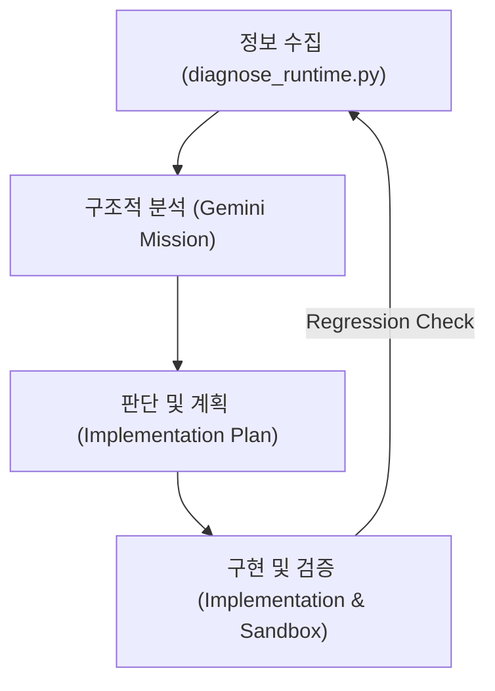

# 🩺 Runtime Diagnosis Pipeline (RDP)

이 매뉴얼은 시뮬레이션의 런타임 오류를 구조적으로 진단하고 해결하기 위한 표준 절차를 정의합니다.

## 🏗️ Pipeline Overview
정확한 데이터 수집과 인공지능 분석을 통해 단순 증상 수정이 아닌 **구조적 근본 원인(Root Cause)** 해결을 목표로 합니다.

---

## 1단계: 정보 수집 (Information Collection)
시뮬레이션을 안전한 샌드박스에서 실행하여 상세 로그를 확보합니다.

- **실행 도구**: `diagnose_runtime.py` (최상위 루트)
- **주요 목적**: 
  - 특정 Ticks(예: 80~100) 내의 시스템 오류 재현.
  - 전역 로깅 레벨을 `DEBUG`로 설정하여 트랜잭션 흐름 추적.
- **결과물**: `reports/diagnostics/runtime_audit.log`

---

## 2단계: 구조적 분석 (Analysis)
수집된 로그와 소스 코드를 결합하여 구조적 결함을 식별합니다.

- **실행 도구**: `gemini-go.bat analyze-runtime-structural-failures`
- **분석 관점**:
  - **Existential Logic**: 에이전트 소멸(Death) 후 잔존하는 참조 분석.
  - **Budget Logic**: 무제한 예산(Seamless Liquidity) 관행의 위반 지점 식별.
  - **Integrity Logic**: Penny Standard(Integer Core) 위반 타입 mismatch 추적.

---

## 3단계: 판단 및 계획 수립 (Judgment & Planning)
분석 결과를 바탕으로 시스템 설계를 수정하고 사용자 승인을 받습니다.

- **산출물**: `implementation_plan_runtime_stability.md`
- **핵심 원칙**:
  - **No Budget, No Execution**: 예산 부족 시 트랜잭션은 즉시 실패하거나 보류되어야 함.
  - **Cleanup Atomicity**: 에이전트 제거 시 Transaction Processor의 대기열에서도 즉시 제거되어야 함.

---

## 4단계: 구현 및 검증 (Implementation & Verification)
계획에 따라 코드를 수정하고 샌드박스 재실행으로 해결 여부를 확인합니다.

- **검증 방법**: `diagnose_runtime.py`를 다시 실행하여 `structural_analysis_report.md`에서 식별된 오류 패턴이 사라졌는지 확인.
- **최종 승인**: Stress Run (200+ Ticks) 성공 시 운영 환경에 반영.
