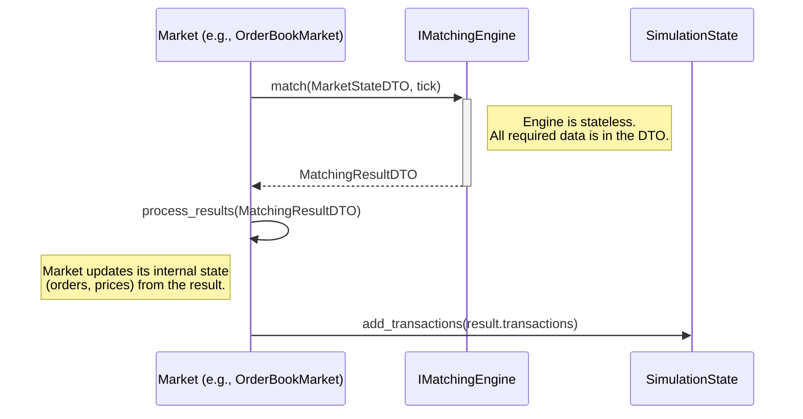

I will now draft the technical specification (`spec.md`) and the API definition file (`api.py`) for the "Market Decoupling and Protocol Hardening" tracks.

First, the API definitions that introduce the new interfaces and data transfer objects.

```python
# modules/market/api.py (Proposed Additions/Modifications)

from typing import Protocol, List, Dict, Any, Tuple, TypeVar, runtime_checkable
from dataclasses import dataclass, field

from modules.market.api import CanonicalOrderDTO
from simulation.models import Transaction
from modules.system.api import CurrencyCode, DEFAULT_CURRENCY


# --- DTOs for State-Passing to Matching Engines ---

@dataclass(frozen=True)
class OrderBookStateDTO:
    """
    An immutable snapshot of an OrderBookMarket's state required for matching.
    """
    market_id: str
    buy_orders: Dict[str, List[CanonicalOrderDTO]]
    sell_orders: Dict[str, List[CanonicalOrderDTO]]
    price_history: Dict[str, List[float]] # For dynamic circuit breakers
    config: Dict[str, Any] # Relevant config values like price determination rules

@dataclass(frozen=True)
class StockMarketStateDTO:
    """
    An immutable snapshot of a StockMarket's state required for matching.
    """
    market_id: str
    buy_orders: Dict[int, List[CanonicalOrderDTO]] # firm_id -> orders
    sell_orders: Dict[int, List[CanonicalOrderDTO]]
    reference_prices: Dict[int, float]
    config: Dict[str, Any]

@dataclass(frozen=True)
class MatchingResultDTO:
    """
    The result of a matching operation, including transactions and updated state.
    """
    transactions: List[Transaction]
    remaining_buy_orders: Dict[str | int, List[CanonicalOrderDTO]]
    remaining_sell_orders: Dict[str | int, List[CanonicalOrderDTO]]
    updated_market_state: Dict[str, Any] # For market-specific state like last_price, price_history

# --- Matching Engine Interfaces ---

T_StateDTO = TypeVar('T_StateDTO', bound=Any)

class IMatchingEngine(Protocol[T_StateDTO]):
    """
    Base protocol for a stateless matching engine. It receives market state,
    performs matching, and returns the results and the new state.
    """
    def match(self, state: T_StateDTO, current_tick: int) -> MatchingResultDTO:
        ...

class IOrderBookMatchingEngine(IMatchingEngine[OrderBookStateDTO], Protocol):
    """Specialized matching engine for order book markets."""
    ...

class IStockMatchingEngine(IMatchingEngine[StockMarketStateDTO], Protocol):
    """Specialized matching engine for the stock market."""
    ...


# --- Firm Real Estate Utilization Interfaces ---

@dataclass(frozen=True)
class FirmProductionContextDTO:
    """
    Data required by the RealEstateUtilizationComponent to calculate cost reductions.
    """
    firm_id: int
    owned_real_estate_space: float # Total square meters/units
    production_volume: float
    current_production_costs: float

@dataclass(frozen=True)
class CostReductionEffectDTO:
    """
    An effect representing a reduction in production costs for a firm.
    This will be processed by the appropriate system phase.
    """
    firm_id: int
    cost_reduction_amount: float
    reason: str = "Real Estate Ownership"

class IRealEstateUtilizationComponent(Protocol):
    """
    Calculates production benefits for firms based on owned real estate.
    """
    def calculate_cost_reduction(self, context: FirmProductionContextDTO) -> CostReductionEffectDTO:
        ...


# --- Protocol Hardening (TD-270) ---
# Proposed modification to modules/finance/api.py

@runtime_checkable
class IFinancialAgent(Protocol):
    """
    Strict protocol for any agent participating in the financial system.
    (MODIFIED for TD-270)
    """
    id: int

    def deposit(self, amount: float, currency: CurrencyCode = DEFAULT_CURRENCY) -> None:
        """Deposits a specific amount of a given currency."""
        ...

    def withdraw(self, amount: float, currency: CurrencyCode = DEFAULT_CURRENCY) -> None:
        """
        Withdraws a specific amount of a given currency.
        Raises InsufficientFundsError if funds are insufficient.
        """
        ...

    def get_balance(self, currency: CurrencyCode = DEFAULT_CURRENCY) -> float:
        """Returns the current balance for the specified currency."""
        ...

    def get_all_balances(self) -> Dict[CurrencyCode, float]:
        """Returns a dictionary of all currency balances."""
        ...

    @property
    def total_wealth(self) -> float:
        """
        [COMPATIBILITY LAYER]
        Calculates and returns the total value of all currency holdings
        in the system's default currency.
        (Assumes an exchange rate of 1.0 for simplicity, a real implementation
        would need an exchange rate service).
        """
        ...
```

Next, the comprehensive technical specification.

```markdown
# Spec: Market Decoupling & Protocol Hardening
- **Phase**: 10
- **Tracks**: Market Decoupling, Protocol Hardening, Firm Real Estate Utilization

## 1. Overview & Goals
This specification details a major architectural refactoring across three tracks:
1.  **Market Decoupling**: Extracting the stateful matching logic from `Market` classes into stateless, portable `IMatchingEngine` components.
2.  **Protocol Hardening (TD-270)**: Unifying financial data representation across protocols to resolve `TD-270` by standardizing on `Dict[CurrencyCode, float]` for asset holdings.
3.  **Firm Real Estate (TD-271)**: Introducing a `RealEstateUtilizationComponent` to make firm-owned property a productive asset, resolving `TD-271`.

The primary goal is to improve modularity, reduce coupling, and eliminate architectural inconsistencies identified in the pre-flight audit.

## 2. High-Level Design
The core architectural constraint is the "Execute-Sync" loop (`ARCH_SEQUENCING.md`). All new components will operate within this pattern, consuming the `SimulationState` DTO and placing their outputs (transactions, effects) onto its queues to be drained into the central `WorldState` after their respective phases.

### 2.1. Market Decoupling Data Flow
The current tight coupling will be broken by introducing a state-passing pattern:


## 3. Detailed Design

### Track 1: Matching Engine Decoupling

#### 3.1. Interfaces (`api.py`)
- **`IMatchingEngine[T_StateDTO]`**: A generic protocol for stateless matching.
  - `match(state: T_StateDTO, current_tick: int) -> MatchingResultDTO`
- **`IOrderBookMatchingEngine` & `IStockMatchingEngine`**: Specialized versions for different market types.
- **`OrderBookStateDTO` / `StockMarketStateDTO`**: Immutable snapshots of market state, containing all data needed for matching (orders, config, price history).
- **`MatchingResultDTO`**: The container for all outputs from an engine run: `transactions`, `remaining_buy_orders`, `remaining_sell_orders`, and `updated_market_state`.

#### 3.2. Pseudo-code: `OrderBookMarket.match_orders` (Refactored)
```python
# In simulation/markets/order_book_market.py

class OrderBookMarket(Market):
    def __init__(self, market_id: str, matching_engine: IOrderBookMatchingEngine, ...):
        ...
        self.matching_engine = matching_engine

    def match_orders(self, current_time: int) -> List[Transaction]:
        # 1. Create immutable state snapshot
        state_dto = OrderBookStateDTO(
            market_id=self.id,
            buy_orders=self._buy_orders, # Using internal mutable representation for now
            sell_orders=self._sell_orders,
            price_history=self.price_history,
            config={
                "price_determination": "labor" if "labor" in self.id else "avg_bid_ask"
            }
        )

        # 2. Delegate to stateless engine
        result_dto = self.matching_engine.match(state_dto, current_time)

        # 3. Process results and update internal state
        self._buy_orders = result_dto.remaining_buy_orders
        self._sell_orders = result_dto.remaining_sell_orders
        self.last_traded_prices.update(result_dto.updated_market_state.get('last_prices', {}))
        # ... update other internal state like price_history ...
        
        # 4. Return transactions to be added to the main queue
        self.matched_transactions.extend(result_dto.transactions)
        return result_dto.transactions
```

### Track 2: Protocol Hardening (TD-270)

#### 3.1. `IFinancialAgent` Modification
The `IFinancialAgent` protocol in `modules/finance/api.py` will be modified to standardize on multi-currency dictionaries.

- **`get_all_balances() -> Dict[CurrencyCode, float]`**: New method to get the full currency wallet.
- **`total_wealth: float` (Property)**: A **critical compatibility layer** will be added to provide a single float value representing total wealth, converted to the `DEFAULT_CURRENCY`. This prevents immediate breakage across the codebase.

#### 3.2. Pseudo-code: `total_wealth` Property
```python
# In a class implementing IFinancialAgent

@property
def total_wealth(self) -> float:
    """
    Calculates total wealth in DEFAULT_CURRENCY.
    Assumes exchange rate of 1.0; a real implementation would use a service.
    """
    # exchange_rate_service = self.locator.get(IExchangeRateService) # Future-proof
    total = 0.0
    for currency, amount in self.get_all_balances().items():
        # rate = exchange_rate_service.get_rate(currency, DEFAULT_CURRENCY)
        rate = 1.0 # Placeholder
        total += amount * rate
    return total
```
This ensures that legacy code calling `agent.assets` (if `assets` is made an alias for `total_wealth`) continues to function during the migration period.

### Track 3: Firm Real Estate Utilization (TD-271)

#### 3.1. `IRealEstateUtilizationComponent`
A new component will be introduced to calculate production cost savings for firms owning property.
- **Interface**: `IRealEstateUtilizationComponent` with `calculate_cost_reduction(context: FirmProductionContextDTO) -> CostReductionEffectDTO`.
- **Execution Phase**: This component will be called during `Phase1_Decision`. It will generate `CostReductionEffectDTO` objects and place them on the `SimulationState.effects_queue`. These effects will be applied during `Phase_FirmProductionAndSalaries`.

#### 3.2. Cost Reduction Formula
The cost reduction will be calculated as follows:
`cost_reduction = owned_space * space_utility_factor * regional_rent_index`

- `owned_space`: Total property area owned by the firm.
- `space_utility_factor`: A configurable parameter representing the efficiency of the space (e.g., $5/sq. meter).
- `regional_rent_index`: A government/system-provided index reflecting local commercial real estate value.

The result is capped at a percentage of the firm's total production costs (e.g., max 50%) to prevent unrealistic scenarios.

## 4. 🚨 Risk & Impact Audit (Addressing Pre-flight Check)

1.  **Risk: Matching Logic Portability**: Acknowledged. The design explicitly adopts a state-passing pattern (`match(state) -> result`). The `MatchingResultDTO` returns the **full updated state** (remaining orders, new market prices), making the `Market` class responsible for updating its own internal state from this result. This keeps the engine itself stateless.

2.  **Constraint: No Generic Matching Engine**: Acknowledged. The design specifies two distinct interfaces, `IOrderBookMatchingEngine` and `IStockMatchingEngine`, inheriting from a base `IMatchingEngine`. This allows for market-specific logic while maintaining a common protocol pattern.

3.  **Constraint: Central "God State" Pattern**: Acknowledged. All new components are designed to operate within the "Execute-Sync" loop. The `RealEstateUtilizationComponent` generates `Effect` DTOs for the `SimulationState` queue, and the refactored `Market` classes will continue to place `Transaction` DTOs on the queue. Their operation is explicitly dependent on the state being synchronized after each phase.

4.  **Risk: Cascading Protocol Breakage (TD-270)**: Acknowledged. The `total_wealth` property on `IFinancialAgent` is defined as a non-negotiable compatibility layer. The migration plan is to first implement this layer, then incrementally refactor all consumers of the old `float`-based asset properties before finally removing them. This mitigates the risk of a "big bang" failure.

## 5. Verification Plan & Integrity
- **Unit & Integration Tests**: All new components (`MatchingEngine` implementations, `RealEstateUtilizationComponent`) will have 100% unit test coverage. Integration tests will be added to verify the new `Market -> Engine` data flow within a running simulation tick.
- **Zero-Sum Validation**: The `scripts/audit_zero_sum.py` and `scripts/hunt_leak.py` will be run against the refactored system. The stateless nature of the matching engine, which does not create or destroy value but merely rearranges ownership based on the input state, is expected to pass these tests.
- **Contract Tests**: Tests will be written to ensure that mock objects used for `Market` and `IFinancialAgent` consumers fail if they do not adhere to the new/modified protocols.

## 6. Mocking Guide
- **Engine Mocking**: When testing a `Market` class, the `IMatchingEngine` dependency will be mocked. The mock will be configured to return a specific `MatchingResultDTO` to simulate various outcomes (e.g., full match, partial match, no match).
- **Golden Fixtures**: `golden_households` and `golden_firms` fixtures will be updated to reflect the new `Dict`-based asset structure to support the testing of `IFinancialAgent` consumers.
- **Schema Change**: As per protocol, any DTO schema changes require updating the corresponding golden samples in `design/_archive/snapshots/` and running the `scripts/fixture_harvester.py`.

## 7. 🚨 Mandatory Reporting Verification
Insights and potential technical debt discovered during the implementation of this specification will be recorded in `communications/insights/PH10_Market_Decoupling.md`. This includes tracking the remaining call sites for the legacy `float`-based asset properties and any complexities discovered in the state-passing DTOs for the matching engines. This report is a hard requirement for mission completion.
```
