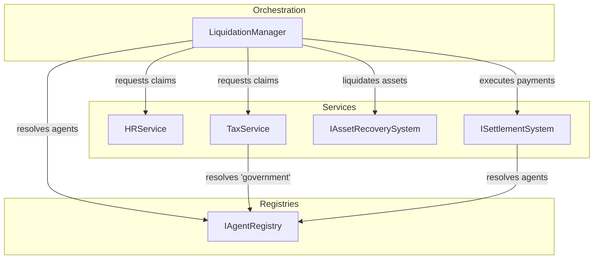

# Spec: Refactoring LiquidationManager for SRP Compliance

## 1. Introduction

- **Purpose**: This document outlines the design for refactoring the `LiquidationManager` to adhere to the Single Responsibility Principle (SRP).
- **Scope**: The core of this effort is to extract complex claim calculation logic (specifically for employee entitlements and corporate taxes) into dedicated service components. The `LiquidationManager` will be simplified to an orchestrator role.
- **Goals**:
    - Improve modularity and maintainability by separating concerns.
    - Enhance encapsulation, preventing direct access to the internal state of `Firm` sub-components.
    - Stabilize dependencies by introducing a formal `AgentRegistry` and service interfaces.
    - Improve testability by allowing services to be mocked independently.

## 2. System Architecture (High-Level)

The refactored architecture will follow a clear dependency flow:



The `LiquidationManager` no longer contains calculation logic. It queries the `HRService` and `TaxService` for claims, then orchestrates the waterfall process using the `SettlementSystem`. All components that need to find other agents will use the `IAgentRegistry`.

## 3. Detailed Design

### 3.1. Component: `LiquidationManager` (Refactored)

- **Dependencies (Constructor Injected)**:
    - `settlement_system: ISettlementSystem`
    - `hr_service: IHRService`
    - `tax_service: ITaxService`
    - `agent_registry: IAgentRegistry`
    - `public_manager: Optional[IAssetRecoverySystem] = None`
- **Method: `initiate_liquidation(self, firm: Firm, state: SimulationState)`**
    - **Pseudo-code**:
        1.  Log the start of the liquidation process.
        2.  If `public_manager` exists, call `_liquidate_assets(firm, state)` (no change in this internal method's logic).
        3.  Re-fetch `firm.finance.balance` to get available cash after asset sales.
        4.  Initialize `all_claims = []`.
        5.  **Get HR Claims**: `employee_claims = self.hr_service.calculate_liquidation_employee_claims(firm, state.time)`. Add to `all_claims`.
        6.  **Get Tax Claims**: `tax_claims = self.tax_service.calculate_liquidation_tax_claims(firm)`. Add to `all_claims`.
        7.  **Get Secured Debt Claims**: Query `firm.finance` for secured debt (e.g., bank loans). Create `Claim` objects and add to `all_claims`. (Future refactoring could move this to a `FinanceService` as well).
        8.  Log the total claims found.
        9.  Call `self.execute_waterfall(firm, all_claims, available_cash, state)`.
- **Method: `_pay_claim(self, firm: Firm, claim: Claim, ...)` (Refactored)**
    - **Pseudo-code**:
        1.  `creditor = self.agent_registry.get_agent(claim.creditor_id)`.
        2.  If `creditor` is not found, log a warning and return.
        3.  Proceed with the transfer using `self.settlement_system.transfer(firm, creditor, ...)`.
        4.  The fragile logic of searching through `state.agents` or `state.households` is removed.

### 3.2. New Component: `HRService`

- **Implements**: `IHRService`
- **Responsibilities**: Encapsulates all logic related to calculating employee entitlements during liquidation.
- **Method: `calculate_liquidation_employee_claims(self, firm: Firm, current_tick: int) -> List[Claim]`**
    - This method will contain the exact logic for calculating **unpaid wages** and **severance pay** that was previously in `LiquidationManager`.
    - It accesses `firm.hr`, `firm.config`, and `firm.hr.employees` but this access is now properly encapsulated within a dedicated HR-domain service.
    - It returns a list of `Claim` DTOs with `tier=1`.

### 3.3. New Component: `TaxService`

- **Implements**: `ITaxService`
- **Dependencies (Constructor Injected)**:
    - `agent_registry: IAgentRegistry`
- **Responsibilities**: Encapsulates logic for calculating corporate tax liability during liquidation.
- **Method: `calculate_liquidation_tax_claims(self, firm: Firm) -> List[Claim]`**
    - This method contains the logic for calculating tax liability based on `firm.finance.current_profit` and `firm.config.corporate_tax_rate`.
    - It uses `self.agent_registry.get_agent("government")` to reliably find the government entity.
    - Returns a list of `Claim` DTOs with `tier=3`.

## 4. Interface Specifications & DTOs

### 4.1. `modules/common/dtos.py`

```python
from dataclasses import dataclass
from typing import Any

@dataclass
class Claim:
    """Represents a creditor's claim against a liquidating entity."""
    creditor_id: Any
    amount: float
    tier: int
    description: str
```

### 4.2. `modules/hr/api.py`

```python
from __future__ import annotations
from abc import ABC, abstractmethod
from typing import List, TYPE_CHECKING

if TYPE_CHECKING:
    from modules.common.dtos import Claim
    from simulation.firms import Firm

class IHRService(ABC):
    @abstractmethod
    def calculate_liquidation_employee_claims(self, firm: Firm, current_tick: int) -> List[Claim]:
        """Calculates all employee-related claims (wages, severance) for a firm in liquidation."""
        ...
```

### 4.3. `modules/finance/api.py` (or a new `tax` module)

```python
from __future__ import annotations
from abc import ABC, abstractmethod
from typing import List, TYPE_CHECKING

if TYPE_CHECKING:
    from modules.common.dtos import Claim
    from simulation.firms import Firm

class ITaxService(ABC):
    @abstractmethod
    def calculate_liquidation_tax_claims(self, firm: Firm) -> List[Claim]:
        """Calculates corporate tax claims for a firm in liquidation."""
        ...
```

### 4.4. `modules/system/api.py`

```python
from __future__ import annotations
from abc import ABC, abstractmethod
from typing import Any, Optional, TYPE_CHECKING

if TYPE_CHECKING:
    from simulation.agents import Agent

class IAgentRegistry(ABC):
    @abstractmethod
    def get_agent(self, agent_id: Any) -> Optional[Agent]:
        """Resolves an agent ID to an agent object."""
        ...
```

## 5. Verification Plan

- **Test `LiquidationManager`**:
  - **Strategy**: Rewrite existing tests to be pure unit tests.
  - **Setup**: Mock `IHRService`, `ITaxService`, and `IAgentRegistry`.
  - **Asserts**:
      1. Verify `calculate_liquidation_employee_claims` and `calculate_liquidation_tax_claims` are called exactly once.
      2. Verify the waterfall logic correctly distributes cash based on the claims returned *from the mocks*.
      3. Verify `agent_registry.get_agent` is called for each claim being paid.

- **Test `HRService`**:
  - **Strategy**: Create new integration tests for the calculation logic.
  - **Setup**: Use `conftest.py` fixtures (`golden_firms`, `golden_households`) to create a realistic `Firm` object with employees at various tenures.
  - **Asserts**: Verify the service returns a list of `Claim` objects with correctly calculated severance and unpaid wage amounts.

- **Test `TaxService`**:
  - **Strategy**: Create new unit tests.
  - **Setup**: Create a `Firm` with a known `current_profit` and a mock `IAgentRegistry` that returns a mock government agent.
  - **Asserts**: Verify the service returns a `Claim` with the correct tax amount and `creditor_id`.

## 6. Mocking Guide

- **`LiquidationManager` Tests**: These tests **MUST** now use mocks for `IHRService` and `ITaxService`. They are no longer responsible for testing the underlying calculations, only the orchestration.
- **Service Tests**: Tests for `HRService` and `TaxService` **MUST** use golden data fixtures (e.g., `golden_firms`) to ensure calculations are tested against realistic data structures. Do not manually construct complex `Firm` objects in tests.
- **Agent Resolution**: The `IAgentRegistry` provides a formal seam for mocking. Tests requiring agent lookups should provide a mock registry that returns pre-defined mock agents.

## 7. Risk & Impact Audit

- **Circular Dependency**: Risk is low. The new dependencies are one-way (`Manager` -> `Service`), which is a valid architectural pattern.
- **Test Impact**: **High**. Existing tests for `LiquidationManager` will break and require a complete rewrite as outlined in the Verification Plan. This is an expected and necessary consequence of the refactoring.
- **Configuration Dependency**: The new services will still read from `firm.config`. This is an acceptable, cross-cutting dependency. No changes are required.
- **Precedent**: This refactoring sets a critical precedent for future work. All complex, domain-specific logic should be encapsulated in services rather than being embedded in orchestrators. This addresses the core issue identified in **TD-161**.

## 8. Mandatory Reporting

- **[Routine]** Insights gathered during the implementation of this refactoring (e.g., difficulties in mocking, unexpected config dependencies, further SRP violations discovered) **MUST** be logged to a new file: `communications/insights/WO-211-Liquidation-Refactor.md`. This ensures that lessons learned are captured for future architectural reviews.
