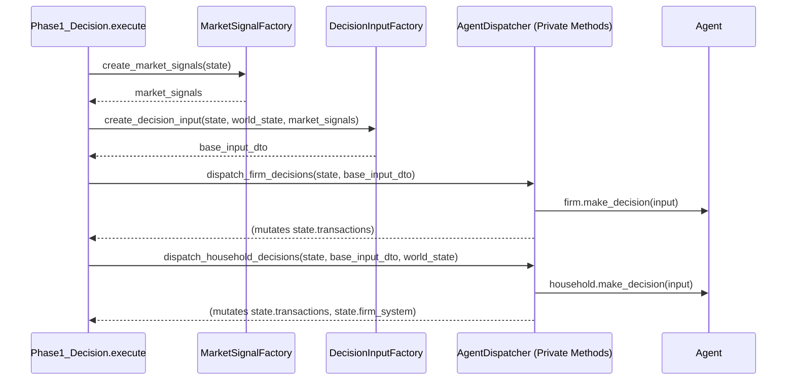

# Technical Specification: Refactoring `Phase1_Decision` (TD-189)

## 1. Introduction

- **Objective**: Refactor the `Phase1_Decision.execute` method to improve modularity, readability, and testability by separating distinct responsibilities.
- **Problem**: The current method is a "God Method" that handles market signal generation, input DTO assembly, and agent decision dispatching, including entangled business logic and direct state mutations. This makes the code difficult to understand, maintain, and test.
- **Scope**: This refactoring focuses exclusively on the `Phase1_Decision` phase. It introduces new utility components but does not alter the functional output or performance of the simulation tick.

---

## 2. Proposed Architecture

The monolithic `execute` method will be decomposed into three distinct, orchestrated components, executed in sequence:

1.  **`MarketSignalFactory`**: A stateless utility responsible for calculating and creating all `MarketSignalDTO` objects from the current market state.
2.  **`DecisionInputFactory`**: A factory responsible for assembling the common `DecisionInputDTO` used by all agents. This component will encapsulate the complex creation of various context objects (`MacroFinancialContext`, `FiscalContext`, etc.).
3.  **`AgentDispatcher`**: The `Phase1_Decision` method itself will be refactored to act as a dispatcher. It will loop through agents, but delegate the complex, entangled logic within the loop to smaller, private helper methods.

This new structure is illustrated below:



---

## 3. Component Design & Logic

### 3.1. `simulation.orchestration.factories.MarketSignalFactory`

This new component will be housed in a new file: `simulation/orchestration/factories.py`.

- **Responsibility**: Generate a dictionary of `MarketSignalDTO`s for all items across all `OrderBookMarket`s.
- **Interface (`api.py`):**
    ```python
    class IMarketSignalFactory(Protocol):
        def create_market_signals(self, markets: Dict[str, Any]) -> Dict[str, MarketSignalDTO]:
            ...
    ```
- **Pseudo-code (`factories.py`):**
    ```python
    class MarketSignalFactory:
        def create_market_signals(self, markets: Dict[str, Any]) -> Dict[str, MarketSignalDTO]:
            market_signals = {}
            for market_id, market in markets.items():
                if not isinstance(market, OrderBookMarket):
                    continue

                all_items_in_market = self._get_all_items(market)
                for item_id in all_items_in_market:
                    # Calculate volatility, history, etc. as in the original code
                    volatility = self._calculate_volatility(market, item_id)
                    history_7d = self._get_price_history(market, item_id)

                    signal = MarketSignalDTO(
                        market_id=market_id,
                        item_id=item_id,
                        best_bid=market.get_best_bid(item_id),
                        best_ask=market.get_best_ask(item_id),
                        # ... other fields
                        volatility_7d=volatility,
                        price_history_7d=history_7d,
                    )
                    market_signals[item_id] = signal
            return market_signals

        # Private helper methods for _get_all_items, _calculate_volatility, etc.
    ```

### 3.2. `simulation.orchestration.factories.DecisionInputFactory`

This component will also reside in `simulation/orchestration/factories.py`.

- **Responsibility**: Assemble the `DecisionInputDTO`. This isolates the creation of complex nested context objects and manages the `world_state` dependency.
- **Interface (`api.py`):**
    ```python
    class IDecisionInputFactory(Protocol):
        def create_decision_input(
            self,
            state: SimulationState,
            world_state: "WorldState", # Pass WorldState here
            market_snapshot: MarketSnapshotDTO
        ) -> DecisionInputDTO:
            ...
    ```
- **Pseudo-code (`factories.py`):**
    ```python
    class DecisionInputFactory:
        def create_decision_input(self, state, world_state, market_snapshot):
            gov_policy = self._create_gov_policy(state)
            fiscal_context = self._create_fiscal_context(state)
            macro_financial_context = self._create_macro_context(state, world_state) # world_state needed here
            agent_registry = self._create_agent_registry(state)

            return DecisionInputDTO(
                markets=state.markets,
                goods_data=state.goods_data,
                market_data=state.market_data,
                current_time=state.time,
                market_snapshot=market_snapshot,
                government_policy=gov_policy,
                fiscal_context=fiscal_context,
                macro_context=macro_financial_context,
                agent_registry=agent_registry,
                stress_scenario_config=world_state.stress_scenario_config
            )

        # Private helpers for _create_gov_policy, _create_fiscal_context, etc.
        def _create_macro_context(self, state, world_state):
            # Logic for calculating interest_rate_trend using world_state.last_interest_rate
            # Logic for getting market_volatility from world_state.stock_tracker
            # ...
            return MacroFinancialContext(...)
    ```

### 3.3. Refactored `Phase1_Decision.execute` and `AgentDispatcher` Logic

The `execute` method becomes a high-level orchestrator. The complex looping logic is moved to private methods acting as the `AgentDispatcher`.

- **Pseudo-code (`phases.py`):**
    ```python
    # In simulation/orchestration/phases.py
    from .factories import MarketSignalFactory, DecisionInputFactory

    class Phase1_Decision(IPhaseStrategy):
        def __init__(self, world_state: WorldState):
            self.world_state = world_state
            self.signal_factory = MarketSignalFactory()
            self.input_factory = DecisionInputFactory()

        def execute(self, state: SimulationState) -> SimulationState:
            # Snapshotting and initial data prep remains
            self._snapshot_agent_pre_states(state)
            state.market_data = prepare_market_data(state)

            # 1. Create Signals using the factory
            market_signals = self.signal_factory.create_market_signals(state.markets)
            market_snapshot = MarketSnapshotDTO(tick=state.time, market_signals=market_signals, market_data=state.market_data)

            # 2. Create Base Input DTO using the factory
            base_input_dto = self.input_factory.create_decision_input(state, self.world_state, market_snapshot)

            # 3. Dispatch decisions
            self._dispatch_firm_decisions(state, base_input_dto)
            self._dispatch_household_decisions(state, base_input_dto)

            # 4. Commerce planning remains at the end
            self._plan_commerce(state)

            return state

        # --- Agent Dispatcher Logic (Private Methods) ---

        def _dispatch_household_decisions(self, state: SimulationState, base_input_dto: DecisionInputDTO):
            for household in state.households:
                if not household.is_active: continue

                # ... pre-state capture for AI remains here ...

                household_input = self._prepare_household_input(base_input_dto)
                decision_output = household.make_decision(household_input)
                
                # Decompose output and calculate time allocation
                orders, work_agg = self._unpack_household_decision(decision_output)
                self._update_household_time_allocation(state, household.id, work_agg)

                # Process orders with entangled logic
                for order in orders:
                    self._process_household_order(state, household, order)

        def _process_household_order(self, state: SimulationState, household: Household, order: Order):
            # Logic for handling INVEST order (calls self.world_state.firm_system)
            if self._is_investment_order(order):
                self._handle_investment_order(state, household)
                return

            # Logic for market redirection (loan_market, etc.)
            target_market_id = self._get_redirected_market(order)
            target_market = state.markets.get(target_market_id)

            if not target_market: return

            # Logic for scenario-specific modifications (WO-053)
            final_order = self._apply_order_scenario_effects(order, state.market_data, self.world_state.stress_scenario_config)
            
            # Side-effect: Place order and mutate state
            new_txs = target_market.place_order(final_order, state.time)
            if new_txs:
                state.transactions.extend(new_txs)
    ```

---

## 4. Addressing Architectural Risks

This design directly mitigates the risks identified in the pre-flight audit:

1.  **God-Object Dependency (`WorldState`)**: The dependency is now contained entirely within the `DecisionInputFactory` and the private dispatcher methods (`_handle_investment_order`). It is no longer a pervasive dependency of the entire `execute` method, making the other components (`MarketSignalFactory`) pure and easier to test.
2.  **Entangled Business Logic**: The logic is not removed but is **isolated** into smaller, single-purpose private methods (e.g., `_process_household_order`, `_get_redirected_market`, `_apply_order_scenario_effects`). This dramatically improves readability and makes the specific business rules explicit.
3.  **Performance Sensitivity**: The single-pass nature is preserved. We iterate markets once (in `SignalFactory`) and agents once (in the dispatcher methods). No new loops over large collections are introduced.
4.  **Fragility of Side Effects**: The side effects (mutating `state.transactions`, calling `firm_system.spawn_firm`) remain within the dispatcher methods. Their execution order relative to the agent decision call is identical to the original implementation, ensuring that test expectations are met.
5.  **Circular Dependencies**: By creating a new `simulation/orchestration/factories.py` file, we establish a clean dependency graph: `phases.py` -> `factories.py` -> `dtos.py`. The `factories.py` file will have no knowledge of the `phases` module, preventing import cycles.

---

## 5. Verification Plan

1.  **Unit Testing**:
    - All existing tests for `Phase1_Decision` must pass without modification after the refactoring.
    - New unit tests will be created for `MarketSignalFactory` to validate signal and volatility calculations in isolation.
    - New unit tests will be created for `DecisionInputFactory` to verify the correct assembly of the `DecisionInputDTO` and its nested contexts.
2.  **Integration Testing**:
    - The existing integration tests that run the simulation for several ticks must be executed.
3.  **End-to-End Verification**:
    - A full simulation run (e.g., `smoke_test.py`) will be performed. The final state and key economic indicators must match the results from a run using the original, un-refactored code to prove there has been no functional regression.

---
## 6. API Definition

A new API file is not required. The new interfaces will be added to the existing `simulation/orchestration/api.py` to centralize orchestration-related contracts.

---
```python
# In: simulation/orchestration/api.py

from __future__ import annotations
from typing import List, Dict, Any, Optional, Tuple, Protocol, TYPE_CHECKING

from simulation.dtos.api import SimulationState, DecisionInputDTO
from modules.system.api import MarketSignalDTO

if TYPE_CHECKING:
    from simulation.world_state import WorldState


class IPhaseStrategy(Protocol):
    """Defines the contract for a single phase in the simulation sequence."""
    def execute(self, state: SimulationState) -> SimulationState:
        ...


# --- TD-189: Refactoring Factories ---

class IMarketSignalFactory(Protocol):
    """Defines the contract for creating market signals from the current market state."""
    def create_market_signals(self, markets: Dict[str, Any]) -> Dict[str, MarketSignalDTO]:
        """
        Iterates through markets and generates a comprehensive dictionary of MarketSignalDTOs.

        Args:
            markets: The dictionary of all market objects from the SimulationState.

        Returns:
            A dictionary mapping item_id to its corresponding MarketSignalDTO.
        """
        ...


class IDecisionInputFactory(Protocol):
    """Defines the contract for assembling the main DecisionInputDTO for agents."""
    def create_decision_input(
        self,
        state: SimulationState,
        world_state: "WorldState",
        market_snapshot: MarketSnapshotDTO
    ) -> DecisionInputDTO:
        """
        Constructs the primary input DTO used for all agent decisions in the phase.
        This encapsulates the creation of various financial and governmental contexts.

        Args:
            state: The current SimulationState DTO.
            world_state: The simulation's WorldState object, required for accessing systems
                         and state not present in the SimulationState DTO (e.g., trackers).
            market_snapshot: The snapshot of market signals for the current tick.

        Returns:
            A fully populated DecisionInputDTO.
        """
        ...
```
