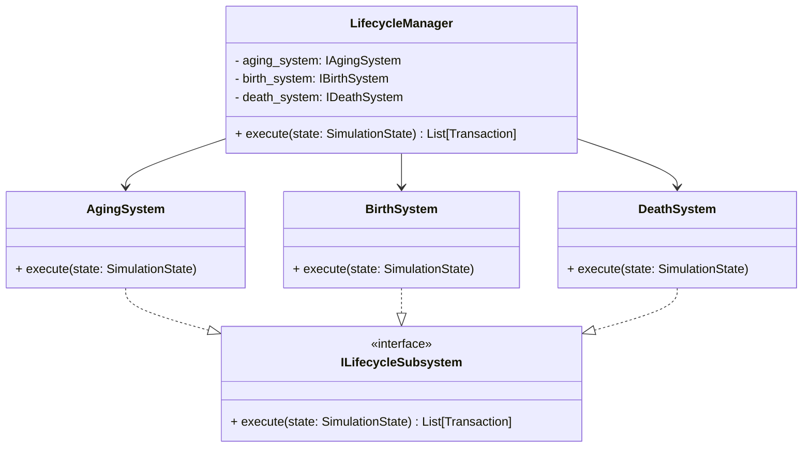

default_api:write_file{file_path:<ctrl46>communications/insights/lifecycle-decomposition-spec.md<ctrl46>,text:<ctrl46># Insight Report: Lifecycle Manager Decomposition

## 🏗️ Architectural Insights
- **TD-ARCH-LIFE-GOD Resolution**: The decomposition directly addresses the monolithic nature of `LifecycleManager`, ensuring Single Responsibility Principle (SRP) compliance.
- **Protocol-Driven Design**: Introducing `ILifecycleSubsystem` protocol standardizes the interface for all lifecycle components (Birth, Aging, Death), facilitating easier extension and testing.
- **Statelessness**: Moving towards stateless systems (`BirthSystem`, `DeathSystem`, `AgingSystem`) that operate on `SimulationState` DTOs aligns with the `SEO_PATTERN`.
- **Dependency Injection**: Explicit dependency injection in the new systems will resolve hidden coupling issues present in the current implementation.

## ⚠️ Risks & Mitigation
- **Execution Order Sensitivity**: The order of lifecycle phases (Aging -> Birth -> Death) is critical. The `LifecycleManager` (Orchestrator) must strictly enforce this sequence.
- **Shared State Management**: Care must be taken to ensure that modifications to `SimulationState` in one subsystem (e.g., removing agents in DeathSystem) are correctly reflected for subsequent systems or the next tick. `SimulationState` lists are mutable, which helps, but index management is key.
- **Legacy Dependencies**: `DemographicManager` currently holds logic for both aging and births. This logic needs to be cleanly extracted without leaving "zombie" code.

## 🧪 Verification Strategy
- **Unit Tests**:
    - Verify `BirthSystem` correctly creates agents and registers them.
    - Verify `DeathSystem` correctly identifies and liquidates agents, producing expected transactions.
    - Verify `AgingSystem` increments ages and triggers distress flags.
- **Integration Tests**:
    - Ensure `LifecycleManager` invokes all subsystems in the correct order.
    - Validate that agent population remains stable over multiple ticks (No mass extinction or explosion events due to logic gaps).

## 📝 Technical Debt Impact
- **Resolves**: `TD-ARCH-LIFE-GOD` (Systems)
- **Impacts**: `TD-INT-PENNIES-FRAGILITY` (Indirectly, by ensuring new systems use strict types)

<ctrl46>}multiplexer:write_file{file_path:<ctrl46>simulation/systems/lifecycle/api.py<ctrl46>,text:<ctrl46>from __future__ import annotations
from typing import Protocol, List, Any, runtime_checkable
from simulation.dtos.api import SimulationState
from simulation.models import Transaction

@runtime_checkable
class ILifecycleSubsystem(Protocol):
    """
    Protocol for discrete lifecycle systems (Birth, Aging, Death).
    Adheres to SEO Pattern: Stateless execution on State DTO.
    """
    def execute(self, state: SimulationState) -> List[Transaction]:
        """
        Executes the lifecycle logic for the current tick.
        Returns a list of transactions (e.g., inheritance, fees) to be processed.
        """
        ...

@runtime_checkable
class IAgingSystem(ILifecycleSubsystem):
    """
    Responsible for incrementing age, updating biological needs,
    and performing health/distress checks for all agents.
    """
    ...

@runtime_checkable
class IBirthSystem(ILifecycleSubsystem):
    """
    Responsible for creating new agents (Households) via reproduction
    and handling immigration entry.
    """
    ...

@runtime_checkable
class IDeathSystem(ILifecycleSubsystem):
    """
    Responsible for handling agent death, liquidation of assets,
    and inheritance processing.
    """
    ...
<ctrl46>}multiplexer:write_file{file_path:<ctrl46>design/3_work_artifacts/specs/lifecycle_decomposition_spec.md<ctrl46>,text:<ctrl46># Specification: Lifecycle Manager Decomposition

## 1. Overview
This specification details the decomposition of the monolithic `LifecycleManager` into three discrete, testable subsystems: `AgingSystem`, `BirthSystem`, and `DeathSystem`. This refactoring aims to resolve **TD-ARCH-LIFE-GOD**, enforce the **SEO (Stateless Engine & Orchestrator)** pattern, and improve the testability of critical lifecycle logic (specifically liquidation and inheritance).

## 2. Architecture

### 2.1. New Component Structure
The `LifecycleManager` will evolve into a lightweight **Orchestrator** that delegates logic to specialized subsystems implementing the `ILifecycleSubsystem` protocol.



### 2.2. Subsystem Responsibilities

#### A. AgingSystem
- **Core Responsibility**: Time progression and health monitoring.
- **Logic Extracted**:
    - `demographic_manager.process_aging` (Household biological aging).
    - `_process_firm_lifecycle` (Firm aging, liquidity checks, distress flagging).
    - `_process_household_lifecycle` (Household survival need checks, distress flagging).
- **Output**: Updates agent state (age, needs, flags) in place. No transactions usually, but returns empty list for protocol compliance.

#### B. BirthSystem
- **Core Responsibility**: New agent instantiation and entry.
- **Logic Extracted**:
    - `_process_births` (Breeding logic).
    - `immigration_manager.process_immigration` (Immigration logic).
    - `_register_new_agents` (Registration logic).
    - `firm_system.check_entrepreneurship` (New firm creation - *Optional consideration: Move to EconomicSystem? For now, keep in Lifecycle/Birth as "Firm Birth"*).
- **Dependencies**: `BreedingPlanner`, `HouseholdFactory`, `ImmigrationManager`.
- **Output**: Modifies `state.households`, `state.firms`, `state.agents`. Returns empty list.

#### C. DeathSystem
- **Core Responsibility**: Termination and Asset Liquidation.
- **Logic Extracted**:
    - `_handle_agent_liquidation`.
    - Firm Liquidation (Waterfall).
    - Household Death (Inheritance).
- **Dependencies**: `LiquidationManager`, `InheritanceManager`, `SettlementSystem`.
- **Output**: Returns `List[Transaction]` (Inheritance transfers, etc.).

## 3. Logic Flow (Pseudo-code)

### 3.1. LifecycleManager.execute()
```python
def execute(self, state: SimulationState) -> List[Transaction]:
    all_transactions = []

    # 1. Aging Phase (Updates Age, Needs, Distress Flags)
    self.aging_system.execute(state)

    # 2. Birth Phase (Adds new agents)
    self.birth_system.execute(state)

    # 3. Death Phase (Removes agents, Generates Inheritance Tx)
    # MUST run last to capture agents that died/failed during Aging or were effectively stillborn (rare).
    death_txs = self.death_system.execute(state)
    all_transactions.extend(death_txs)

    return all_transactions
```

### 3.2. DeathSystem.execute()
```python
def execute(self, state: SimulationState) -> List[Transaction]:
    transactions = []

    # Identify Inactive Agents
    # Note: AgingSystem might have marked them inactive (e.g., starve, bankrupt)
    # or they were naturally inactive.

    # 1. Firm Liquidation
    inactive_firms = [f for f in state.firms if not f.is_active]
    for firm in inactive_firms:
        self.liquidation_manager.initiate_liquidation(firm, state)
        self.settlement_system.record_liquidation(...)
        # Cleanup Registry...

    # 2. Household Liquidation
    inactive_households = [h for h in state.households if not h._bio_state.is_active]
    for household in inactive_households:
        txs = self.inheritance_manager.process_death(household, state.government, state)
        transactions.extend(txs)
        # Cleanup Registry...

    # 3. Global List Cleanup
    # Rebuild state.households, state.firms, state.agents to exclude dead agents.
    # (Copy logic from current _handle_agent_liquidation)

    return transactions
```

## 4. Interfaces & DTOs

### 4.1. `simulation/systems/lifecycle/api.py`
Defined in the accompanying `api.py` file.

## 5. Verification Plan

### 5.1. Unit Tests
- `tests/systems/lifecycle/test_birth_system.py`:
    - Mock `SimulationState`.
    - Verify `execute` increases `state.households` count when `BreedingPlanner` returns true.
- `tests/systems/lifecycle/test_death_system.py`:
    - Create `SimulationState` with 1 active and 1 inactive household.
    - Verify `execute` removes the inactive household and returns inheritance transactions.
- `tests/systems/lifecycle/test_aging_system.py`:
    - Create `SimulationState` with a household at age 20.
    - Verify `execute` increments age to 21 (or appropriate tick increment).

### 5.2. Integration Check
- Run `pytest tests/systems/test_lifecycle_integration.py` (New test).
- Verify the orchestrator calls systems in order: `Aging` -> `Birth` -> `Death`.

## 6. Risk Assessment (Audit)
- **Circular Imports**: `LifecycleManager` imports sub-systems. Sub-systems import `SimulationState`. Low risk if `api.py` is used correctly.
- **Performance**: Iterating through agent lists multiple times (once per system) vs once in a monolith loop.
    - *Mitigation*: The readability and maintainability benefits outweigh the negligible O(N) overhead. Python references are cheap.
- **State Mutation**: `AgingSystem` mutates state in place. `DeathSystem` mutates lists (removes items).
    - *Constraint*: `DeathSystem` MUST be the only one removing agents to prevent index errors in other systems if they were interleaved (which they are not).

## 7. Migration Steps
1. Create `simulation/systems/lifecycle/` directory.
2. Create `api.py`, `birth_system.py`, `death_system.py`, `aging_system.py`.
3. Move logic from `LifecycleManager` to respective files.
4. Refactor `LifecycleManager` to use these new classes.
5. Update `main.py` if instantiation arguments change (likely yes, need to construct sub-systems).

<ctrl46>}