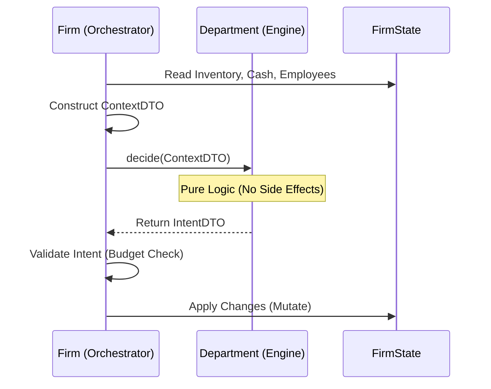

file: modules/firm/api.py
```python
from __future__ import annotations
from dataclasses import dataclass, field
from typing import Dict, List, Optional, Protocol, runtime_checkable, Any, Union
from modules.simulation.api import AgentID
from modules.system.api import MarketSnapshotDTO

# ==============================================================================
# Context DTOs (Inputs from Firm Orchestrator -> Department Engine)
# ==============================================================================

@dataclass(frozen=True)
class BaseDepartmentContextDTO:
    """Base context shared by all departments."""
    firm_id: AgentID
    tick: int
    budget_pennies: int
    market_snapshot: MarketSnapshotDTO
    
    # Financial Context
    available_cash_pennies: int
    is_solvent: bool

@dataclass(frozen=True)
class ProductionContextDTO(BaseDepartmentContextDTO):
    """Context for Production Department."""
    inventory_raw_materials: Dict[str, float]
    inventory_finished_goods: Dict[str, float]
    current_workforce_count: int
    technology_level: float
    production_efficiency: float
    # Config parameters
    input_goods: Dict[str, float]  # Recipe
    output_good_id: str

@dataclass(frozen=True)
class HRContextDTO(BaseDepartmentContextDTO):
    """Context for HR Department."""
    current_employees: List[AgentID]
    current_wage: float
    target_workforce_count: int  # Strategic target set by logic or config
    labor_market_avg_wage: float
    marginal_labor_productivity: float
    happiness_avg: float

@dataclass(frozen=True)
class SalesContextDTO(BaseDepartmentContextDTO):
    """Context for Sales Department."""
    inventory_to_sell: Dict[str, float]
    current_prices: Dict[str, int]
    previous_sales_volume: float
    competitor_prices: Optional[Dict[str, float]]

# ==============================================================================
# Intent DTOs (Outputs from Department Engine -> Firm Orchestrator)
# ==============================================================================

@dataclass(frozen=True)
class ProductionIntentDTO:
    """Intent from Production Department."""
    target_production_quantity: float
    materials_to_use: Dict[str, float]
    estimated_cost_pennies: int
    
    # Flags for orchestrator
    insufficient_materials: bool = False

@dataclass(frozen=True)
class HRIntentDTO:
    """Intent from HR Department."""
    hiring_target: int  # Positive to hire, Negative to fire
    wage_update_pennies: int  # New wage offering
    total_payroll_budget_pennies: int
    
    # Specific actions
    fire_employee_ids: List[AgentID] = field(default_factory=list)

@dataclass(frozen=True)
class SalesIntentDTO:
    """Intent from Sales Department."""
    price_adjustments: Dict[str, int]  # ItemID -> New Price (Pennies)
    sales_orders: List[Dict[str, Any]] # List of sell orders to post
    marketing_spend_pennies: int = 0

# ==============================================================================
# Protocols (Interfaces)
# ==============================================================================

@runtime_checkable
class IDepartmentEngine(Protocol):
    """
    Protocol for a stateless department engine.
    Must not hold reference to the parent firm.
    """
    def decide(self, context: Any) -> Any:
        """
        Pure function: Context -> Intent.
        """
        ...

@runtime_checkable
class IProductionDepartment(IDepartmentEngine, Protocol):
    def decide_production(self, context: ProductionContextDTO) -> ProductionIntentDTO:
        ...

@runtime_checkable
class IHRDepartment(IDepartmentEngine, Protocol):
    def decide_workforce(self, context: HRContextDTO) -> HRIntentDTO:
        ...

@runtime_checkable
class ISalesDepartment(IDepartmentEngine, Protocol):
    def decide_pricing(self, context: SalesContextDTO) -> SalesIntentDTO:
        ...

@runtime_checkable
class IFirmOrchestrator(Protocol):
    """
    Protocol for the Firm entity acting as the Orchestrator.
    Responsible for applying Intents to state.
    """
    def apply_production_intent(self, intent: ProductionIntentDTO) -> bool:
        ...
    
    def apply_hr_intent(self, intent: HRIntentDTO) -> bool:
        ...
    
    def apply_sales_intent(self, intent: SalesIntentDTO) -> bool:
        ...

```

file: design/3_work_artifacts/specs/firm_decoupling_spec.md
```markdown
# Spec: Firm-Department Decoupling (SEO Pattern)

## 1. Introduction

- **Objective**: Resolve `TD-ARCH-FIRM-COUP` by decoupling the `Firm` entity from its functional departments (`Production`, `HR`, `Sales`).
- **Pattern**: Adopt the **SEO (Stateless Engine & Orchestrator)** pattern. Departments become pure engines; the Firm becomes the Orchestrator.
- **Goal**: Eliminate `self.parent` references. Enable deterministic testing of business logic without instantiating a full Firm or WorldState.

## 2. Architecture & Data Flow

### Current State (Liability)
- `Department` holds `self.parent` (Firm).
- `Department` modifies `self.parent.inventory` or `self.parent.cash` directly.
- Logic is tightly coupled to the implementation details of `Firm`.

### Target State (Asset)
The "Brain Scan" Loop:
1.  **Context Construction**: Firm gathers data from its state (Inventory, Cash, Market) into a typed `ContextDTO`.
2.  **Engine Execution**: Firm calls `Department.decide(ContextDTO)`.
3.  **Intent Generation**: Department returns a pure `IntentDTO` describing *what* it wants to do (e.g., "Produce 10 units").
4.  **Orchestration (Resolution)**: Firm verifies the intent (Affordability Check, Zero-Sum Check) and applies it to mutable state.



## 3. Detailed Logic Specification

### 3.1. Production Engine (`decide_production`)

**Input**: `ProductionContextDTO`
**Output**: `ProductionIntentDTO`

**Logic (Pseudo-code)**:
```python
def decide_production(context):
    # 1. Determine Max Production based on Raw Materials
    max_by_materials = min(context.inventory[mat] / req for mat, req in context.input_goods.items())
    
    # 2. Determine Max Production based on Labor
    max_by_labor = context.current_workforce_count * context.production_efficiency
    
    # 3. Determine Max Production based on Budget (if materials need buying - future scope)
    # For now, assume materials are already owned.
    
    target_quantity = min(max_by_materials, max_by_labor)
    
    # 4. Calculate Material Consumption
    materials_used = {mat: req * target_quantity for mat, req in context.input_goods.items()}
    
    return ProductionIntentDTO(
        target_production_quantity=target_quantity,
        materials_to_use=materials_used,
        estimated_cost_pennies=0 # Internal cost logic
    )
```

### 3.2. HR Engine (`decide_workforce`)

**Input**: `HRContextDTO`
**Output**: `HRIntentDTO`

**Logic (Pseudo-code)**:
```python
def decide_workforce(context):
    marginal_revenue = context.marginal_labor_productivity * context.market_snapshot.avg_price
    marginal_cost = context.current_wage
    
    intent = HRIntentDTO(hiring_target=0, wage_update_pennies=context.current_wage, ...)

    if marginal_revenue > marginal_cost:
        # Expand
        intent.hiring_target = 1
        intent.wage_update_pennies = int(context.current_wage * 1.05)
    elif marginal_revenue < marginal_cost:
        # Contract
        intent.hiring_target = -1
        intent.wage_update_pennies = int(context.current_wage * 0.95)
        # Identify least productive employee (simplified)
        if context.current_employees:
            intent.fire_employee_ids = [context.current_employees[-1]]
            
    return intent
```

### 3.3. Sales Engine (`decide_pricing`)

**Input**: `SalesContextDTO`
**Output**: `SalesIntentDTO`

**Logic (Pseudo-code)**:
```python
def decide_pricing(context):
    # Simple inventory pressure logic
    inventory_coverage = context.inventory_to_sell / (context.previous_sales_volume + 1e-9)
    current_price = context.current_prices.get(ITEM_ID, 100)
    
    new_price = current_price
    if inventory_coverage > 5.0:
        new_price = int(current_price * 0.95) # Discount
    elif inventory_coverage < 1.0:
        new_price = int(current_price * 1.05) # Markup
        
    return SalesIntentDTO(
        price_adjustments={ITEM_ID: new_price},
        sales_orders=[{"id": ITEM_ID, "qty": context.inventory_to_sell, "price": new_price}]
    )
```

## 4. Verification & Testing Strategy

### 4.1. New Test Cases (Unit Tests)
- **Engine Tests**: Instantiate `ProductionDept` directly. Pass a manually constructed `ProductionContextDTO`. Assert on the attributes of the returned `ProductionIntentDTO`.
    - *Benefit*: No need to mock `Firm`, `WorldState`, or `Registry`. Pure data input/output.
- **Orchestrator Tests**: Mock the `ProductionDept`. Make it return a fixed `ProductionIntentDTO`. Assert that `Firm` correctly updates its inventory and cash.

### 4.2. Impact on Existing Tests
- **High Risk**: Any test mocking `Firm` and expecting `dept.parent` to exist will fail.
- **Mitigation**: 
    1.  Refactor `Firm` to initialize departments *without* passing `self`.
    2.  Update tests to test the `decide_X` methods directly using DTOs, OR
    3.  Update integration tests to check the result on `Firm` after the tick, rather than inspecting internal department state.

### 4.3. Golden Data
- Use `golden_firms` fixture.
- Extract state from `golden_firm` to create `ProductionContextDTO` for testing.

## 5. Migration Plan (Safety First)

1.  **Phase A**: Create `modules/firm/api.py` with DTOs and Protocols.
2.  **Phase B**: Update `Department` classes to inherit from Protocols. Add `decide(context)` methods *alongside* existing methods.
3.  **Phase C**: Refactor `Firm.step()` (or phase execution) to build Contexts and call `decide()`.
4.  **Phase D**: Deprecate and remove `self.parent` and old methods.

## 6. Risk Audit
- **Zero-Sum Violation**: If `apply_intent` fails to deduct cash/inventory before adding products, magic resources appear. *Mitigation*: Unit test the `Firm.apply_X_intent` methods strictly for balance conservation.
- **Circular Imports**: `modules/firm/api.py` must NOT import `Firm` entity. It uses `AgentID`.
- **Performance**: Creating DTOs every tick involves object overhead. *Verdict*: Negligible compared to existing simulation logic; worth it for safety.
```

file: communications/insights/spec_firm_decoupling.md
```markdown
# Insight: Firm Decoupling Architecture (TD-ARCH-FIRM-COUP)

## 1. Architectural Decisions
- **Adoption of SEO Pattern**: We are strictly separating the "Thinking" (Department Engines) from the "Acting" (Firm Orchestrator).
- **Intent-Based Communication**: Departments will no longer modify state. They will issue `IntentDTOs`. This creates a transactional boundary where the Firm can reject actions (e.g., "Insufficient Funds").
- **DTO Strategy**: Defined strictly in `modules/firm/api.py` to prevent circular dependencies between the entity (`simulation.firms`) and the logic (`modules.firm`).

## 2. Technical Debt Resolution
- **TD-ARCH-FIRM-COUP**: Addressed by removing `self.parent`.
- **Testability**: Logic becomes pure. We can test "What if wages doubled?" by simply passing a modified `HRContextDTO` without setting up a complex graph of objects.

## 3. Risks & Regressions
- **Legacy Test Breakage**: Tests that rely on `MagicMock` of a Firm and deep inspection of `firm.production.parent` will break immediately upon implementation.
- **Refactoring Strategy**: 
    - We will keep legacy methods temporarily if needed but mark them `Deprecated`.
    - We will prioritize fixing `tests/test_firm.py` to use the new DTO interfaces.

## 4. Implementation Checklist
- [ ] Define DTOs in `modules/firm/api.py` (Done in Draft).
- [ ] Refactor `ProductionDepartment` to `IProductionDepartment`.
- [ ] Refactor `HRDepartment` to `IHRDepartment`.
- [ ] Refactor `SalesDepartment` to `ISalesDepartment`.
- [ ] Update `Firm.step()` to use Context/Intent loop.
- [ ] Verify Zero-Sum integrity in Intent application.
```