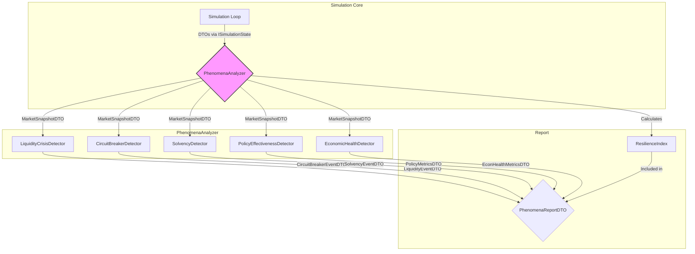

# Spec: Perfect Storm Phenomena Reporting

## 1. Overview & Goal

This document outlines the architecture to resolve **TD-154 (Perfect Storm: Binary Outcome Bias)**. The goal is to evolve `stress_test_perfect_storm.py` from a binary Pass/Fail script into a sophisticated "Phenomena Reporting" tool. This new tool will analyze simulation runs to identify critical economic events, quantify system resilience, and provide data-driven insights into policy effectiveness, rather than delivering a simple success or failure verdict.

## 2. Architecture

The new architecture replaces the monolithic `StormVerifier` with a modular `PhenomenaAnalyzer`. This analyzer acts as a container for a collection of specialized, independent "detector" components, each responsible for identifying a specific economic phenomenon.

-   **`PhenomenaAnalyzer` (Container)**: The main orchestrator. It loads detectors based on a configuration file, feeds them simulation data at each tick, and aggregates their findings into a comprehensive final report.
-   **`IDetector` (Component Interface)**: A standardized interface that all detector modules must implement. This ensures modularity and allows for easy addition of new detectors in the future.
-   **Detectors (Components)**: A set of initial classes implementing `IDetector`. Each focuses on a single responsibility:
    -   `LiquidityCrisisDetector`: Monitors the banking system for signs of a credit crunch or liquidity shortage.
    -   `CircuitBreakerDetector`: Detects when market-wide trading halts (Circuit Breakers) are triggered.
    -   `SolvencyDetector`: Tracks agent (household and firm) and government solvency, identifying bankruptcy waves or sovereign debt crises.
    -   `PolicyEffectivenessDetector`: Measures the impact and activation of fiscal and monetary stabilizer policies.
    -   `EconomicHealthDetector`: Tracks core macroeconomic indicators like GDP, inflation, and unemployment against healthy-range thresholds.

This design adheres to the Single Responsibility Principle, directly mitigating the "God-Class Analyzer Risk" identified in the pre-flight audit. Interaction with the simulation core will be strictly mediated through the `ISimulationState` protocol and its associated DTOs.



## 3. API & DTO Definitions (`modules/analysis/api.py`)

```python
from typing import List, Dict, TypedDict, Optional, Protocol

# --- DTOs for Phenomena Reporting ---

class PhenomenonEventDTO(TypedDict):
    """Generic representation of a detected economic event."""
    detector_name: str
    start_tick: int
    end_tick: int
    severity: float  # Normalized 0.0 to 1.0
    message: str
    details: Dict

class ResilienceIndexDTO(TypedDict):
    """Components of the calculated Resilience Index."""
    final_score: float # Score from 0 (brittle) to 100 (resilient)
    volatility_score: float
    recovery_score: float
    crisis_penalty: float
    policy_bonus: float

class PolicySynergyMetrics(TypedDict):
    """Metrics to analyze the interaction of policies."""
    fiscal_stabilizer_activations: int
    monetary_stabilizer_activations: int
    correlation_gdp_fiscal_stimulus: float
    zlb_duration: int

class PhenomenaReportDTO(TypedDict):
    """The final, comprehensive report object."""
    simulation_ticks: int
    resilience_index: ResilienceIndexDTO
    policy_metrics: PolicySynergyMetrics
    detected_events: List[PhenomenonEventDTO]
    key_timeseries: Dict[str, List[float]] # For plotting GDP, inflation, etc.

# --- Interfaces (Protocols) ---

class IDetector(Protocol):
    """Interface for a modular phenomenon detector."""
    def update(self, tick: int, sim_state: 'ISimulationState') -> None:
        """Update detector with data from the current tick."""
        ...

    def analyze(self) -> List[PhenomenonEventDTO]:
        """Analyze collected data and return detected events."""
        ...

class IAnalyzer(Protocol):
    """Interface for the main phenomena analyzer."""
    def run_tick(self, tick: int, sim_state: 'ISimulationState') -> None:
        ...

    def generate_report(self) -> PhenomenaReportDTO:
        ...

# --- Configuration DTO ---

class DetectorConfigDTO(TypedDict):
    """Configuration for a single detector."""
    module: str # e.g., 'modules.analysis.detectors.LiquidityCrisisDetector'
    enabled: bool
    thresholds: Dict[str, float]

class AnalysisConfigDTO(TypedDict):
    """Top-level configuration for the PhenomenaAnalyzer."""
    detectors: Dict[str, DetectorConfigDTO]
    resilience_weights: Dict[str, float]
```

## 4. Configuration (`config/scenarios/stress_test_phenomena.yaml`)

All parameters will be externalized to a YAML file, following the pattern from `TD-152` and `TD-153`.

```yaml
# config/scenarios/stress_test_phenomena.yaml

SIMULATION_TICKS: 200
NUM_HOUSEHOLDS: 50
NUM_FIRMS: 10

# Configuration for the Phenomena Analyzer
analysis_config:
  resilience_weights:
    volatility_weight: 0.3
    recovery_time_weight: 0.4
    crisis_severity_weight: 0.3
    policy_bonus_factor: 1.1

  detectors:
    liquidity_crisis:
      enabled: true
      module: 'modules.analysis.detectors.LiquidityCrisisDetector'
      thresholds:
        # Bank reserves below this % of deposits triggers alert
        bank_reserve_ratio_min: 0.05
        # More than this many consecutive ticks of credit rationing
        credit_rationing_duration: 5

    circuit_breaker:
      enabled: true
      module: 'modules.analysis.detectors.CircuitBreakerDetector'
      thresholds: {} # Simple event detection, no thresholds needed

    solvency:
      enabled: true
      module: 'modules.analysis.detectors.SolvencyDetector'
      thresholds:
        # If bankruptcy rate exceeds this % per tick
        bankruptcy_rate_max: 0.10

    economic_health:
       enabled: true
       module: 'modules.analysis.detectors.EconomicHealthDetector'
       thresholds:
         # Acceptable inflation range
         inflation_target: 0.02
         inflation_upper_bound: 0.05
         inflation_lower_bound: -0.01
```

## 5. Core Logic (Pseudo-code)

### `PhenomenaAnalyzer.py`

```python
class PhenomenaAnalyzer:
    def __init__(self, config: AnalysisConfigDTO, sim_state: ISimulationState):
        self.config = config
        self.sim_state = sim_state
        self.detectors: List[IDetector] = self._load_detectors()
        # Store time-series data
        self.history: Dict[str, List] = defaultdict(list)

    def _load_detectors(self) -> List[IDetector]:
        # Based on config, dynamically import and instantiate detector modules
        ...

    def run_tick(self, tick: int) -> None:
        # Update all detectors with the latest simulation state
        for detector in self.detectors:
            detector.update(tick, self.sim_state)

        # Record key metrics for the final report's timeseries plot
        snapshot = self.sim_state.get_market_snapshot()
        self.history['gdp'].append(snapshot.gdp)
        self.history['inflation'].append(snapshot.inflation)


    def generate_report(self) -> PhenomenaReportDTO:
        all_events = []
        for detector in self.detectors:
            all_events.extend(detector.analyze())

        resilience_index = self._calculate_resilience(all_events)
        policy_metrics = self._calculate_policy_synergy(all_events)

        return PhenomenaReportDTO(
            resilience_index=resilience_index,
            policy_metrics=policy_metrics,
            detected_events=all_events,
            key_timeseries=self.history
        )

    def _calculate_resilience(self, events: List[PhenomenonEventDTO]) -> ResilienceIndexDTO:
        # Start with a base score of 100
        # Subtract points based on severity and duration of negative events
        # (e.g., liquidity crisis, bankruptcies)
        # Use weights from self.config.resilience_weights
        # Add points for fast recovery post-shock
        # Return ResilienceIndexDTO
        ...
```

## 6. Verification & Visualization

-   **Verification**: The refactored script `scripts/run_phenomena_analysis.py` will no longer exit with a code. It will simply print the `PhenomenaReportDTO` as a structured log or JSON. Assertions in CI/CD will be against specific fields in this report (e.g., `assert report.resilience_index.final_score > 50`).
-   **Visualization**: The `key_timeseries` field in the final report will contain all necessary data for plotting. A separate script (`analysis/plot_phenomena_report.py`) will take the report's output and generate charts showing:
    1.  GDP and Inflation over time, with markers indicating where phenomena (like `CircuitBreaker`) occurred.
    2.  The `ResilienceIndex` score over time.
    3.  A bar chart comparing policy activations.

## 7. Risk & Impact Audit (Addressing Pre-flight Report)

1.  **Insufficient Data Protocol (`ISimulationState`)**:
    -   **Assessment**: The current protocol is likely insufficient. To detect phenomena like Circuit Breakers or bank reserve levels, more granular state is needed beyond `MarketSnapshotDTO`.
    -   **Mitigation**: Propose a **backward-compatible extension** to the `ISimulationState` protocol. A new method, `get_system_state() -> SystemStateDTO`, will be added.
    -   **`SystemStateDTO` Definition**: This new DTO will contain internal system flags and states not meant for agent decision-making but essential for observation.
        ```python
        class SystemStateDTO(TypedDict):
            is_circuit_breaker_active: bool
            bank_total_reserves: float
            bank_total_deposits: float
            fiscal_policy_last_activation_tick: int
            # ... and other internal states
        ```
    -   This approach respects the architectural boundary (`TD-149`) while providing necessary data.

2.  **God-Class Analyzer Risk**:
    -   **Mitigation**: This design explicitly decomposes the analyzer into a container and multiple, independent `IDetector` components. This directly prevents a monolithic analyzer and satisfies the Single Responsibility Principle.

3.  **Test Script Brittleness**:
    -   **Mitigation**: The primary test script (`scripts/stress_test_perfect_storm.py`) will be renamed to `scripts/run_phenomena_analysis.py`. Its responsibility is reduced to: 1. Load config, 2. Instantiate and run simulation/analyzer, 3. Print the final report. The `sys.exit(1)` and binary `success` flag are removed entirely, replaced by the structured `PhenomenaReportDTO`. This resolves the brittleness.

## 8. Mocking & Golden Data Strategy

-   Unit tests for each `IDetector` will be created using "Golden" `SystemStateDTO` and `MarketSnapshotDTO` objects.
-   For example, `test_liquidity_detector.py` will have a test case `test_detects_crisis_on_low_reserves` which passes a handcrafted `SystemStateDTO` with a low reserve ratio to the detector and asserts that a `PhenomenonEventDTO` is generated.
-   These golden test fixtures will be stored in `tests/fixtures/phenomena_data.py`. No `MagicMock` will be used, ensuring type safety and contract adherence.
