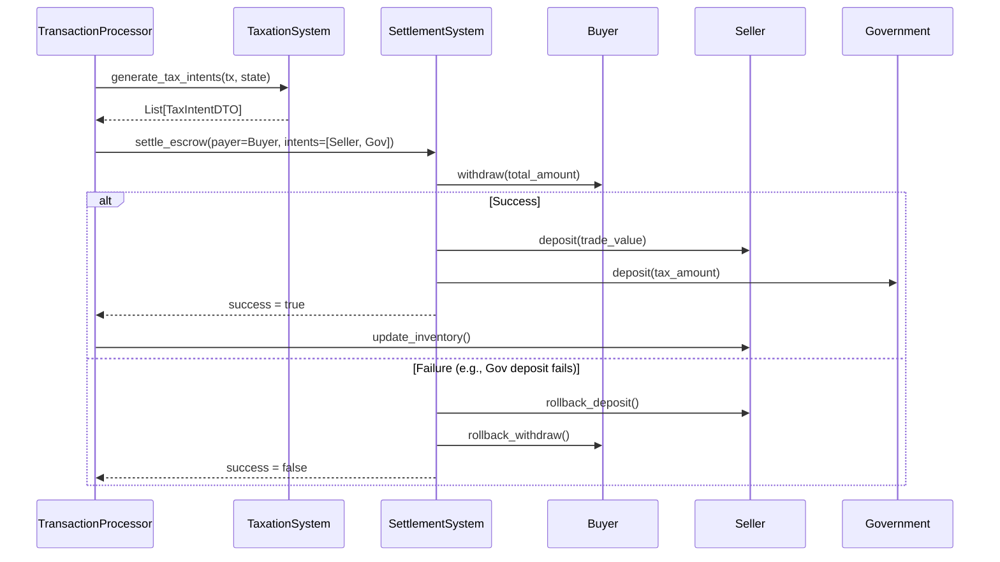

# [WO-176] Spec: Atomic Taxation & Settlement System

## 1. Overview & Goals

This document provides the technical specification for resolving two critical technical debts: **TD-176 (Decoupling TransactionProcessor & Government)** and **TD-175 (Saga-like Atomic Settlement)**.

The current implementation suffers from several architectural flaws:
1.  **Lack of Atomicity**: Tax payments are processed in separate, sequential transactions after the primary trade, creating risks of money leaks if the second transaction fails.
2.  **Single Responsibility Principle (SRP) Violation**: `TransactionProcessor` is a "God Class" handling financial settlement, tax calculation, inventory updates, and employment changes. `Government` mixes policy-making with tax bookkeeping.
3.  **Tight Coupling**: The `TransactionProcessor` is tightly coupled to the `Government`'s internal tax logic.

This refactoring aims to:
- **Introduce Atomic Settlements**: Implement a `settle_escrow` method capable of handling multi-party (1 Debit -> N Credits) payments atomically, with guaranteed rollback on failure.
- **Decouple Tax Logic**: Create a new, dedicated `TaxationSystem` responsible for all tax calculation and revenue recording.
- **Simplify `TransactionProcessor`**: Refactor `TransactionProcessor` into a pure orchestrator that requests payment intents and executes them via the new settlement system.
- **Demote `Government`**: Remove all tax calculation and direct collection logic from the `Government` agent, turning it into a simple payee for tax revenue.

---

## 2. Architecture: The Escrow Settlement Flow

The new transaction flow is designed around an orchestrator and specialized, single-responsibility systems.

**New Flow:**
1.  **`TransactionProcessor` (Orchestrator)** receives a `Transaction` (e.g., a `goods` trade).
2.  It identifies the primary payment (e.g., from Buyer to Seller) and creates a `PaymentIntentDTO`.
3.  It calls `TaxationSystem.generate_tax_intents()` with the transaction context.
4.  The `TaxationSystem` returns a list of `TaxIntentDTO`s (e.g., sales tax from Buyer to Government).
5.  `TransactionProcessor` bundles all intents into a single list of `PaymentIntentDTO`s.
6.  It calls `SettlementSystem.settle_escrow()` with the payer and the bundled payment intents.
7.  **`SettlementSystem` (Financial Layer)** executes the atomic multi-payment.
    - It debits the total amount from the payer (respecting the Seamless Payment Protocol).
    - It credits each payee.
    - If any step fails, it rolls back all changes, ensuring zero-sum integrity.
8.  `TransactionProcessor` receives the result and proceeds with non-financial state changes (inventory, etc.) only upon success.



---

## 3. New Module: `modules.government.taxation`

A new module is created to encapsulate all tax-related responsibilities.

### 3.1. API Definition (`modules/government/taxation/api.py`)

This file defines the public contract for the taxation system.

*(See the `modules/government/taxation/api.py` file block below for the full code.)*

**Key Components:**
- **`PaymentIntentDTO`**: A generic DTO for any payment request.
- **`TaxIntentDTO`**: A specialized DTO for tax payments, including the tax type.
- **`ITaxationSystem`**: An interface defining the system's capabilities.
    - `generate_tax_intents()`: Calculates and returns tax liabilities for a given transaction.
    - `record_revenue()`: Records the outcome of a tax collection attempt for internal bookkeeping.

### 3.2. `TaxationSystem` Implementation (Pseudo-code)

```python
# modules/government/taxation/system.py

class TaxationSystem(ITaxationSystem):
    def __init__(self, config, government_id):
        self.config = config
        self.government_id = government_id
        self.tax_revenue_ledger = {} # { "sales_tax": 100.0, ... }

    def generate_tax_intents(self, transaction, state) -> List[TaxIntentDTO]:
        intents = []
        tx_type = transaction.transaction_type
        trade_value = transaction.quantity * transaction.price

        # --- Sales Tax Logic ---
        if tx_type == "goods":
            sales_tax_rate = self.config.SALES_TAX_RATE
            tax_amount = trade_value * sales_tax_rate
            if tax_amount > 0:
                intents.append(TaxIntentDTO(
                    payer_id=transaction.buyer_id,
                    payee_id=self.government_id,
                    amount=tax_amount,
                    tax_type="sales_tax"
                ))
        
        # --- Income Tax Logic ---
        elif tx_type in ["labor", "research_labor"]:
            # ... calculate tax based on income, survival cost etc.
            tax_amount = self._calculate_income_tax(trade_value, state)
            if tax_amount > 0:
                # Payer depends on config (FIRM or HOUSEHOLD)
                payer_id = self._determine_income_tax_payer(transaction)
                intents.append(TaxIntentDTO(
                    payer_id=payer_id,
                    payee_id=self.government_id,
                    amount=tax_amount,
                    tax_type="income_tax"
                ))
        
        # ... other tax types (wealth, corporate)
        
        return intents

    def record_revenue(self, intent: TaxIntentDTO, success: bool):
        if success:
            tax_type = intent.tax_type
            self.tax_revenue_ledger[tax_type] = self.tax_revenue_ledger.get(tax_type, 0.0) + intent.amount
```

---

## 4. Refactoring `SettlementSystem`

The `SettlementSystem` is upgraded to support atomic multi-payments.

### 4.1. API Definition (`simulation/finance/api.py`)

The `ISettlementSystem` interface will be updated:

```python
from typing import Protocol, List, Dict, Any, Optional

class PaymentIntentDTO(TypedDict):
    payee: IFinancialEntity
    amount: float
    memo: str

class ISettlementSystem(Protocol):
    # ... existing methods ...

    def settle_escrow(
        self,
        payer: IFinancialEntity,
        intents: List[PaymentIntentDTO],
        tick: int
    ) -> bool:
        """
        Atomically settles a multi-payment from one payer to multiple payees.
        Returns True on success, False on failure (with full rollback).
        """
        ...
```

### 4.2. `settle_escrow` Implementation (Pseudo-code)

```python
# simulation/systems/settlement_system.py

class SettlementSystem(ISettlementSystem):
    
    def settle_escrow(self, payer, intents, tick) -> bool:
        if not intents:
            return True # Nothing to do

        total_amount = sum(intent['amount'] for intent in intents)
        if total_amount <= 0:
            return True

        # === 1. DEBIT PHASE (WITH SEAMLESS PAYMENT) ===
        try:
            # This new helper encapsulates cash + bank withdrawal logic
            self._withdraw_from_payer(payer, total_amount, tick)
        except InsufficientFundsError as e:
            self.logger.error(f"ESCROW_FAIL | Payer {payer.id} has insufficient funds for {total_amount:.2f}. Memo: {intents[0]['memo']}. Error: {e}")
            return False

        # === 2. CREDIT PHASE (WITH ROLLBACK) ===
        successful_credits = []
        for i, intent in enumerate(intents):
            payee = intent['payee']
            amount = intent['amount']
            try:
                payee.deposit(amount)
                successful_credits.append(intent)
            except Exception as e:
                # --- ROLLBACK ---
                self.logger.critical(f"ESCROW_ROLLBACK | Deposit failed for {payee.id}. Rolling back transaction. Error: {e}")
                # Rollback successful credits
                for credited_intent in successful_credits:
                    try:
                        credited_intent['payee'].withdraw(credited_intent['amount'])
                    except Exception as rb_e:
                        # FATAL: Money is now stuck in a payee account.
                        self.logger.fatal(f"ESCROW_FATAL | Payee rollback failed! {rb_e}")
                
                # Refund the payer
                try:
                    payer.deposit(total_amount)
                except Exception as refund_e:
                    # FATAL: Money has been destroyed.
                    self.logger.fatal(f"ESCROW_FATAL | Payer refund failed! {refund_e}")

                return False

        # === 3. SUCCESS ===
        self.logger.debug(f"ESCROW_SUCCESS | Settled {total_amount:.2f} from {payer.id} to {len(intents)} payees.")
        return True

    def _withdraw_from_payer(self, payer, amount, tick):
        # This helper implements the "Seamless Payment Protocol"
        # It attempts to withdraw from cash first, then from the bank.
        # Raises InsufficientFundsError if total spending power is too low.
        # ... implementation details ...
        pass
```

---

## 5. Refactoring `TransactionProcessor`

`TransactionProcessor` becomes a lean orchestrator.

### Before:

```python
# transaction_processor.py (Simplified Old Logic)

# ...
if tx.transaction_type == "goods":
    tax_amount = trade_value * sales_tax_rate
    
    # 1. First transfer (Buyer to Seller)
    success = settlement.transfer(buyer, seller, trade_value, "goods_trade")
    
    # 2. Second transfer (Buyer to Government)
    if success and tax_amount > 0:
        government.collect_tax(tax_amount, "sales_tax", buyer, current_time) # Coupled call
# ...
```

### After:

```python
# transaction_processor.py (New Logic)

class TransactionProcessor:
    def __init__(self, config, taxation_system, settlement_system):
        self.config = config
        self.taxation_system = taxation_system
        self.settlement_system = settlement_system

    def execute(self, state: SimulationState):
        # ... loop through transactions ...

        if tx.transaction_type == "goods":
            payment_intents = []
            
            # 1. Create primary payment intent
            payment_intents.append(PaymentIntentDTO(
                payee=seller,
                amount=trade_value,
                memo=f"goods_trade:{tx.item_id}"
            ))

            # 2. Generate tax intents
            tax_intents = self.taxation_system.generate_tax_intents(tx, state)
            
            # Convert and add tax intents to the payment bundle
            for tax_intent in tax_intents:
                tax_payer = agents.get(tax_intent.payer_id) # Payer could be buyer or seller
                tax_payee = agents.get(tax_intent.payee_id) # Government
                # NOTE: Logic needed to determine the actual payer for the bundle
                # For sales/income-withholding, the payer is the same as the primary tx.
                payment_intents.append(PaymentIntentDTO(
                    payee=tax_payee,
                    amount=tax_intent.amount,
                    memo=tax_intent.tax_type
                ))

            # 3. Execute atomic settlement
            success = self.settlement_system.settle_escrow(
                payer=buyer,
                intents=payment_intents,
                tick=current_time
            )

            # 4. Record tax revenue outcome
            for tax_intent in tax_intents:
                self.taxation_system.record_revenue(tax_intent, success)

            # 5. Handle non-financial state changes
            if success:
                self._handle_goods_transaction(tx, buyer, seller, trade_value, current_time)
```

---

## 6. Refactoring `Government`

The `Government` agent is simplified significantly.

**Responsibilities Removed:**
- `calculate_income_tax`
- `calculate_corporate_tax`
- `collect_tax`
- `record_revenue`

The `Government` agent now only contains state related to policy, spending, and its own assets. It receives income passively via the `deposit` method, called by the `SettlementSystem` when a tax payment is successfully processed.

---

## 7. Verification Plan & Risk Mitigation

This section directly addresses the findings of the **Pre-flight Audit**.

1.  **God Class Refactoring Risk**: The new design explicitly demotes `TransactionProcessor` to an orchestrator. Its responsibility is simplified to: 1) request intents, 2) bundle intents, 3) execute settlement, 4) trigger non-financial updates. All complex calculation is delegated.
2.  **Violation of SRP**: `TaxationSystem` now holds all tax-related responsibilities (calculation and recording). `Government` is reduced to a simple `IFinancialEntity` (a payee), and its `record_revenue` method is fully removed. Revenue is tracked within the `TaxationSystem`'s own ledger.
3.  **Threat to Financial Atomicity**: The `settle_escrow` method is designed from the ground up on the **Atomic Escrow Pattern**. It guarantees zero-sum integrity via its strict "debit-then-credit-with-rollback" logic, as specified in `ARCH_TRANSACTIONS.md`.
4.  **Hidden Dependencies in Settlement**: The new `settle_escrow` function's debit phase **must** incorporate the **Seamless Payment Protocol**. The pseudo-code includes a `_withdraw_from_payer` helper which is responsible for checking `cash + bank_deposits` before failing a withdrawal, preserving existing agent spending power logic.
5.  **Test Suite Integrity**: A dedicated testing phase will be required post-implementation.
    - **Strategy**: Identify all tests for `goods`, `labor`, `corporate_tax`, etc.
    - **Refactoring**: These tests will be modified to check the final state of all parties (buyer, seller, government) after the `settle_escrow` call. Assertions on intermediate states (e.g., balance after trade but before tax) will be removed.
    - **New Tests**: New unit tests will be created for `TaxationSystem` (to verify tax calculations) and `SettlementSystem` (to verify atomic rollback scenarios).

---
```python
#
# File: modules/government/taxation/api.py
#
"""
API contracts for the TaxationSystem and related data structures.
This API facilitates the decoupling of tax logic from the core TransactionProcessor.
"""
from __future__ import annotations
from typing import Protocol, List, TypedDict, Optional, TYPE_CHECKING

if TYPE_CHECKING:
    from simulation.models import Transaction
    from simulation.dtos.api import SimulationState
    from modules.finance.api import IFinancialEntity

# ==================================================================
# Data Transfer Objects (DTOs)
# ==================================================================

class PaymentIntentDTO(TypedDict):
    """
    A generic instruction for the SettlementSystem to transfer funds.
    This is the fundamental unit for the atomic escrow settlement.
    """
    payee: IFinancialEntity
    amount: float
    memo: str

class TaxIntentDTO(TypedDict):
    """
    A specific instruction for a tax payment, generated by the TaxationSystem.
    It includes the tax type for detailed revenue recording.
    """
    payer_id: int
    payee_id: int # Should always be the government's ID
    amount: float
    tax_type: str # e.g., "sales_tax", "income_tax", "wealth_tax"

class TaxCollectionResultDTO(TypedDict):
    """
    A record of the outcome of a tax collection attempt. This is used
    for asynchronous recording and auditing.
    """
    success: bool
    amount_collected: float
    tax_type: str
    payer_id: int
    payee_id: int
    tick: int
    error_message: Optional[str]

# ==================================================================
# System Interface
# ==================================================================

class ITaxationSystem(Protocol):
    """
    Defines the public interface for a system responsible for all tax-related
    calculations and record-keeping.
    """

    def generate_tax_intents(
        self,
        transaction: "Transaction",
        state: "SimulationState"
    ) -> List[TaxIntentDTO]:
        """
        Calculates all applicable taxes for a given transaction and returns them
        as a list of TaxIntentDTOs. This method is purely computational and
        MUST NOT cause any state changes.

        Args:
            transaction: The core transaction being processed (e.g., goods, labor).
            state: The current simulation state for context (e.g., market prices).

        Returns:
            A list of tax intents to be bundled into a settlement operation.
        """
        ...

    def record_revenue(self, intent: TaxIntentDTO, success: bool, tick: int) -> None:
        """
        Records the outcome of a tax payment attempt in the government's ledgers.
        This method is called by the orchestrator (TransactionProcessor) after
        the atomic settlement has been attempted.

        Args:
            intent: The original tax intent that was processed.
            success: A boolean indicating if the settlement was successful.
            tick: The current simulation tick.
        """
        ...
```
