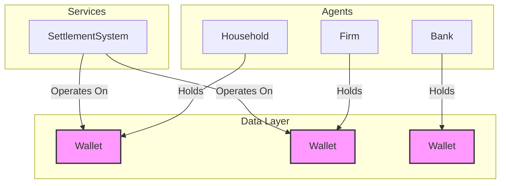

# WO-4.2A: Wallet Abstraction Layer

**Status**: 🟢 Ready for Implementation
**Target**: `modules/finance/`, `simulation/core_agents.py`, `simulation/firms.py`, etc.
**Goal**: Address `TD-179` & `TD-219` by implementing the `Wallet` Abstraction Layer (WAL) to enforce zero-sum financial integrity, eliminate direct asset dictionary manipulation, and provide a robust, automated audit trail.

---

## 1. Executive Summary

This specification details the design and system-wide integration of the `Wallet` Abstraction Layer (WAL). The WAL replaces raw `Dict[CurrencyCode, float]` asset fields in all financial agents with a dedicated `Wallet` class. This change is foundational to guaranteeing zero-sum integrity, as mandated by `ARCH_TRANSACTIONS.md`.

The `Wallet` will:
1.  **Encapsulate** asset data, preventing unauthorized modification.
2.  Provide **atomic** methods for all financial operations.
3.  **Automatically log** every balance change to an in-memory audit trail, enabling a new generation of integrity-checking tools.
4.  Offer **operator overloading** to maintain readability in agent logic.

This is a high-impact, cross-cutting change. The implementation plan is phased to ensure a controlled migration across all affected modules, including `Household`, `Firm`, `Bank`, `Government`, `CentralBank`, and the `SettlementSystem`.

## 2. System Architecture

The `Wallet` is a **low-level data structure**, not a service. It holds and manages an agent's balances. Higher-level systems, like the `SettlementSystem`, are **clients** of the `Wallet`'s API.

This enforces a strict, unidirectional dependency to prevent circular imports:



- **`Wallet`**: Has NO knowledge of any other system. Its responsibility is limited to managing its internal balances atomically and logging changes.
- **`SettlementSystem`**: Takes `Wallet` objects as parameters to perform transfers. It calls the public `Wallet` API (`add`, `subtract`).

## 3. Detailed Design

The `Wallet` and its related components will be located in a new module: `modules/finance/wallet/`.

### 3.1. API Definition (`modules/finance/wallet/api.py`)

```python
from __future__ import annotations
from typing import Dict, Protocol, runtime_checkable
from abc import abstractmethod
from dataclasses import dataclass, field

from modules.system.api import CurrencyCode, DEFAULT_CURRENCY

# --- Data Transfer Objects ---

@dataclass(frozen=True)
class WalletOpLogDTO:
    """A record of a single atomic operation on a wallet."""
    tick: int
    agent_id: int
    currency: CurrencyCode
    delta: float
    memo: str
    resulting_balance: float

# --- Interfaces ---

@runtime_checkable
class IWallet(Protocol):
    """
    Defines the public interface for a currency wallet.
    It provides methods for atomic balance manipulation and observation.
    """
    owner_id: int

    @abstractmethod
    def get_balance(self, currency: CurrencyCode = DEFAULT_CURRENCY) -> float:
        """Retrieves the balance for a specific currency."""
        ...

    @abstractmethod
    def get_all_balances(self) -> Dict[CurrencyCode, float]:
        """Returns a copy of all currency balances."""
        ...

    @abstractmethod
    def add(self, amount: float, currency: CurrencyCode = DEFAULT_CURRENCY, memo: str = "", tick: int = -1) -> None:
        """Atomically adds an amount to a currency's balance."""
        ...

    @abstractmethod
    def subtract(self, amount: float, currency: CurrencyCode = DEFAULT_CURRENCY, memo: str = "", tick: int = -1) -> None:
        """Atomically subtracts an amount from a currency's balance."""
        ...

    # --- Operator Overloading Signatures ---
    @abstractmethod
    def __add__(self, other: IWallet) -> IWallet: ...

    @abstractmethod
    def __sub__(self, other: IWallet) -> IWallet: ...

    @abstractmethod
    def __iadd__(self, other: IWallet) -> IWallet: ...

    @abstractmethod
    def __isub__(self, other: IWallet) -> IWallet: ...
```

### 3.2. Implementation (`modules/finance/wallet/wallet.py`)

```python
from __future__ import annotations
import copy
from collections import defaultdict
from typing import Dict, List
from .api import IWallet, WalletOpLogDTO, CurrencyCode, DEFAULT_CURRENCY

class InsufficientFundsError(Exception):
    """Raised when a wallet operation would result in a negative balance."""
    pass

class Wallet(IWallet):
    """
    An encapsulated, auditable container for an agent's multi-currency assets.
    """
    def __init__(self, owner_id: int, initial_balances: Dict[CurrencyCode, float], audit_log: List[WalletOpLogDTO]):
        self.owner_id = owner_id
        self._balances: Dict[CurrencyCode, float] = defaultdict(float, initial_balances)
        self._audit_log = audit_log # Shared mutable log for global auditing

    def get_balance(self, currency: CurrencyCode = DEFAULT_CURRENCY) -> float:
        return self._balances[currency]

    def get_all_balances(self) -> Dict[CurrencyCode, float]:
        return copy.copy(self._balances)

    def add(self, amount: float, currency: CurrencyCode = DEFAULT_CURRENCY, memo: str = "", tick: int = -1) -> None:
        if amount < 0:
            raise ValueError("Cannot add a negative amount. Use subtract.")
        self._balances[currency] += amount
        self._log_operation(tick, currency, amount, memo)

    def subtract(self, amount: float, currency: CurrencyCode = DEFAULT_CURRENCY, memo: str = "", tick: int = -1) -> None:
        if amount < 0:
            raise ValueError("Cannot subtract a negative amount. Use add.")
        if self._balances[currency] < amount:
            raise InsufficientFundsError(
                f"Agent {self.owner_id}: Cannot subtract {amount} {currency}. "
                f"Balance is only {self._balances[currency]}."
            )
        self._balances[currency] -= amount
        self._log_operation(tick, currency, -amount, memo)

    def _log_operation(self, tick: int, currency: CurrencyCode, delta: float, memo: str):
        log_entry = WalletOpLogDTO(
            tick=tick,
            agent_id=self.owner_id,
            currency=currency,
            delta=delta,
            memo=memo,
            resulting_balance=self._balances[currency]
        )
        self._audit_log.append(log_entry)

    # --- Operator Overloading ---
    def __add__(self, other: IWallet) -> IWallet:
        # Implementation details omitted for brevity
        pass

    def __sub__(self, other: IWallet) -> IWallet:
        pass

    def __iadd__(self, other: IWallet) -> IWallet:
        pass

    def __isub__(self, other: IWallet) -> IWallet:
        pass
```

## 4. Integration & Refactoring Plan

This refactoring will be executed system-wide.

### Step 1: `IFinancialEntity` Update

The existing `IFinancialEntity` protocol in `modules/finance/api.py` will be updated to mandate a `wallet` property.

```python
# In modules/finance/api.py
from modules.finance.wallet.api import IWallet

class IFinancialEntity(Protocol):
    id: int
    wallet: IWallet
    # ... other properties
```

### Step 2: `Household` Refactoring (WO-4.0 Compatibility)

The `EconStateDTO` will be modified to use the `IWallet` interface.

**Before (`modules/household/dtos.py`):**
```python
@dataclass
class EconStateDTO:
    assets: Dict[CurrencyCode, float]
    # ...
```

**After (`modules/household/dtos.py`):**
```python
from modules.finance.wallet.api import IWallet

@dataclass
class EconStateDTO:
    wallet: IWallet # Replaces assets Dict
    # ...
```

The `HouseholdFinancialsMixin` methods will be updated to use the wallet API.

**Before (`modules/household/mixins/_financials.py`):**
```python
def adjust_assets(self, amount: float, currency: CurrencyCode = DEFAULT_CURRENCY):
    self._econ_state.assets[currency] += amount
```

**After (`modules/household/mixins/_financials.py`):**
```python
def adjust_assets(self, amount: float, currency: CurrencyCode = DEFAULT_CURRENCY, memo: str = "", tick: int = -1):
    if amount > 0:
        self._econ_state.wallet.add(amount, currency, memo, tick)
    elif amount < 0:
        self._econ_state.wallet.subtract(abs(amount), currency, memo, tick)
```

## 5. Verification Plan & `trace_leak.py` Migration

### 5.1. `trace_leak.py` Overhaul
The current `trace_leak.py` script will be rewritten to be an **auditor** of the global `MONEY_DELTA` log generated by the wallets.

**New `trace_leak.py` Logic:**
- `Total Money Delta (Actual)` = `WorldState.get_total_money(end) - WorldState.get_total_money(start)`
- `Authorized Delta` = `sum(log.delta for log in global_audit_log if log.agent == CentralBank)`
- `Integrity Check` = `Actual Delta - Authorized Delta == 0`

## 6. Risk & Impact Audit

This design directly addresses the findings of the pre-flight audit:
-   **Isolation**: No more direct `assets` dictionary manipulation.
-   **Auditability**: Every single cent movement is recorded in a verifiable trace.
-   **Scalability**: Adding new currencies does not break agent-level arithmetic.
