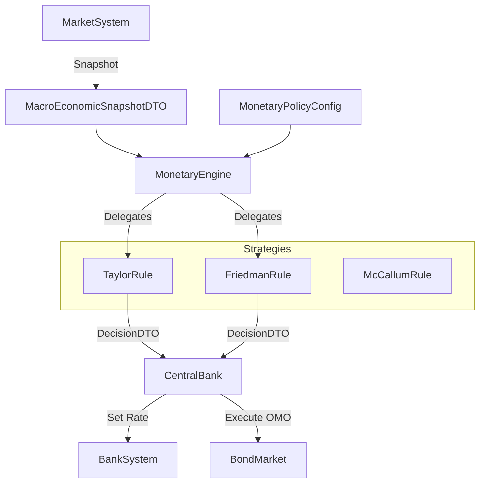

# Specification: Wave 5 Monetary Strategy Pattern

## 1. Overview
This specification details the refactoring of the Central Bank's decision-making process into a **Strategy Pattern**. This allows the simulation to switch dynamically between different economic philosophies (Keynesian vs. Monetarist) without rewriting the agent's core code.

## 2. Core Components

### 2.1. The Strategy Interface (`IMonetaryStrategy`)
Every monetary rule must implement `calculate_decision`. The input is a strictly typed `MacroEconomicSnapshotDTO` (SSoT), ensuring the Central Bank reacts to the *true* state of the economy, not an internal approximation.

### 2.2. Concrete Strategies

#### A. `TaylorRuleStrategy` (The Default)
*   **Philosophy**: Price Stability via Interest Rate Control.
*   **Logic**:
    $$i_t = r^* + \pi_t + \alpha_{\pi}(\pi_t - \pi^*) + \beta_{y}(y_t)$$
    Where $y_t$ is the Output Gap (Current GDP vs Potential GDP).
*   **Output**: Sets `target_interest_rate`. `omo_action` is typically `NONE` (assumes rate sets via signaling), or `BUY/SELL` if we model the interbank market explicitly. For V1, we assume **Rate Signaling**.

#### B. `FriedmanKPercentStrategy` (The Monetarist)
*   **Philosophy**: Control Inflation by controlling the Money Supply quantity.
*   **Logic**:
    1.  Calculate Target M2: $M2_{target} = M2_{prev} \times (1 + k)$ where $k$ is typically 3% annually.
    2.  Compare with Current M2 ($M2_{curr}$).
    3.  Delta $\Delta = M2_{target} - M2_{curr}$.
*   **Output**:
    *   If $\Delta > 0$: `target_interest_rate` = Market Rate (Ignore). `omo_action` = `BUY_BONDS` (Inject $\Delta$ cash).
    *   If $\Delta < 0$: `omo_action` = `SELL_BONDS` (Drain $\Delta$ cash).

#### C. `McCallumRuleStrategy` (The NGDP Targeter)
*   **Philosophy**: Target Nominal GDP to stabilize aggregate demand.
*   **Logic**:
    $$MB_{target} = MB_{t-1} + (NGDP^*_{growth} - V_{avg}) + \lambda(NGDP^* - NGDP_{t-1})$$
    Adjusts the Monetary Base ($MB$) to offset changes in Velocity ($V$).
*   **Output**: Similar to Friedman, but targets Base Money (Cash + Reserves) explicitly via OMO.

## 3. The OMO Execution Gap (The "How")

The `CentralBank` class must be upgraded to support **Quantity-Based Operations**.

### 3.1. Execution Logic (`CentralBank.execute_open_market_operation`)
When the strategy returns a `MonetaryDecisionDTO` with `omo_action != NONE`:

1.  **BUY_BONDS (QE)**:
    *   Bank creates a `BuyOrder` for Government Bonds on the `BondMarket`.
    *   Price: Market Price + Premium (to ensure fill).
    *   Funding: **Minting** (Negative Balance allowed for CB).
    *   Result: Bank gets Bonds, Seller gets Cash. M2 increases.

2.  **SELL_BONDS (QT)**:
    *   Bank checks its `self.bonds` portfolio.
    *   If empty -> **Force Majeure** (Cannot drain money if no assets to sell).
    *   Else -> Creates `SellOrder`.
    *   Result: Buyer gets Bonds, Bank gets Cash. Bank **Burns** the cash (removes from circulation). M2 decreases.

## 4. Architecture & Data Flow

## 5. Migration Plan (Refactoring `CentralBank`)

1.  **Rename Attributes**:
    *   `self.strategy` (Scenario) -> Keep.
    *   New: `self.monetary_policy: IMonetaryStrategy`.
    *   New: `self.monetary_config: MonetaryPolicyConfigDTO`.
2.  **Logic Swap**:
    *   In `step()`: Build `MacroEconomicSnapshotDTO`.
    *   Call `self.monetary_policy.calculate_decision(...)`.
    *   Apply `decision.target_interest_rate`.
    *   Execute `decision.omo_action`.
3.  **Backward Compatibility**:
    *   Ensure the default config instantiates `TaylorRuleStrategy` with parameters matching the old hardcoded logic.

## 6. Verification Plan

### 6.1. Unit Tests
*   **`test_taylor_rule_calculation`**: Verify math matches the formula.
*   **`test_friedman_rule_omo`**:
    *   Mock M2 = 1000. Target Growth 10%. Target = 1100.
    *   Verify Decision requests `BUY_BONDS` of 100.
*   **`test_liquidity_trap`**:
    *   Friedman Rule requests `SELL_BONDS`.
    *   Central Bank has 0 bonds.
    *   Verify graceful failure (Log warning, no crash).

### 6.2. Integration Tests
*   **Rate Transmission**: Verify that when CB sets rate, `IBankService.get_interest_rate()` reflects the change in the next tick.
*   **Inflation Response**: Inject High Inflation -> Run Taylor Strategy -> Verify Rate Increases.
