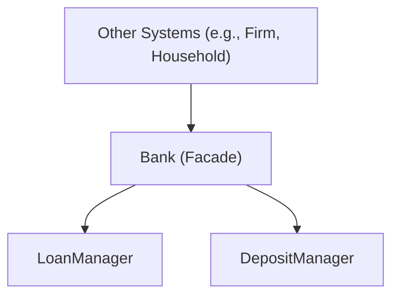

# Technical Spec: Bank Class Decomposition (TD-274)

## 1. Overview & Goal

This document outlines the technical specification for refactoring the monolithic `Bank` class to resolve **TD-274**. The current `Bank` class violates the Single Responsibility Principle (SRP) by managing deposits, loans, and central banking functions.

The goal is to decompose the `Bank` class into two distinct, single-responsibility services:
1.  `LoanManager`: Manages all aspects of the loan lifecycle.
2.  `DepositManager`: Manages all agent deposit accounts and interest calculations.

The existing `Bank` class will be repurposed as a facade, delegating calls to the appropriate manager and serving as the single point of contact for external systems like the `SettlementSystem`. This refactoring directly addresses the risks of abstraction leaks (**TD-276**, **TD-275**) and protocol bypasses (**TD-273**) identified in the pre-flight audit.

## 2. Architectural Principles

-   **Single Responsibility Principle (SRP)**: Each new manager will have one well-defined responsibility.
-   **No Raw Agent Access**: All interactions with agents (e.g., `Household`, `Firm`) **MUST** be through their unique integer IDs. Direct manipulation of agent objects or lists of agent objects is strictly forbidden, adhering to the remediation plan for **TD-276**.
-   **Protocol Compliance**: All financial transactions **MUST** use the established `SettlementSystem` and wallet interfaces (`deposit`/`withdraw`). Direct manipulation of agent assets is forbidden, addressing **TD-273** and **TD-260**.
-   **DTO Purity**: Data transfer between components and services will exclusively use strongly-typed Data Transfer Objects (DTOs).

## 3. Proposed Architecture

The `Bank` class will transition from a "God Class" to a **Facade**. It will instantiate and hold references to `LoanManager` and `DepositManager`. External callers will interact with the `Bank` facade, which will route requests to the appropriate underlying service.



## 4. Interface Definitions (`api.py`)

The public contract for the new financial services will be defined in `modules/finance/api.py`.

### 4.1. Data Transfer Objects (DTOs)

```python
# modules/finance/dtos.py
from typing import TypedDict, Literal

# --- Loan DTOs ---
LoanStatus = Literal["PENDING", "ACTIVE", "PAID", "DEFAULTED"]

class LoanApplicationDTO(TypedDict):
    applicant_id: int
    amount: float
    purpose: str
    term_months: int

class LoanDTO(TypedDict):
    loan_id: str
    borrower_id: int
    principal: float
    interest_rate: float
    term_months: int
    remaining_principal: float
    status: LoanStatus

# --- Deposit DTOs ---
class DepositDTO(TypedDict):
    owner_id: int
    balance: float
    interest_rate: float
```

### 4.2. Service Interfaces

```python
# modules/finance/api.py
from typing import Protocol, List
from .dtos import LoanApplicationDTO, LoanDTO, DepositDTO

class ILoanManager(Protocol):
    """Interface for managing the entire lifecycle of loans."""
    def submit_loan_application(self, application: LoanApplicationDTO) -> str: ...
    def process_applications(self) -> None: ...
    def service_loans(self) -> None: ...
    def get_loan_by_id(self, loan_id: str) -> LoanDTO | None: ...
    def get_loans_for_agent(self, agent_id: int) -> List[LoanDTO]: ...

class IDepositManager(Protocol):
    """Interface for managing agent deposit accounts."""
    def get_balance(self, agent_id: int) -> float: ...
    def get_deposit_dto(self, agent_id: int) -> DepositDTO | None: ...
    def calculate_and_distribute_interest(self) -> None: ...
```

## 5. Verification Plan

1.  **Isolation Tests**: Create isolated test suites for `LoanManager` and `DepositManager` using fake `AgentRegistry` and `SettlementSystem` implementations (Protocols).
2.  **Facade Verification**: Ensure `Bank` correctly delegating and maintaining backward compatibility where necessary.
3.  **M2 Integrity**: Confirm `calculate_total_money` (trace_leak.py equivalent) remains 0.0000% leakage after the split.
