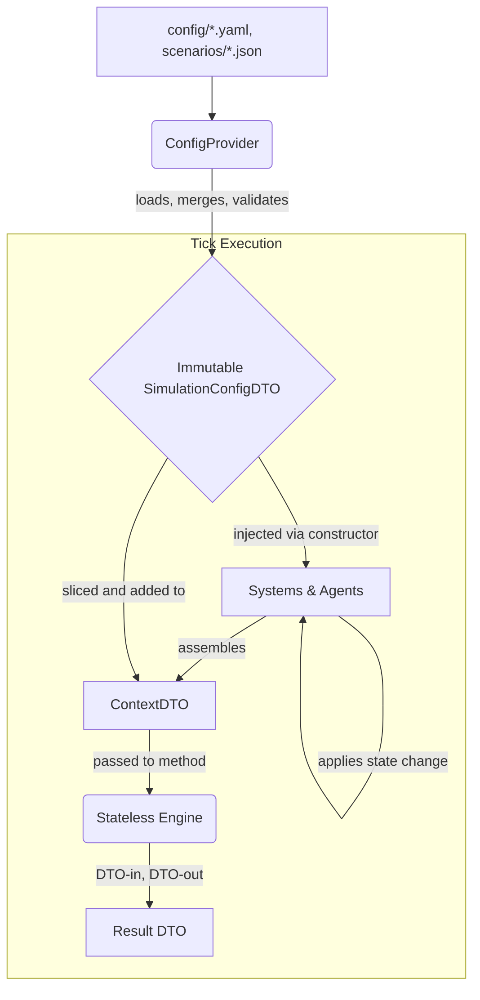

# Spec: Immutable Configuration Architecture

## 1. Introduction

- **Purpose**: This document outlines a critical architectural refactoring to replace the current mutable, globally-accessible configuration system with an immutable, DTO-based approach.
- **Scope**: The refactoring introduces a `ConfigProvider`, a set of immutable `ConfigDTOs`, and a `ContextDTO` injection pattern. It will deprecate and phase out direct `setattr` modifications of configuration objects at runtime.
- **Goals**:
    - **Determinism & Safety**: Ensure configuration is write-protected after initialization, eliminating an entire class of runtime bugs caused by unexpected state changes.
    - **Testability**: Decouple components from global state, allowing for isolated and reliable unit tests with explicit configuration.
    - **Clarity & Maintainability**: Make component dependencies explicit through constructors and method signatures, improving code readability and reducing cognitive load.
    - **Multi-Scenario Safety**: Enable the `ConfigProvider` to manage multiple, isolated simulation configurations without risk of cross-contamination.

## 2. System Architecture (High-Level)

The new configuration flow is designed to be unidirectional and immutable after initialization.



**Flow Description:**
1.  The `ConfigProvider` reads all necessary `.yaml` and `.json` configuration files at startup.
2.  It merges the base configuration with any active scenario configuration, validates the result, and constructs a frozen, nested `SimulationConfigDTO`.
3.  This single, immutable `SimulationConfigDTO` is injected into the `SimulationInitializer`, which then passes the relevant sub-DTOs down into the constructors of all systems and agents.
4.  During a tick, a System (Orchestrator) assembles a `ContextDTO` containing the required *state* and the relevant slice of its *configuration* DTO.
5.  This `ContextDTO` is passed to a stateless Engine, which performs calculations and returns a `ResultDTO`.
6.  The System receives the `ResultDTO` and is solely responsible for applying the resulting state changes to itself or other components.

## 3. Detailed Design

### 3.1. Component: `ConfigProvider`
- **Responsibility**: Acts as the single source of truth for all simulation configuration.
- **Interface (`IConfigProvider` in `modules/common/config_manager/api.py`):**
    ```python
    class IConfigProvider(Protocol):
        def get_config(self, scenario_name: Optional[str] = None) -> SimulationConfigDTO:
            """
            Loads, merges, and returns the frozen SimulationConfigDTO.
            If a scenario_name is provided, it merges that scenario over the base config.
            Caches results to prevent redundant file I/O.
            """
            ...
    ```
- **Implementation**:
    - Resides in `modules/common/config_manager/provider.py`.
    - On initialization, it scans and parses the base `config/**/*.yaml` files.
    - The `get_config` method will parse a specified `scenarios/*.json` file, merge its contents over the base configuration, and instantiate the `SimulationConfigDTO` and its nested DTOs.
    - The resulting DTO is frozen (`@dataclass(frozen=True)`) to guarantee immutability.

### 3.2. Data Model: Immutable `ConfigDTOs`
- **Definition**: All configuration will be represented by a tree of nested dataclasses, with the root being `SimulationConfigDTO`.
- **Location**: `modules/common/config_manager/dtos.py`
- **Example Structure**:
    ```python
    # modules/common/config_manager/dtos.py
    from dataclasses import dataclass, field
    from typing import Dict, List, Any

    @dataclass(frozen=True)
    class GovernmentConfigDTO:
        corporate_tax_rate: float
        income_tax_rate: float
        # ... other government-related params

    @dataclass(frozen=True)
    class ScenarioConfigDTO:
        name: str
        is_active: bool
        start_tick: int
        inflation_expectation_multiplier: float
        # ... other scenario-specific params

    @dataclass(frozen=True)
    class SimulationConfigDTO:
        num_households: int
        num_firms: int
        goods: List[str]
        government: GovernmentConfigDTO
        scenario: ScenarioConfigDTO = field(default_factory=dict)
        raw_params: Dict[str, Any] = field(default_factory=dict) # For legacy access
    ```

### 3.3. Pattern: `ContextDTO` for Engine Injection
- **Problem**: Engines currently receive entire agent instances or the global `world_state`, creating tight coupling and allowing for state mutation side-effects.
- **Solution**: Engines will now be pure, stateless functions that receive all required data (state and config) via a single `ContextDTO`.
- **Example**:
    ```python
    # modules/firm/engine.py
    from dataclasses import dataclass
    from modules.common.config_manager.dtos import FirmConfigDTO # New DTO

    @dataclass(frozen=True)
    class ProductionContext:
        """DTO containing all data needed for the production engine."""
        # --- State ---
        current_inventory: Dict[str, float]
        available_workers: int
        # --- Config ---
        firm_config: FirmConfigDTO

    class FirmEngine:
        @staticmethod
        def calculate_production(ctx: ProductionContext) -> ProductionPlanDTO:
            # Logic uses ONLY data from ctx
            # Cannot access self, sim, world_state, etc.
            ...
    ```

## 4. Phased Migration Plan

This is a high-risk, high-reward refactoring. A "big bang" approach is infeasible. The migration will be incremental.

1.  **Phase 1: Foundation**
    - Implement `ConfigProvider` and the full tree of `ConfigDTOs`.
    - Modify `SimulationInitializer` to use `ConfigProvider` to create the `SimulationConfigDTO`.
    - **Crucially**, for backward compatibility during transition, the old mutable `strategy` object can be constructed from the new `config_dto.raw_params` and attached to `sim` and `world_state`. This contains the risk while allowing incremental refactoring.

2.  **Phase 2: First Adoption (`Government` Module)**
    - Refactor `Government` and its related systems (e.g., `TaxationSystem`) to accept `GovernmentConfigDTO` in their constructors.
    - Remove all usage of `self.config_module` or `self.strategy` within these classes, using `self.config` (the injected DTO) instead.
    - Update `TestGovernment` and related tests. Test setup will now involve creating a specific `GovernmentConfigDTO` (or a full `SimulationConfigDTO`) rather than patching a global object.

3.  **Phase 3: Deprecate Runtime Mutations**
    - Refactor `Simulation._process_commands`. Instead of direct state mutation (e.g., `sim.government.corporate_tax_rate = ...`), it will now dispatch a command/event (e.g., `UpdateTaxRateCommand`).
    - The `Government` agent (Orchestrator) will handle this command, validate it, and update its own internal state. This enforces the Orchestrator pattern.

4.  **Phase 4: Incremental Rollout**
    - Repeat Phase 2 and 3 for all other modules (`Firm`, `Household`, `Bank`, etc.) one by one.
    - As modules are migrated, remove the corresponding legacy attributes from the `raw_params` in the DTO to track progress.

5.  **Phase 5: Finalization**
    - Once all modules are migrated, remove the backward-compatibility logic from `SimulationInitializer` (the creation of the mutable `strategy` object).
    - Remove all `__setattr__` overrides on `Simulation` and `WorldState`.

## 5. 검증 계획 (Testing & Verification Strategy)

- **New Test Cases**:
    - `TestConfigProvider`: Verify correct loading, merging of scenarios, and creation of `SimulationConfigDTO`. Test edge cases like malformed files.
- **Existing Test Impact**:
    - **Universal Breakage is Expected**. The fundamental pattern of test setup will change.
    - **New Pattern**: Tests will instantiate a `ConfigProvider` and use it to generate the specific `ConfigDTO` needed for the component under test. This provides explicit, hermetic test configuration.
    - **Example**:
      ```python
      # tests/systems/test_government.py
      def test_tax_collection_with_high_rates(config_provider: IConfigProvider):
          # config_provider is now a fixture that can be pointed to test-specific files
          config = config_provider.get_config(scenario="high_tax_scenario")
          tax_system = TaxationSystem(config=config.government)
          # ... rest of the test
      ```
- **Integration Check**: A full, end-to-end simulation run using a standard scenario must complete successfully after each phase of the migration. Key macroeconomic indicators (GDP, unemployment) should be compared against a baseline run to detect unintended behavioral changes.

## 6. 🚨 Risk & Impact Audit (기술적 위험 분석)

This specification directly addresses the findings of the **Pre-flight Audit**.

-   **Pervasive Test Breakage**: Acknowledged. The migration plan's core feature is a new, more robust testing pattern. The cost of rewriting tests is accepted as necessary to pay down the technical debt of untestable, coupled code.
-   **God Object Entanglement**: Acknowledged. This refactoring is the **first step** in dismantling the God Objects. By externalizing configuration and injecting it, we begin to break the hard dependencies on `Simulation` and `WorldState`. Subsequent refactorings will tackle state management.
-   **Cascading Refactoring**: Acknowledged. The phased migration plan is designed specifically to manage this risk by isolating changes to one module at a time.
-   **Direct State Mutation**: Acknowledged. Phase 3 of the migration plan explicitly replaces this anti-pattern with a proper Command/Event-driven approach, enforcing the Orchestrator pattern.
-   **Dynamic Scenario Loading**: Acknowledged. The `ConfigProvider` is designed to handle this from the ground up, making it a core, validated feature of the new architecture.

## 7. 🚨 Mandatory Reporting Verification

The insights regarding the risks of mutable configurations and the architectural path forward have been formally documented in `communications/insights/CFG-IMMUTABILITY-001.md`. This specification is the implementation plan for the strategy outlined in that report.
