```mermaid
graph TD
    subgraph TickOrchestrator [The Conductor: Execute-Sync Loop]
        direction LR
        
        Start[Tick Start] --> P0[Pre-Sequence]
        P0 --> P_PROD[Production]
        P_PROD --> P1[Decision]
        P1 --> P4_BANKRUPTCY[Lifecycle: Bankruptcy]
        P4_BANKRUPTCY --> P4_HOUSING[Lifecycle: Housing Saga]
        P4_HOUSING --> P4_LIQUIDATION[Lifecycle: Systemic Liquidation]
        P4_LIQUIDATION --> P2[Matching]
        P2 --> P3_SUB_DEBT[Tx-Decomposition: Bank & Debt]
        P3_SUB_DEBT --> P3_SUB_PROD[Tx-Decomposition: Firm Prod & Salaries]
        P3_SUB_PROD --> P3_SUB_GOV[Tx-Decomposition: Gov Programs]
        P3_SUB_GOV --> P3_SUB_TAX[Tx-Decomposition: Taxation Intents]
        P3_SUB_TAX --> P3_SUB_MONETARY[Tx-Decomposition: Monetary Processing]
        P3_SUB_MONETARY --> P3_FINAL[Transaction: Final Settlement]
        P3_FINAL --> P_CONSUMPTION[Lifecycle: Consumption]
        P_CONSUMPTION --> P5[Post-Sequence]
        P5 --> End[Tick End]
        
        %% Styling
        style Start fill:#f9f,stroke:#333,stroke-width:2px
        style P4_BANKRUPTCY fill:#ff9,stroke:#333,stroke-width:4px
        style P2 fill:#ccf,stroke:#333,stroke-width:2px
        style End fill:#f9f,stroke:#333,stroke-width:2px
    end
```

🕵️  Reviewing Code with instruction: 'Analyze this PR.'...
📖 Attached context: C:\coding\economics\design\_archive\gemini_output\pr_diff_cockpit-fe-2-macro-canvas-16208039191384492706.txt
📖 Attached context: design\1_governance\architecture\standards\INDEX.md
📖 Attached context: design\1_governance\architecture\standards\TESTING_STABILITY.md
📖 Attached context: design\1_governance\architecture\ARCH_TESTS.md
📖 Attached context: design\1_governance\architecture\standards\LIFECYCLE_HYGIENE.md
📖 Attached context: design\1_governance\architecture\ARCH_SEQUENCING.md
📖 Attached context: modules\system\api.py
📖 Attached context: design\2_operations\ledgers\TECH_DEBT_LEDGER.md
📖 Attached context: simulation\dtos\api.py
🚀 [GeminiWorker] Running task with manual: git-review.md

📝 [Review Report]
============================================================
# 🐙 Gemini CLI System Prompt: Git Reviewer

> **Worker Identity**: You are a **Gemini-CLI Subordinate Worker** (Lead Code Reviewer & Security Auditor).
> **Mission Authority**: You operate under the strict orchestration of **Antigravity (The Architect)**. 
> **Operational Protocol**: You are a content generator. You cannot execute code or modify the filesystem. Your output is a "Code Review Report" for human/Antigravity review.

---

## 🏗️ 분석 관점 (Audit Pillars)

### 1. 보안 및 하드코딩 (Security & Hardcoding)
- **CRITICAL**: API Key, 비밀번호, 외부 서버 주소 등이 하드코딩되어 있는지 검사하십시오.
- **CRITICAL**: 타 팀(타 회사)의 프로젝트 레포지토리 URL이나 경로가 포함되어 있는지 검사하십시오. (Supply Chain Attack 방지)
- 파일 경로가 상대 경로가 아닌 시스템 절대 경로로 하드코딩되어 있는지 확인하십시오.

### 2. 로직 및 정합성 (Logic & Integrity)
- **Zero-Sum**: 화폐나 자원이 시스템 내에서 이유 없이 생성(Magic Creation)되거나 소멸(Leak)되는지 확인하십시오. 특히 `assets +=` 연산 시 반대편의 `assets -=`가 있는지 확인하십시오.
- **Double-Entry for Engines**: Stateless Engine이 상태 DTO를 수정할 때, 차변(Debit)과 대변(Credit)이 균형을 이루는지 확인하십시오. ([FINANCIAL_INTEGRITY.md](../design/1_governance/architecture/standards/FINANCIAL_INTEGRITY.md) 참조)
- **Late-Reset Principle**: 틱 카운터(`xxx_this_tick`) 초기화가 비즈니스 로직 내부가 아닌 `Post-Sequence` 단계에서 수행되는지 확인하십시오. ([LIFECYCLE_HYGIENE.md](../design/1_governance/architecture/standards/LIFECYCLE_HYGIENE.md) 참조)
- **Spec 준수**: 커밋 의도와 실제 구현이 일치하는지, 누락된 요구사항(Covenants, 예외처리 등)이 있는지 확인하십시오.

### 3. 설정 및 의존성 순수성 (Configuration & Dependency Purity)
- **Stateless Engine Purity**: 
  - Engine 클래스에서 `self.state`나 `self.balance`와 같은 멤버 변수 수정을 시도하는지 엄격히 감시하십시오.
  - Engine이 Agent 핸들(`self`)을 직접 인자로 받거나 참조하는지 확인하여 즉시 지적하십시오.
  - 모든 상태 변경이 오직 Agent(Orchestrator) 클래스 내에서만 일어나는지 검증하십시오.
- **Config Access Pattern**: 설정값 접근 시 `getattr`이나 ad-hoc dictionary lookup을 지양하고, 타입이 명확한 DTO나 Wrapper 클래스를 사용하도록 권장하십시오. (매직 넘버 하드코딩 방지)

### 4. 지식 및 매뉴얼화 (Knowledge & Manualization)
- **Insight Reporting Check**: 이번 구현 과정에서 발견된 기술 부채나 인사이트가 `communications/insights/[Mission_Key].md` 파일에 기록되었는지 확인하십시오.
- **Insight Evaluation**: Jules(수행자)가 작성한 인사이트의 기술적 깊이와 정확성을 평가하십시오. 단순히 "작성됨"을 확인하는 것을 넘어, 내용의 타당성을 검토해야 합니다.
- **Decentralized Protocol**: 공용 매뉴얼(`design/2_operations/ledgers/TECH_DEBT_LEDGER.md` 등)을 직접 수정하는 대신, 미션별 독립 로그 파일이 생성되었는지 검토하십시오.
- **Template Match**: 기록된 인사이트가 `현상/원인/해결/교훈` 형식을 준수하고 실제 코드 기반의 구체적인 정보를 담고 있는지 확인하십시오.

### 5. 테스트 및 위생 (Testing & Hygiene)
- **Refactoring Sync**: 로직 리팩토링 시 관련 테스트 코드도 함께 업데이트되었는지 확인하십시오.
- **Mock Purity**: 테스트용 Mock 객체가 DTO 필드에 주입될 때, 원시값(Primitive)이 아닌 `MagicMock` 객체가 그대로 반환되도록 설정되어 있지는 않은지 확인하십시오. ([TESTING_STABILITY.md](../design/1_governance/architecture/standards/TESTING_STABILITY.md) 참조)
- **Golden Fixture Usage**: 복잡한 에이전트 생성 시 직접적인 `MagicMock` 대신 `golden_households` 등의 픽스처 사용을 권장하십시오.
- **Test Evidence**: 
  - PR 내용에 `pytest` 실행 결과(성공/실패 로그)나 로컬 테스트 통과 증거가 포함되어야 합니다.
  - "테스트 통과" 증거 없이 로직 변경만 있는 경우 **REQUEST CHANGES**를 발행하십시오.

---

## 📝 출력 명세 (Output Specifications)

반드시 **Markdown 형식**으로 작성하십시오.

### Report Structure
1.  **🔍 Summary**: 변경 사항의 핵심 요약 (3줄 이내).
2.  **🚨 Critical Issues**: 즉시 수정이 필요한 보안 위반, 돈 복사 버그, 하드코딩.
3.  **⚠️ Logic & Spec Gaps**: 기획 의도와 다른 구현, 누락된 기능, 잠재적 버그.
4.  **💡 Suggestions**: 더 나은 구현 방법이나 리팩토링 제안.
5.  **🧠 Implementation Insight Evaluation**:
    - **Original Insight**: [Jules가 작성한 `communications/insights/*.md`의 내용을 그대로 인용]
    - **Reviewer Evaluation**: [원문 인사이트에 대한 검토 및 가치 평가. 지적된 기술 부채나 교훈이 타당한지, 누락된 통찰은 없는지 기술]
6.  **📚 Manual Update Proposal (Draft)**: 
    - **Target File**: [인사이트를 추가할 기존 파일 경로 (예: `design/2_operations/ledgers/ECONOMIC_INSIGHTS.md`)]
    - **Draft Content**: [해당 파일의 템플릿에 맞춘 구체적인 업데이트 내용. 이 텍스트는 사용자가 복사하여 붙여넣을 수 있는 형태로 작성하십시오.]
    - **Note**: 당신은 직접 지시서를 수정할 수 없습니다. 제안된 텍스트 블록만을 출력하십시오.
7.  **✅ Verdict**:
    *   **APPROVE**: 모든 보안 및 로직 검사를 통과했으며, 인사이트 보고서가 정상적으로 작성된 경우.
    *   **REQUEST CHANGES (Hard-Fail)**: 
        - 보안 위반이나 로직 오류가 발견된 경우.
        - **🚨 인사이트 보고서(`communications/insights/*.md`)가 PR Diff에 포함되지 않은 경우 (가장 빈번한 실수이므로 엄기 체크하십시오).**
    *   **REJECT**: 시스템을 파괴하거나 심각한 Zero-Sum 위반이 있는 경우.

---

## 🛠️ 작업 지침 (Instructions)

1.  **Diff Only**: 제공된 **Diff 내용에 근거해서만** 판단하십시오. 추측하지 마십시오.
2.  **Line Numbers**: 문제를 지적할 때는 Diff 상의 대략적인 라인 번호나 함수명을 명시하십시오.
3.  **Strict Mode**: "이 정도면 괜찮겠지"라고 넘어가지 마십시오. 작은 하드코딩 하나도 놓치지 마십시오.


[Context Files]

File: C:\coding\economics\design\_archive\gemini_output\pr_diff_cockpit-fe-2-macro-canvas-16208039191384492706.txt
```
diff --git a/communications/insights/exec-cockpit-fe-2.md b/communications/insights/exec-cockpit-fe-2.md
new file mode 100644
index 00000000..cc177275
--- /dev/null
+++ b/communications/insights/exec-cockpit-fe-2.md
 @@ -0,0 +1,61 @@
+# Cockpit 2.0 FE-2 Insight Report
+
+## Architectural Insights
+
+### 1. Agent Service & DTOs
+- Introduced `AgentService` in `simulation/orchestration/agent_service.py` to decouple data extraction logic from the server.
+- Created `AgentBasicDTO` and `AgentDetailDTO` in `simulation/dtos/agents.py` using Pydantic for strict typing and validation.
+- `AgentBasicDTO` is lightweight for scatter plot visualization (id, type, wealth, income, expense).
+- `AgentDetailDTO` extends `AgentBasicDTO` with granular fields (needs, inventory, production, etc.) for the Inspector Panel.
+
+### 2. WebSocket & API Endpoints
+- Added `/ws/agents` WebSocket endpoint to stream `List[AgentBasicDTO]` periodically (throttled to 1Hz) for the Macro Canvas.
+- Added `/api/v1/inspector/{agent_id}` HTTP GET endpoint for fetching detailed agent data on demand, adhering to the API Contract.
+- Global `agent_service` instance manages access to simulation state.
+
+### 3. Protocol Safety
+- Used `isinstance(agent, IAgent)` checks to ensure safe access to agent properties, adhering to the "Protocol Purity" guardrail.
+- Refactored `AgentService` to avoid `hasattr` checks.
+
+### 4. Frontend Architecture
+- Implemented a Sticky Layout in `App.tsx`:
+    - Header (HUD): `sticky top-0 z-50`
+    - Main (MacroCanvas): `flex-1 overflow-y-auto`
+    - Footer (GodBar): `sticky bottom-0 z-50`
+- This ensures the UI remains usable on different screen sizes and prevents the HUD from obscuring content.
+
+## Test Evidence
+
+### Unit Tests (`tests/unit/modules/watchtower/test_agent_service.py`)
+
+```
+tests/unit/modules/watchtower/test_agent_service.py::test_get_agents_basic_empty PASSED [ 12%]
+tests/unit/modules/watchtower/test_agent_service.py::test_get_agents_basic_household PASSED [ 25%]
+tests/unit/modules/watchtower/test_agent_service.py::test_get_agents_basic_firm PASSED [ 37%]
+tests/unit/modules/watchtower/test_agent_service.py::test_get_agents_basic_inactive PASSED [ 50%]
+tests/unit/modules/watchtower/test_agent_service.py::test_get_agents_basic_limit PASSED [ 62%]
+tests/unit/modules/watchtower/test_agent_service.py::test_get_agent_detail_household PASSED [ 75%]
+tests/unit/modules/watchtower/test_agent_service.py::test_get_agent_detail_firm PASSED [ 87%]
+tests/unit/modules/watchtower/test_agent_service.py::test_get_agent_detail_not_found PASSED [100%]
+
+============================== 8 passed in 0.39s ===============================
+```
+
+### Manual Verification (`verification/verify_macro_canvas.py`)
+
+The Playwright verification script confirmed:
+1.  **Navigation**: Successfully loaded `http://localhost:5173`.
+2.  **WebSocket Connection**: "Agents Live" indicator appeared.
+3.  **Scatter Plot**: Rendered ~20 scatter points (Wealth vs Income).
+4.  **Interaction**: Clicking a point opened the Inspector Panel.
+5.  **Data Fetching**: The Inspector Panel successfully fetched details via `/api/v1/inspector/{id}` (verified via `curl` as well).
+
+```
+Navigating to app...
+...
+Waiting for Macro Canvas...
+...
+Found 20 .recharts-scatter-symbol elements.
+Clicking a scatter point...
+Verifying Inspector Panel...
+```
diff --git a/frontend/src/App.tsx b/frontend/src/App.tsx
index 9d3d9413..0066ee7c 100644
--- a/frontend/src/App.tsx
+++ b/frontend/src/App.tsx
 @@ -2,6 +2,7 @@ import './App.css';
 import { useCockpit } from './hooks/useCockpit';
 import HUD from './components/HUD';
 import GodBar from './components/GodBar';
+import MacroCanvas from './components/macro/MacroCanvas';
 
 function App() {
   const { snapshot, connected, sendCommand } = useCockpit();
 @@ -20,32 +21,22 @@ function App() {
   }
 
   return (
-    <div className="min-h-screen bg-background text-foreground flex flex-col p-4 md:p-6 gap-4 md:gap-6 relative pb-24">
-
-      {/* HUD (Heads-Up Display) */}
-      <HUD data={snapshot} />
-
-      {/* Main Content Placeholder */}
-      <main className="flex-1 glass-card rounded-2xl p-6 md:p-8 relative overflow-hidden flex flex-col items-center justify-center text-center">
-        <div className="absolute inset-0 bg-gradient-to-br from-primary/5 to-transparent pointer-events-none" />
-        <h1 className="text-3xl font-bold mb-4">Cockpit 2.0 Under Construction</h1>
-        <p className="text-muted-foreground max-w-md">
-            The foundation has been laid. Detailed views for Population, Politics, Finance, and Macroeconomics will be implemented in subsequent updates.
-        </p>
-        <div className="mt-8 grid grid-cols-2 gap-4 text-left">
-            <div className="p-4 bg-white/5 rounded border border-white/10">
-                <div className="text-xs text-muted-foreground">Ruling Party</div>
-                <div className="font-bold">{snapshot.politics.status.ruling_party}</div>
-            </div>
-            <div className="p-4 bg-white/5 rounded border border-white/10">
-                <div className="text-xs text-muted-foreground">M2 Supply</div>
-                <div className="font-bold">{snapshot.finance.supply.m2.toLocaleString()}</div>
-            </div>
-        </div>
+    <div className="h-screen bg-background text-foreground flex flex-col relative overflow-hidden">
+
+      {/* HUD (Heads-Up Display) - Sticky Top */}
+      <header className="sticky top-0 z-50 bg-background/95 backdrop-blur border-b border-border/50 px-4 py-2">
+         <HUD data={snapshot} />
+      </header>
+
+      {/* Main Content: Macro Canvas - Scrollable Area */}
+      <main className="flex-1 overflow-y-auto p-4 md:p-6">
+        <MacroCanvas />
       </main>
 
-      {/* God Bar (Command Center) */}
-      <GodBar sendCommand={sendCommand} status={snapshot.status} />
+      {/* God Bar (Command Center) - Sticky Bottom */}
+      <footer className="sticky bottom-0 z-50 bg-background/95 backdrop-blur border-t border-border/50 px-4 py-2">
+         <GodBar sendCommand={sendCommand} status={snapshot.status} />
+      </footer>
 
     </div>
   )
diff --git a/frontend/src/components/macro/InspectorPanel.tsx b/frontend/src/components/macro/InspectorPanel.tsx
new file mode 100644
index 00000000..e9a98216
--- /dev/null
+++ b/frontend/src/components/macro/InspectorPanel.tsx
 @@ -0,0 +1,183 @@
+import React, { useEffect, useState } from 'react';
+import { AgentDetailDTO } from '../../types/agents';
+
+interface InspectorPanelProps {
+    agentId: number | null;
+}
+
+const InspectorPanel: React.FC<InspectorPanelProps> = ({ agentId }) => {
+    const [detail, setDetail] = useState<AgentDetailDTO | null>(null);
+    const [loading, setLoading] = useState(false);
+    const [error, setError] = useState<string | null>(null);
+
+    useEffect(() => {
+        if (!agentId) {
+            setDetail(null);
+            return;
+        }
+
+        const fetchDetail = async () => {
+            setLoading(true);
+            setError(null);
+            try {
+                // Updated to match API contract /api/v1/inspector/{agentId}
+                const res = await fetch(`/api/v1/inspector/${agentId}`);
+                if (!res.ok) {
+                    throw new Error(`Failed to fetch agent ${agentId}: ${res.statusText}`);
+                }
+                const data = await res.json();
+                setDetail(data);
+            } catch (err: any) {
+                setError(err.message);
+            } finally {
+                setLoading(false);
+            }
+        };
+
+        fetchDetail();
+    }, [agentId]);
+
+    if (!agentId) {
+        return (
+            <div className="h-full bg-card/50 rounded-xl p-6 border border-border/50 flex items-center justify-center text-muted-foreground">
+                Select an agent from the scatter plot to inspect.
+            </div>
+        );
+    }
+
+    if (loading) {
+        return (
+            <div className="h-full bg-card/50 rounded-xl p-6 border border-border/50 flex items-center justify-center">
+                <div className="animate-spin h-8 w-8 border-4 border-primary border-t-transparent rounded-full" />
+            </div>
+        );
+    }
+
+    if (error) {
+        return (
+            <div className="h-full bg-card/50 rounded-xl p-6 border border-border/50 flex flex-col items-center justify-center text-destructive">
+                <p>Error loading agent details</p>
+                <p className="text-sm opacity-75">{error}</p>
+            </div>
+        );
+    }
+
+    if (!detail) return null;
+
+    const formatMoney = (val: number | undefined) => (val !== undefined ? `$${(val / 100).toFixed(2)}` : '-');
+
+    return (
+        <div className="h-full bg-card/50 rounded-xl p-6 border border-border/50 overflow-y-auto">
+            <div className="flex justify-between items-center mb-4 border-b border-border/50 pb-2">
+                <h3 className="text-xl font-bold">{detail.type.toUpperCase()} #{detail.id}</h3>
+                <span className={`px-2 py-1 rounded text-xs font-mono ${detail.is_active ? 'bg-green-500/20 text-green-500' : 'bg-red-500/20 text-red-500'}`}>
+                    {detail.is_active ? 'ACTIVE' : 'INACTIVE'}
+                </span>
+            </div>
+
+            <div className="space-y-4 text-sm">
+                <div className="grid grid-cols-2 gap-4">
+                    <div className="p-3 bg-background/50 rounded border border-border/30">
+                        <div className="text-xs text-muted-foreground">Total Wealth</div>
+                        <div className="font-semibold text-lg">{formatMoney(detail.wealth)}</div>
+                    </div>
+                    <div className="p-3 bg-background/50 rounded border border-border/30">
+                        <div className="text-xs text-muted-foreground">Income (Tick)</div>
+                        <div className="font-semibold text-lg text-green-400">{formatMoney(detail.income)}</div>
+                    </div>
+                </div>
+
+                {detail.type === 'household' && (
+                    <div className="space-y-2">
+                        <h4 className="font-semibold text-muted-foreground uppercase text-xs tracking-wider">Demographics</h4>
+                        <div className="grid grid-cols-2 gap-2 text-xs">
+                            <div className="flex justify-between">
+                                <span>Age:</span>
+                                <span>{detail.age?.toFixed(1)}</span>
+                            </div>
+                            <div className="flex justify-between">
+                                <span>Employer ID:</span>
+                                <span>{detail.employer_id ?? 'Unemployed'}</span>
+                            </div>
+                            <div className="flex justify-between">
+                                <span>Wage:</span>
+                                <span>{formatMoney(detail.current_wage)}</span>
+                            </div>
+                        </div>
+
+                        {detail.needs && (
+                            <div className="mt-2">
+                                <h4 className="font-semibold text-muted-foreground uppercase text-xs tracking-wider mb-1">Needs</h4>
+                                <div className="grid grid-cols-2 gap-2">
+                                    {Object.entries(detail.needs).map(([key, val]) => (
+                                        <div key={key} className="flex flex-col">
+                                            <div className="flex justify-between text-xs mb-0.5">
+                                                <span>{key}</span>
+                                                <span>{(val * 100).toFixed(0)}%</span>
+                                            </div>
+                                            <div className="h-1.5 bg-background rounded-full overflow-hidden">
+                                                <div
+                                                    className={`h-full ${val > 0.5 ? 'bg-green-500' : val > 0.2 ? 'bg-yellow-500' : 'bg-red-500'}`}
+                                                    style={{ width: `${Math.min(100, val * 100)}%` }}
+                                                />
+                                            </div>
+                                        </div>
+                                    ))}
+                                </div>
+                            </div>
+                        )}
+
+                         {detail.inventory && (
+                            <div className="mt-2">
+                                <h4 className="font-semibold text-muted-foreground uppercase text-xs tracking-wider mb-1">Inventory</h4>
+                                <div className="flex flex-wrap gap-2">
+                                    {Object.entries(detail.inventory).map(([key, val]) => (
+                                        <div key={key} className="px-2 py-1 bg-background rounded text-xs border border-border/20">
+                                            {key}: {val.toFixed(1)}
+                                        </div>
+                                    ))}
+                                </div>
+                            </div>
+                        )}
+                    </div>
+                )}
+
+                {detail.type === 'firm' && (
+                    <div className="space-y-2">
+                        <h4 className="font-semibold text-muted-foreground uppercase text-xs tracking-wider">Production</h4>
+                        <div className="grid grid-cols-2 gap-2 text-xs">
+                             <div className="flex justify-between">
+                                <span>Sector:</span>
+                                <span>{detail.sector}</span>
+                            </div>
+                            <div className="flex justify-between">
+                                <span>Employees:</span>
+                                <span>{detail.employees_count}</span>
+                            </div>
+                            <div className="flex justify-between">
+                                <span>Production:</span>
+                                <span>{detail.production?.toFixed(1)}</span>
+                            </div>
+                        </div>
+
+                        {detail.revenue_this_turn && (
+                            <div className="mt-2">
+                                <h4 className="font-semibold text-muted-foreground uppercase text-xs tracking-wider mb-1">Revenue Sources</h4>
+                                <div className="space-y-1">
+                                    {Object.entries(detail.revenue_this_turn).map(([key, val]) => (
+                                        <div key={key} className="flex justify-between text-xs">
+                                            <span>{key}</span>
+                                            <span>{formatMoney(val)}</span>
+                                        </div>
+                                    ))}
+                                </div>
+                            </div>
+                        )}
+                    </div>
+                )}
+            </div>
+        </div>
+    );
+};
+
+export default InspectorPanel;
diff --git a/frontend/src/components/macro/MacroCanvas.tsx b/frontend/src/components/macro/MacroCanvas.tsx
new file mode 100644
index 00000000..dfeb01f5
--- /dev/null
+++ b/frontend/src/components/macro/MacroCanvas.tsx
 @@ -0,0 +1,35 @@
+import React, { useState } from 'react';
+import ScatterPlot from './ScatterPlot';
+import InspectorPanel from './InspectorPanel';
+import { useAgents } from '../../hooks/useAgents';
+
+const MacroCanvas: React.FC = () => {
+    const { agents, connected } = useAgents();
+    const [selectedAgentId, setSelectedAgentId] = useState<number | null>(null);
+
+    return (
+        <div className="h-full flex gap-4">
+            {/* Main Canvas Area */}
+            <div className="flex-1 flex flex-col gap-4">
+                <div className="flex justify-between items-center bg-card/50 px-4 py-2 rounded-xl border border-border/50">
+                    <h2 className="text-xl font-bold">Macro Canvas</h2>
+                    <div className="flex items-center gap-2 text-sm">
+                        <span className={`w-2 h-2 rounded-full ${connected ? 'bg-green-500' : 'bg-red-500'}`} />
+                        {connected ? `${agents.length} Agents Live` : 'Disconnected'}
+                    </div>
+                </div>
+
+                <div className="flex-1 min-h-0 relative">
+                     <ScatterPlot agents={agents} onSelectAgent={setSelectedAgentId} />
+                </div>
+            </div>
+
+            {/* Inspector Panel Sidebar */}
+            <div className="w-80 flex-shrink-0">
+                <InspectorPanel agentId={selectedAgentId} />
+            </div>
+        </div>
+    );
+};
+
+export default MacroCanvas;
diff --git a/frontend/src/components/macro/ScatterPlot.tsx b/frontend/src/components/macro/ScatterPlot.tsx
new file mode 100644
index 00000000..0caa968d
--- /dev/null
+++ b/frontend/src/components/macro/ScatterPlot.tsx
 @@ -0,0 +1,80 @@
+import React from 'react';
+import { ResponsiveContainer, ScatterChart, Scatter, XAxis, YAxis, ZAxis, Tooltip, Legend, CartesianGrid } from 'recharts';
+import { AgentBasicDTO } from '../../types/agents';
+
+interface ScatterPlotProps {
+    agents: AgentBasicDTO[];
+    onSelectAgent: (agentId: number) => void;
+}
+
+const ScatterPlot: React.FC<ScatterPlotProps> = ({ agents, onSelectAgent }) => {
+    // Separate data for visualization
+    const households = agents.filter(a => a.type === 'household');
+    const firms = agents.filter(a => a.type === 'firm');
+
+    // Customize Tooltip
+    const CustomTooltip = ({ active, payload }: any) => {
+        if (active && payload && payload.length) {
+            const data = payload[0].payload;
+            return (
+                <div className="bg-background border border-border p-2 rounded shadow-md text-xs">
+                    <p className="font-bold">{data.type.toUpperCase()} #{data.id}</p>
+                    <p>Wealth: {(data.wealth / 100).toFixed(2)}</p>
+                    <p>Income: {(data.income / 100).toFixed(2)}</p>
+                    <p>Expense: {(data.expense / 100).toFixed(2)}</p>
+                </div>
+            );
+        }
+        return null;
+    };
+
+    return (
+        <div className="w-full h-[500px] bg-card/50 rounded-xl p-4 border border-border/50 flex flex-col">
+            <h3 className="text-lg font-semibold mb-2">Agent Distribution (Wealth vs Income)</h3>
+            <div className="flex-1 min-h-0 w-full h-[400px]">
+                <ResponsiveContainer width="100%" height={400}>
+                    <ScatterChart margin={{ top: 20, right: 20, bottom: 20, left: 20 }}>
+                        <CartesianGrid strokeDasharray="3 3" opacity={0.2} />
+                        <XAxis
+                            type="number"
+                            dataKey="wealth"
+                            name="Wealth"
+                            unit=""
+                            tickFormatter={(value) => (value / 100).toFixed(0)}
+                            label={{ value: 'Wealth ($)', position: 'insideBottomRight', offset: -10 }}
+                        />
+                        <YAxis
+                            type="number"
+                            dataKey="income"
+                            name="Income"
+                            unit=""
+                            tickFormatter={(value) => (value / 100).toFixed(0)}
+                            label={{ value: 'Income ($)', angle: -90, position: 'insideLeft' }}
+                        />
+                        <ZAxis type="number" dataKey="id" range={[50, 400]} name="ID" />
+                        <Tooltip content={<CustomTooltip />} cursor={{ strokeDasharray: '3 3' }} />
+                        <Legend />
+                        <Scatter
+                            name="Households"
+                            data={households}
+                            fill="#3b82f6"
+                            shape="circle"
+                            onClick={(data) => onSelectAgent(data.id)}
+                            cursor="pointer"
+                        />
+                        <Scatter
+                            name="Firms"
+                            data={firms}
+                            fill="#ef4444"
+                            shape="triangle"
+                            onClick={(data) => onSelectAgent(data.id)}
+                            cursor="pointer"
+                        />
+                    </ScatterChart>
+                </ResponsiveContainer>
+            </div>
+        </div>
+    );
+};
+
+export default ScatterPlot;
diff --git a/frontend/src/hooks/useAgents.ts b/frontend/src/hooks/useAgents.ts
new file mode 100644
index 00000000..0864c58f
--- /dev/null
+++ b/frontend/src/hooks/useAgents.ts
 @@ -0,0 +1,67 @@
+import { useState, useEffect } from 'react';
+import { AgentBasicDTO } from '../types/agents';
+
+export const useAgents = () => {
+    const [agents, setAgents] = useState<AgentBasicDTO[]>([]);
+    const [connected, setConnected] = useState(false);
+
+    useEffect(() => {
+        let ws: WebSocket | null = null;
+        let timeoutId: number | null = null;
+
+        const connect = () => {
+            const protocol = window.location.protocol === 'https:' ? 'wss:' : 'ws:';
+            const host = window.location.host;
+            // Use window.location.host directly which includes port if any
+            // If running via Vite proxy, it handles it.
+            // If running via static file server, it assumes backend is same host/port?
+            // Usually Vite dev server proxies /ws/agents to backend 8000.
+            // So connecting to `ws://localhost:5173/ws/agents` (Vite) proxies to `ws://localhost:8000/ws/agents`.
+            const url = `${protocol}//${host}/ws/agents`;
+
+            console.log(`Connecting to Agents WS: ${url}`);
+            ws = new WebSocket(url);
+
+            ws.onopen = () => {
+                console.log('Agents WS Connected');
+                setConnected(true);
+            };
+
+            ws.onmessage = (event) => {
+                try {
+                    const data: AgentBasicDTO[] = JSON.parse(event.data);
+                    setAgents(data);
+                } catch (e) {
+                    console.error('Error parsing agents data:', e);
+                }
+            };
+
+            ws.onclose = () => {
+                console.log('Agents WS Disconnected');
+                setConnected(false);
+                // Reconnect after 2s
+                timeoutId = window.setTimeout(connect, 2000);
+            };
+
+            ws.onerror = (error) => {
+                console.error('Agents WS Error:', error);
+                ws?.close();
+            };
+        };
+
+        connect();
+
+        return () => {
+            if (ws) {
+                // Remove listener to prevent reconnection loop on unmount
+                ws.onclose = null;
+                ws.close();
+            }
+            if (timeoutId) {
+                clearTimeout(timeoutId);
+            }
+        };
+    }, []);
+
+    return { agents, connected };
+};
diff --git a/frontend/src/types/agents.ts b/frontend/src/types/agents.ts
new file mode 100644
index 00000000..9317da0c
--- /dev/null
+++ b/frontend/src/types/agents.ts
 @@ -0,0 +1,23 @@
+export interface AgentBasicDTO {
+    id: number;
+    type: string;
+    wealth: number;
+    income: number;
+    expense: number;
+}
+
+export interface AgentDetailDTO extends AgentBasicDTO {
+    is_active: boolean;
+    // Household
+    age?: number;
+    needs?: Record<string, number>;
+    inventory?: Record<string, number>;
+    employer_id?: number;
+    current_wage?: number;
+    // Firm
+    sector?: string;
+    employees_count?: number;
+    production?: number;
+    revenue_this_turn?: Record<string, number>;
+    expenses_this_tick?: Record<string, number>;
+}
diff --git a/server.py b/server.py
index 24d8040a..9751ed8d 100644
--- a/server.py
+++ b/server.py
 @@ -6,9 +6,10 @@ import os
 from contextlib import asynccontextmanager
 # from dataclasses import asdict # Removed as we use Pydantic now
 
-from fastapi import FastAPI, WebSocket, WebSocketDisconnect, status
+from fastapi import FastAPI, WebSocket, WebSocketDisconnect, status, HTTPException
 from modules.system.builders.simulation_builder import create_simulation
 from simulation.orchestration.dashboard_service import DashboardService
+from simulation.orchestration.agent_service import AgentService
 from modules.governance.cockpit.api import CockpitCommand
 from modules.system.security import verify_god_mode_token
 from modules.demographics.genealogy.router import router as genealogy_router
 @@ -21,6 +22,7 @@ logger = logging.getLogger("server")
 # Global State
 sim = None
 dashboard_service = None
+agent_service = None
 background_task = None
 is_running = False
 is_ready = False
 @@ -53,7 +55,7 @@ async def simulation_loop():
 
 @asynccontextmanager
 async def lifespan(app: FastAPI):
-    global sim, dashboard_service, background_task, is_running, is_ready
+    global sim, dashboard_service, agent_service, background_task, is_running, is_ready
 
     # Startup
     logger.info("Initializing simulation...")
 @@ -61,6 +63,7 @@ async def lifespan(app: FastAPI):
         # overrides can be passed here if needed
         sim = create_simulation()
         dashboard_service = DashboardService(sim)
+        agent_service = AgentService(sim)
 
         is_running = True
         background_task = asyncio.create_task(simulation_loop())
 @@ -170,6 +173,38 @@ async def command_endpoint(websocket: WebSocket):
     except Exception as e:
         logger.error(f"Command WebSocket error: {e}")
 
+ @app.websocket("/ws/agents")
+async def agents_websocket_endpoint(websocket: WebSocket):
+    await websocket.accept()
+    logger.info("Client connected to /ws/agents")
+    try:
+        while True:
+            if is_ready and agent_service:
+                # Serves List[AgentBasicDTO]
+                # Default limit 500, could be parameterized via query params in connection
+                agents = agent_service.get_agents_basic(limit=500)
+                data = [a.model_dump() for a in agents]
+
+                await websocket.send_json(data)
+
+            # Throttle to 1Hz
+            await asyncio.sleep(1.0)
+    except WebSocketDisconnect:
+        logger.info("Client disconnected from /ws/agents")
+    except Exception as e:
+        logger.error(f"Agents WebSocket error: {e}")
+
+ @app.get("/api/v1/inspector/{agent_id}")
+async def get_agent_detail(agent_id: int):
+    if not is_ready or not agent_service:
+        raise HTTPException(status_code=503, detail="Simulation not ready")
+
+    agent = agent_service.get_agent_detail(agent_id)
+    if not agent:
+        raise HTTPException(status_code=404, detail="Agent not found")
+
+    return agent
+
 @app.get("/")
 def read_root():
     return {"status": "Watchtower Server Running"}
diff --git a/simulation/dtos/agents.py b/simulation/dtos/agents.py
new file mode 100644
index 00000000..cb7c982d
--- /dev/null
+++ b/simulation/dtos/agents.py
 @@ -0,0 +1,27 @@
+from typing import Dict, Any, List, Optional
+from pydantic import BaseModel
+
+class AgentBasicDTO(BaseModel):
+    id: int
+    type: str  # "household" | "firm"
+    wealth: int
+    income: int
+    expense: int
+
+class AgentDetailDTO(AgentBasicDTO):
+    # Common
+    is_active: bool
+
+    # Household specific
+    age: Optional[float] = None
+    needs: Optional[Dict[str, float]] = None
+    inventory: Optional[Dict[str, float]] = None
+    employer_id: Optional[int] = None
+    current_wage: Optional[int] = None
+
+    # Firm specific
+    sector: Optional[str] = None
+    employees_count: Optional[int] = None
+    production: Optional[float] = None
+    revenue_this_turn: Optional[Dict[str, int]] = None
+    expenses_this_tick: Optional[Dict[str, int]] = None
diff --git a/simulation/orchestration/agent_service.py b/simulation/orchestration/agent_service.py
new file mode 100644
index 00000000..49b683b6
--- /dev/null
+++ b/simulation/orchestration/agent_service.py
 @@ -0,0 +1,126 @@
+from typing import List, Optional, Any, TYPE_CHECKING
+import logging
+
+from simulation.dtos.agents import AgentBasicDTO, AgentDetailDTO
+from simulation.core_agents import Household
+from simulation.firms import Firm
+from modules.simulation.api import IAgent, IOrchestratorAgent, ISensoryDataProvider
+
+if TYPE_CHECKING:
+    from simulation.engine import Simulation
+
+logger = logging.getLogger(__name__)
+
+class AgentService:
+    def __init__(self, simulation: "Simulation"):
+        self.simulation = simulation
+
+    def get_agents_basic(self, limit: int = 500) -> List[AgentBasicDTO]:
+        """
+        Returns a lightweight list of agents for scatter plot visualization.
+        Uses IAgent/IOrchestratorAgent protocols for type safety.
+        """
+        if not self.simulation or not self.simulation.world_state:
+            return []
+
+        agents = []
+        count = 0
+
+        # Access agents directly from the registry/world_state
+        # Assuming world_state.agents is Dict[int, IAgent]
+        all_agents = self.simulation.world_state.agents.values()
+
+        for agent in all_agents:
+            # Protocol-based check
+            if isinstance(agent, IAgent):
+                if not agent.is_active:
+                    continue
+            else:
+                # If agent doesn't implement IAgent (e.g. system agents?), skip or include based on policy
+                # For scatter plot, we only care about entities with wealth/income (Households/Firms)
+                # which are IOrchestratorAgent usually.
+                pass
+
+            # Only map known types that implement required properties
+            if isinstance(agent, (Household, Firm)):
+                 dto = self._map_to_basic_dto(agent)
+                 if dto:
+                    agents.append(dto)
+                    count += 1
+                    if count >= limit:
+                        break
+
+        return agents
+
+    def get_agent_detail(self, agent_id: int) -> Optional[AgentDetailDTO]:
+        """
+        Returns detailed information for a specific agent.
+        """
+        if not self.simulation or not self.simulation.world_state:
+            return None
+
+        agent = self.simulation.world_state.agents.get(agent_id)
+        if not agent:
+            return None
+
+        return self._map_to_detail_dto(agent)
+
+    def _map_to_basic_dto(self, agent: Any) -> Optional[AgentBasicDTO]:
+        try:
+            if isinstance(agent, Household):
+                return AgentBasicDTO(
+                    id=agent.id,
+                    type="household",
+                    wealth=agent.total_wealth,
+                    income=agent.labor_income_this_tick,
+                    expense=agent._econ_state.consumption_expenditure_this_tick_pennies
+                )
+            elif isinstance(agent, Firm):
+                # Calculate total expense for this tick across all currencies (simplified sum for visualization)
+                expense = sum(agent.finance_state.expenses_this_tick.values())
+                # Calculate total revenue for this turn
+                income = sum(agent.finance_state.revenue_this_turn.values())
+
+                return AgentBasicDTO(
+                    id=agent.id,
+                    type="firm",
+                    wealth=agent.total_wealth,
+                    income=int(income),
+                    expense=int(expense)
+                )
+        except Exception as e:
+            logger.warning(f"Failed to map agent {agent.id} to basic DTO: {e}")
+            return None
+        return None
+
+    def _map_to_detail_dto(self, agent: Any) -> Optional[AgentDetailDTO]:
+        basic = self._map_to_basic_dto(agent)
+        if not basic:
+            return None
+
+        try:
+            if isinstance(agent, Household):
+                return AgentDetailDTO(
+                    **basic.model_dump(),
+                    is_active=agent.is_active,
+                    age=agent.age,
+                    needs=agent._bio_state.needs,
+                    inventory=agent.inventory,
+                    employer_id=agent.employer_id,
+                    current_wage=agent.current_wage
+                )
+            elif isinstance(agent, Firm):
+                return AgentDetailDTO(
+                    **basic.model_dump(),
+                    is_active=agent.is_active,
+                    sector=agent.sector,
+                    employees_count=len(agent.hr_state.employees),
+                    production=agent.current_production,
+                    revenue_this_turn=agent.finance_state.revenue_this_turn,
+                    expenses_this_tick=agent.finance_state.expenses_this_tick
+                )
+        except Exception as e:
+            logger.warning(f"Failed to map agent {agent.id} to detail DTO: {e}")
+            return None
+
+        return None
diff --git a/tests/unit/modules/watchtower/test_agent_service.py b/tests/unit/modules/watchtower/test_agent_service.py
new file mode 100644
index 00000000..b222bb54
--- /dev/null
+++ b/tests/unit/modules/watchtower/test_agent_service.py
 @@ -0,0 +1,138 @@
+import pytest
+from unittest.mock import MagicMock
+from simulation.orchestration.agent_service import AgentService
+from simulation.core_agents import Household
+from simulation.firms import Firm
+from modules.simulation.api import IAgent
+
+# Helper to attach attributes to mock since spec=Class prevents setting new attributes
+def create_mock_household(id):
+    h = MagicMock(spec=Household)
+    h.id = id
+    h.is_active = True
+    h.total_wealth = 5000
+    h.labor_income_this_tick = 200
+
+    # Mocking internal state objects
+    econ = MagicMock()
+    econ.consumption_expenditure_this_tick_pennies = 150
+    h._econ_state = econ
+
+    bio = MagicMock()
+    bio.needs = {"food": 0.5}
+    h._bio_state = bio
+
+    h.inventory = {"apple": 2}
+    h.employer_id = 201
+    h.current_wage = 1000
+    h.age = 30
+
+    return h
+
+def create_mock_firm(id):
+    f = MagicMock(spec=Firm)
+    f.id = id
+    f.is_active = True
+    f.total_wealth = 10000
+
+    fin = MagicMock()
+    fin.revenue_this_turn = {"USD": 500}
+    fin.expenses_this_tick = {"USD": 300}
+    f.finance_state = fin
+
+    hr = MagicMock()
+    hr.employees = [MagicMock(), MagicMock()]
+    f.hr_state = hr
+
+    f.sector = "FOOD"
+    f.current_production = 50.0
+
+    return f
+
+ @pytest.fixture
+def mock_simulation():
+    sim = MagicMock()
+    sim.world_state = MagicMock()
+    return sim
+
+ @pytest.fixture
+def agent_service(mock_simulation):
+    return AgentService(mock_simulation)
+
+def test_get_agents_basic_empty(agent_service, mock_simulation):
+    mock_simulation.world_state.agents = {}
+    result = agent_service.get_agents_basic()
+    assert result == []
+
+def test_get_agents_basic_household(agent_service, mock_simulation):
+    household = create_mock_household(101)
+    mock_simulation.world_state.agents = {101: household}
+
+    result = agent_service.get_agents_basic()
+    assert len(result) == 1
+    dto = result[0]
+    assert dto.id == 101
+    assert dto.type == "household"
+    assert dto.wealth == 5000
+    assert dto.income == 200
+    assert dto.expense == 150
+
+def test_get_agents_basic_firm(agent_service, mock_simulation):
+    firm = create_mock_firm(201)
+    mock_simulation.world_state.agents = {201: firm}
+
+    result = agent_service.get_agents_basic()
+    assert len(result) == 1
+    dto = result[0]
+    assert dto.id == 201
+    assert dto.type == "firm"
+    assert dto.wealth == 10000
+    assert dto.income == 500
+    assert dto.expense == 300
+
+def test_get_agents_basic_inactive(agent_service, mock_simulation):
+    agent = create_mock_household(101)
+    agent.is_active = False
+
+    mock_simulation.world_state.agents = {101: agent}
+
+    result = agent_service.get_agents_basic()
+    assert len(result) == 0
+
+def test_get_agents_basic_limit(agent_service, mock_simulation):
+    agents = {}
+    for i in range(10):
+        agents[i] = create_mock_household(i)
+
+    mock_simulation.world_state.agents = agents
+
+    result = agent_service.get_agents_basic(limit=5)
+    assert len(result) == 5
+
+def test_get_agent_detail_household(agent_service, mock_simulation):
+    household = create_mock_household(101)
+    mock_simulation.world_state.agents = {101: household}
+
+    result = agent_service.get_agent_detail(101)
+    assert result is not None
+    assert result.id == 101
+    assert result.age == 30
+    assert result.needs == {"food": 0.5}
+    assert result.inventory == {"apple": 2}
+    assert result.current_wage == 1000
+
+def test_get_agent_detail_firm(agent_service, mock_simulation):
+    firm = create_mock_firm(201)
+    mock_simulation.world_state.agents = {201: firm}
+
+    result = agent_service.get_agent_detail(201)
+    assert result is not None
+    assert result.id == 201
+    assert result.sector == "FOOD"
+    assert result.employees_count == 2
+    assert result.production == 50.0
+
+def test_get_agent_detail_not_found(agent_service, mock_simulation):
+    mock_simulation.world_state.agents = {}
+    result = agent_service.get_agent_detail(999)
+    assert result is None
diff --git a/tests/verify_agents_api.py b/tests/verify_agents_api.py
new file mode 100644
index 00000000..91616d40
--- /dev/null
+++ b/tests/verify_agents_api.py
 @@ -0,0 +1,86 @@
+import sys
+import os
+import time
+import subprocess
+import requests
+import websocket
+import json
+import signal
+
+def main():
+    # Start server
+    print("Starting server...")
+    server_process = subprocess.Popen(
+        [sys.executable, "server.py"],
+        stdout=subprocess.PIPE,
+        stderr=subprocess.PIPE,
+        text=True
+    )
+
+    try:
+        # Wait for server to be ready
+        print("Waiting for server to be ready...")
+        max_retries = 30
+        server_ready = False
+        for i in range(max_retries):
+            try:
+                resp = requests.get("http://localhost:8000/")
+                if resp.status_code == 200:
+                    server_ready = True
+                    break
+            except requests.exceptions.ConnectionError:
+                pass
+            time.sleep(1)
+            print(f"Retrying connection... {i+1}/{max_retries}")
+
+        if not server_ready:
+            print("Server failed to start.")
+            stdout, stderr = server_process.communicate(timeout=5)
+            print("STDOUT:", stdout)
+            print("STDERR:", stderr)
+            sys.exit(1)
+
+        print("Server is ready.")
+
+        # Test WebSocket
+        print("Testing WebSocket /ws/agents...")
+        ws = websocket.create_connection("ws://localhost:8000/ws/agents")
+        result = ws.recv()
+        data = json.loads(result)
+        ws.close()
+
+        print(f"Received {len(data)} agents from WebSocket.")
+        if len(data) == 0:
+            print("Warning: No agents received. Simulation might be empty or initializing.")
+        else:
+            first_agent = data[0]
+            print("First Agent Basic DTO:", first_agent)
+
+            # Test API
+            agent_id = first_agent['id']
+            print(f"Testing API /api/agents/{agent_id}...")
+            resp = requests.get(f"http://localhost:8000/api/agents/{agent_id}")
+            if resp.status_code == 200:
+                detail = resp.json()
+                print("Agent Detail DTO received successfully.")
+                print("Keys:", detail.keys())
+            else:
+                print(f"Failed to fetch agent details. Status: {resp.status_code}")
+                print(resp.text)
+                sys.exit(1)
+
+    except Exception as e:
+        print(f"Verification failed: {e}")
+        # Print server logs if possible
+        # server_process.terminate()
+        # stdout, stderr = server_process.communicate()
+        # print("Server Output:\n", stdout)
+        # print("Server Error:\n", stderr)
+        sys.exit(1)
+    finally:
+        print("Stopping server...")
+        server_process.terminate()
+        server_process.wait()
+
+if __name__ == "__main__":
+    main()
diff --git a/verification/debug.png b/verification/debug.png
new file mode 100644
index 00000000..8325df71
Binary files /dev/null and b/verification/debug.png differ
diff --git a/verification/debug_v3.png b/verification/debug_v3.png
new file mode 100644
index 00000000..fb8dd71f
Binary files /dev/null and b/verification/debug_v3.png differ
diff --git a/verification/failure.png b/verification/failure.png
new file mode 100644
index 00000000..0c058650
Binary files /dev/null and b/verification/failure.png differ
diff --git a/verification/failure_v2.png b/verification/failure_v2.png
new file mode 100644
index 00000000..e0a6b790
Binary files /dev/null and b/verification/failure_v2.png differ
diff --git a/verification/verify_macro_canvas.py b/verification/verify_macro_canvas.py
new file mode 100644
index 00000000..58769f2b
--- /dev/null
+++ b/verification/verify_macro_canvas.py
 @@ -0,0 +1,71 @@
+import os
+import time
+from playwright.sync_api import sync_playwright, expect
+
+def test_macro_canvas(page):
+    # Capture console logs
+    page.on("console", lambda msg: print(f"BROWSER CONSOLE: {msg.text}"))
+
+    print("Navigating to app...")
+    page.goto("http://localhost:5173")
+
+    # Wait for Macro Canvas to load
+    print("Waiting for Macro Canvas...")
+    expect(page.get_by_text("Macro Canvas")).to_be_visible(timeout=10000)
+
+    # Wait for connection indicator
+    print("Waiting for connection...")
+    expect(page.get_by_text("Agents Live")).to_be_visible(timeout=30000)
+
+    # Wait for scatter plot to render points
+    print("Waiting for scatter points...")
+    time.sleep(5) # Give some time for rendering
+
+    # Count svg elements
+    svgs = page.locator("svg")
+    print(f"Found {svgs.count()} SVGs.")
+
+    # Count paths and circles
+    paths = page.locator("path")
+    circles = page.locator("circle")
+    print(f"Found {paths.count()} paths.")
+    print(f"Found {circles.count()} circles.")
+
+    # Try to find symbols
+    symbols = page.locator(".recharts-scatter-symbol")
+    count = symbols.count()
+    print(f"Found {count} .recharts-scatter-symbol elements.")
+
+    if count == 0:
+        # Dump HTML of chart area
+        chart = page.locator(".recharts-responsive-container")
+        if chart.count() > 0:
+            print("Chart HTML:", chart.inner_html())
+        else:
+            print("Chart container not found.")
+
+    # Take debug screenshot
+    os.makedirs("verification", exist_ok=True)
+    page.screenshot(path="verification/debug_v3.png")
+
+    if count > 0:
+        print("Clicking a scatter point...")
+        symbols.first.click()
+
+        # Verify Inspector Panel
+        print("Verifying Inspector Panel...")
+        expect(page.locator("h3").filter(has_text="#")).to_be_visible()
+    else:
+        print("No points found to click!")
+        raise Exception("No scatter points found")
+
+if __name__ == "__main__":
+    with sync_playwright() as p:
+        browser = p.chromium.launch(headless=True)
+        page = browser.new_page()
+        try:
+            test_macro_canvas(page)
+        except Exception as e:
+            print(f"Test failed: {e}")
+        finally:
+            browser.close()

```

File: design\1_governance\architecture\standards\INDEX.md
```
# ⚖️ Architectural Standards Index

Welcome to the central repository of architectural rules and coding patterns for the Economics simulation. These standards ensure the integrity, testability, and scalability of our "Living Digital Economy".

---

## 🏛️ 1. Design Patterns
- **[SEO_PATTERN.md](./SEO_PATTERN.md)**: Stateless Engine & Orchestrator. The foundational logic/state separation.
- **[FINANCIAL_INTEGRITY.md](./FINANCIAL_INTEGRITY.md)**: The Penny Standard, Double-Entry rules, and Zero-Sum enforcement.

## 🔌 2. Infrastructure & Lifecycle
- **[LIFECYCLE_HYGIENE.md](./LIFECYCLE_HYGIENE.md)**: Tick sequencing, Late-Reset principle, and state transition safety.
- **[TESTING_STABILITY.md](./TESTING_STABILITY.md)**: Mock Purity, Golden Fixtures, and library-less environment stability.

## ⚡ 3. Performance Optimization
- **Iterator Efficiency**: When combining large sequences (e.g., `Transaction` lists), prefer `itertools.chain` over list concatenation (`+`) to save memory/CPU.

---

## 🚀 How to use these Standards
1. **In Specs**: Reference the specific standard file (e.g., "Must follow [SEO_PATTERN.md]") in the design principles section.
2. **In Reviews**: Use these files as criteria for checking `Hard-Fail` violations.
3. **In Audits**: Map violations back to the specific standard IDs defined in these documents.
```

File: design\1_governance\architecture\standards\TESTING_STABILITY.md
```
# 🧪 Testing Standard: Integrity & Stability

## 🔍 Context
Test failures in isolated/lean environments often stem from brittle mocks and library dependencies that drift from production code.

---

## 🛡️ Hard Rules

### 1. Mock Purity (Preventing MagicMock Poisoning)
- **Primitive Injection is Mandatory**: When mocking objects or their sub-states (e.g., `agent.social_state`), you MUST configure the mock to return primitive values (int, float, bool, str) for any attributes that will be accessed. By default, a `MagicMock` returns another `MagicMock`, which is not serializable.
  - **WRONG (CRITICAL VIOLATION)**: `h = MagicMock()` -> `h.social_state.conformity` returns another `MagicMock`. This will crash any system that creates a DTO from this agent.
  - **RIGHT**: `h.social_state.conformity = 0.5`.
- **Serialization Check**: Any mock that will be passed into a `get_state_dto()` call, logged, or persisted MUST be configured to respond with serializable types for all accessed attributes.

### 2. Golden Fixture Priority
- **Prefer Real State**: Test logic MUST prefer loading a "Golden Sample" (a serialized snapshot of a real agent state) over manual `MagicMock` construction for complex objects like `Firm` or `Household`. Manual mocks are brittle and cause "Test Mock Drift" as production code evolves.
- **Standard Fixtures**: Use the pre-defined fixtures `golden_households`, `golden_firms`, and `golden_ledger` from `conftest.py` whenever possible.
- **Mock Factories**: If a custom mock is unavoidable, it should be generated via a dedicated Factory function that ensures all necessary attributes and DTO-related fields are populated with correct primitive types.

### 3. External Dependency Faking
- **Fake Objects**: For complex libraries like `numpy` or `yaml`, use specialized "Fake" classes (e.g., `FakeNumpy`) that implement the minimal interface with primitive return values.

### 4. Protocol Compliance
- **Strict Mocking**: Always create mocks with `spec=IProtocol` (e.g., `MagicMock(spec=IFinancialEntity)`) to ensure the mock fails immediately if the underlying interface changes. This prevents "Mock Drift" where tests pass against an outdated API.

### 5. Test Collection & Packaging
- **Explicit Packages**: All subdirectories within `tests/` MUST contain an `__init__.py` file to be recognized as proper Python packages. This prevents `import file mismatch` errors and namespace collisions during test collection.
- **Unique Test Filenames**: Test files should be named uniquely across the entire project (e.g., `test_service_unit.py` vs `test_service_int.py`) to avoid conflicts when `pytest` collects tests from multiple directories.
- **Absolute Path Resolution**: Code that loads configuration files or resources (e.g., `SchemaLoader`) MUST resolve paths relative to `__file__` using `pathlib.Path`, rather than relying on `os.getcwd()` or relative paths. This ensures tests run correctly regardless of the execution context.

---

## 🚨 Violations
- **Severity: High**: Tests failing with `MagicMock is not JSON serializable`.
- **Severity: Medium**: Over-mocking that hides real logic drift between Agents and DTOs.

```

File: design\1_governance\architecture\ARCH_TESTS.md
```
# Unit Test Architecture & Cleanup Campaign Reference

## Executive Summary
This document provides a comprehensive and up-to-date overview of the unit test architecture within the `tests/unit/` directory. The test suite is extensive, but its structure has grown organically, leading to many misplaced files and inconsistent testing patterns. This analysis serves as a master reference to guide the ongoing effort to clean up, restructure, and improve the unit tests for better maintainability and clarity.

## 1. Structural Analysis of Test Failures
Recent test failures (e.g., `TypeError`, `AttributeError`, `Dataclass` issues) are primarily symptoms of a large-scale architectural refactoring. The core reasons are:

- **Constructor Mismatches**: The most common failure is a `TypeError` on `Household.__init__()` and `Firm.__init__()`. Tests are using outdated constructor signatures (e.g., passing `id=...`). The new architecture requires `core_config: AgentCoreConfigDTO` and `engine: IDecisionEngine` arguments, which are missing in dozens of test setups.
- **DTO/State Object Transition**: The codebase has migrated from direct object attribute manipulation (e.g., `agent.assets = 100`) to using nested, often immutable, Data Transfer Objects (DTOs) (e.g., `EconStateDTO`). Tests written for the old architecture fail with `AttributeError` when they try to access or set attributes that now reside within a DTO (e.g., `context.state.econ_state.wallet`).
- **Inconsistent/Incomplete Mocking**: Mocks are frequently not updated to reflect new realities. This leads to `AttributeError` when a test tries to access a newly added attribute on an old mock (e.g., a mock `config` object missing `profit_history_ticks`). It also causes `TypeError` when a `MagicMock` returns another mock instead of a primitive value (e.g., comparing a mock to an `int`).
- **Component-Based Refactoring**: Logic is being moved from large agent classes (e.g., `Household`) into smaller, focused components or managers (e.g., `ConsumptionManager`, `LifecycleComponent`). Tests targeting the old agent methods are now obsolete or fail because the logic has moved.
- **API and Protocol Drift**: Method signatures in interfaces (Protocols) have changed (e.g., `withdraw()` now requires a `currency` keyword argument), but test mocks have not been updated, causing `TypeError` on keyword arguments.
- **SSoT Balance Verification (Critical)**: Following "Dual-Write Elimination," tests MUST NOT assert against `Agent.assets`. All balance checks must query the `SettlementSystem` SSoT (e.g., `settlement_system.get_balance(agent.id)`). Failure to do so leads to `TD-TEST-SSOT-SYNC` debt.

## 2. Module-to-Source Mapping & Relocation Plan

The following table maps each unit test file to its source module and provides a **Target Path** for the recommended restructuring. Files in the `tests/unit` root are the highest priority for relocation.

| Current Test Path | Source Module Tested | Recommended Target Path |
| :--- | :--- | :--- |
| `tests/unit/factories.py` | _Test Helper/Factory_ | `tests/unit/helpers/factories.py` |
| `tests/unit/test_ai_driven_firm_engine.py` | `simulation/decisions/ai_driven_firm_engine.py` | `tests/unit/simulation/decisions/test_ai_driven_firm_engine.py` |
| `tests/unit/test_ai_training_manager.py` | `simulation/ai/ai_training_manager.py` | `tests/unit/simulation/ai/test_ai_training_manager.py` |
| `tests/unit/test_api_extensions.py` | `simulation/viewmodels/economic_indicators_viewmodel.py` | `tests/unit/simulation/viewmodels/test_economic_indicators_viewmodel.py` |
| `tests/unit/test_api_history.py` | _N/A (Placeholder)_ | _(Remove or Implement)_ |
| `tests/unit/test_bank.py` | `simulation/bank.py` | `tests/unit/simulation/test_bank.py` |
| `tests/unit/test_bank_decomposition.py` | `simulation/bank.py` | `tests/unit/simulation/test_bank.py` (Merge) |
| `tests/unit/test_config_parity.py` | `config.py`, `simulation/utils/config_factory.py` | `tests/unit/utils/test_config_parity.py` |
| `tests/unit/test_consumption_manager_survival.py` | `simulation/decisions/household/consumption_manager.py` | `tests/unit/modules/household/test_consumption_manager.py` (Merge) |
| `tests/unit/test_diagnostics.py` | `simulation/world_state.py` | `tests/unit/simulation/test_world_state_diagnostics.py` |
| `tests/unit/test_factories.py` | `simulation/orchestration/factories.py` | `tests/unit/simulation/orchestration/test_factories.py` |
| `tests/unit/test_firms.py` | `simulation/firms.py` | `tests/unit/simulation/agents/test_firm.py` |
| `tests/unit/test_firm_profit.py` | `simulation/firms.py` | `tests/unit/simulation/agents/test_firm.py` (Merge) |
| `tests/unit/test_handlers_fix.py` | `simulation/systems/handlers/*` | `tests/unit/simulation/systems/handlers/` (Distribute) |
| `tests/unit/test_household_ai.py` | `simulation/ai/household_ai.py` | `tests/unit/simulation/ai/test_household_ai.py` |
| `tests/unit/test_household_decision_engine_new.py`| `simulation/decisions/ai_driven_household_engine.py` | `tests/unit/simulation/decisions/household/test_ai_driven_household_engine.py` (Merge) |
| `tests/unit/test_household_refactor.py` | `simulation/core_agents.py` (`Household`) | `tests/unit/simulation/agents/test_household.py` |
| `tests/unit/test_household_system2.py` | `simulation/ai/household_system2.py` | `tests/unit/simulation/ai/test_household_system2.py` |
| `tests/unit/test_learning_tracker.py` | `simulation/ai/learning_tracker.py` | `tests/unit/simulation/ai/test_learning_tracker.py` |
| `tests/unit/test_ledger_manager.py` | `scripts/ledger_manager.py` | `tests/unit/scripts/test_ledger_manager.py` |
| `tests/unit/test_logger.py` | `utils/logger.py` | `tests/unit/utils/test_logger.py` |
| `tests/unit/test_market_adapter.py` | `modules/market/api.py` | `tests/unit/modules/market/test_api.py` |
| `tests/unit/test_marketing_roi.py` | `simulation/firms.py` (Marketing Logic) | `tests/unit/simulation/agents/test_firm.py` (Merge) |
| `tests/unit/test_markets_v2.py` | `simulation/markets/order_book_market.py` | `tests/unit/simulation/markets/test_order_book_market.py` (Merge) |
| `tests/unit/test_monetary_ledger_repayment.py` | `modules/government/components/monetary_ledger.py` | `tests/unit/modules/government/components/test_monetary_ledger.py` |
| `tests/unit/test_phase1_refactor.py` | `simulation/orchestration/phases.py` | `tests/unit/simulation/orchestration/test_phases.py` |
| `tests/unit/test_portfolio_macro.py` | `simulation/decisions/portfolio_manager.py` | `tests/unit/simulation/decisions/test_portfolio_manager.py` |
| `tests/unit/test_real_estate_lien.py` | `simulation/models.py` | `tests/unit/simulation/test_models.py` |
| `tests/unit/test_repository.py` | `simulation/db/repository.py` | `tests/unit/simulation/db/test_repository.py` |
| `tests/unit/test_sensory_purity.py` | `simulation/systems/sensory_system.py` | `tests/unit/simulation/systems/test_sensory_system.py` |
| `tests/unit/test_socio_tech.py` | `simulation/ai/household_ai.py` | `tests/unit/simulation/ai/test_household_ai.py` (Merge) |
| `tests/unit/test_stock_market.py` | `simulation/markets/stock_market.py` | `tests/unit/simulation/markets/test_stock_market.py` |
| `tests/unit/test_taxation_system.py` | `modules/government/taxation/system.py` | `tests/unit/modules/government/taxation/test_system.py` |
| `tests/unit/test_tax_collection.py` | `simulation/agents/government.py` | `tests/unit/simulation/agents/test_government.py` (Merge) |
| `tests/unit/test_tax_incidence.py` | `simulation/engine.py` (Integration) | `tests/unit/simulation/test_engine_integrations.py` |
| `tests/unit/test_transaction_engine.py` | `modules/finance/transaction/engine.py` | `tests/unit/modules/finance/transaction/test_engine.py` |
| `tests/unit/test_transaction_processor.py` | `simulation/systems/transaction_processor.py` | `tests/unit/simulation/systems/test_transaction_processor.py` |
| `tests/unit/test_watchtower_hardening.py` | `simulation/metrics/economic_tracker.py`, `...` | `tests/unit/simulation/metrics/test_economic_tracker.py` |
| `tests/unit/test_wo157_dynamic_pricing.py`| `simulation/components/engines/sales_engine.py` | `tests/unit/simulation/components/engines/test_sales_engine.py` |
| `tests/unit/agents/test_government.py` | `simulation/agents/government.py` | `tests/unit/simulation/agents/test_government.py` (Merge) |
| `tests/unit/components/test_agent_lifecycle.py`| `simulation/components/agent_lifecycle.py` | `tests/unit/simulation/components/test_agent_lifecycle.py` |
| `tests/unit/components/test_demographics_component.py`| `simulation/components/demographics_component.py` | `tests/unit/simulation/components/test_demographics_component.py` |
| `tests/unit/components/test_market_component.py`| `simulation/components/market_component.py` | `tests/unit/simulation/components/test_market_component.py` |
| `tests/unit/corporate/*` | `simulation/decisions/firm/*` | `tests/unit/simulation/decisions/firm/` (Relocate files) |
| `tests/unit/decisions/*` | `simulation/decisions/*` | `tests/unit/simulation/decisions/` (Relocate files) |
| `tests/unit/finance/call_market/test_service.py`| `modules/finance/call_market/service.py` | `tests/unit/modules/finance/call_market/test_service.py` |
| `tests/unit/finance/test_bank_service_interface.py`| `simulation/bank.py`, `modules/finance/api.py` | `tests/unit/modules/finance/test_bank_service_interface.py` |
| `tests/unit/finance/test_credit_scoring.py` | `modules/finance/credit_scoring.py` | `tests/unit/modules/finance/test_credit_scoring.py` |
| `tests/unit/finance/test_finance_system_refactor.py`| `modules/finance/system.py` | `tests/unit/modules/finance/test_system.py` (Merge) |
| `tests/unit/governance/test_judicial_system.py` | `modules/governance/judicial/system.py` | `tests/unit/modules/governance/judicial/test_system.py` |
| `tests/unit/household/engines/*` | `modules/household/engines/*` | `tests/unit/modules/household/engines/` (Relocate files) |
| `tests/unit/household/test_snapshot_assembler.py`| `modules/household/services.py` | `tests/unit/modules/household/test_services.py` |
| `tests/unit/markets/*` | `simulation/markets/*`, `modules/market/*` | `tests/unit/simulation/markets/` & `tests/unit/modules/market/` |
| `tests/unit/modules/analysis/test_bubble_observatory.py`| `modules/analysis/bubble_observatory.py` | (No change) |
| `tests/unit/modules/common/config/test_impl.py` | `modules/common/config/impl.py` | (No change) |
| `tests/unit/modules/common/config_manager/test_config_manager.py` | `modules/common/config_manager/impl.py` | (No change) |
| `tests/unit/modules/finance/central_bank/test_cb_service.py` | `modules/finance/central_bank/service.py` | (No change) |
| `tests/unit/modules/finance/*` | `modules/finance/*` | (Distribute files) |
| `tests/unit/modules/government/components/*` | `modules/government/components/*` | (No change) |
| `tests/unit/modules/government/*` | `modules/government/*` | (Distribute files) |
| `tests/unit/modules/household/*` | `modules/household/*` | (No change) |
| `tests/unit/modules/memory/test_memory_v2.py` | `modules/memory/V2/*` | (No change) |
| `tests/unit/modules/system/execution/*` | `modules/system/execution/*` | (No change) |
| `tests/unit/orchestration/*` | `simulation/orchestration/*` | `tests/unit/simulation/orchestration/` (Relocate files) |
| `tests/unit/sagas/test_orchestrator.py` | `modules/finance/sagas/orchestrator.py` | `tests/unit/modules/finance/sagas/test_orchestrator.py` |
| `tests/unit/systems/handlers/*` | `simulation/systems/handlers/*`, `modules/market/handlers/*`| (Distribute files) |
| `tests/unit/systems/*` | `simulation/systems/*` | `tests/unit/simulation/systems/` (Relocate files) |
| `tests/unit/utils/test_config_factory.py` | `simulation/utils/config_factory.py` | `tests/unit/simulation/utils/test_config_factory.py` |

## 3. Coverage Gaps
Based on the comprehensive file review, the following source modules still appear to be **untested or undertested**:

- **`modules/analytics/`**: Core analytics logic and services.
- **`modules/events/`**: DTOs and event definitions.
- **`modules/hr/`**: The main HR service and components.
- **`modules/housing/`**: The `modules/housing` directory exists but has no tests.
- **`modules/inventory/`**: The core inventory management logic.
- **`modules/memory/`**: V1 of the memory system.
- **`modules/simulation/`**: The API/DTOs module itself lacks specific validation tests.
- **`scripts/`**: Most scripts are untested, with the exception of `ledger_manager.py`.

## 4. Test File Count by Domain
The test suite is heavily focused on `systems`, `decisions`, `agents`, and `finance`.

| Domain | Test File Count | Notes |
| :--- | :--- | :--- |
| **Agents & Core (`simulation`)** | ~10 | `test_firms`, `test_household_refactor`, `test_bank`, etc. |
| **AI & Decisions (`simulation`)** | ~25 | `test_ai_*`, `decisions/*`, `corporate/*`. High volume, needs consolidation. |
| **Finance (`modules`)** | ~11 | `finance/*`, `modules/finance/*`, `sagas/*`. |
| **Government (`modules`)** | ~6 | `test_government`, `modules/government/*`, etc. |
| **Household (`modules`)** | ~10 | `household/*`, `modules/household/*`. |
| **Systems (`simulation`/`modules`)** | ~30+ | `systems/*`, `test_transaction_processor`, etc. Largest category. |
| **Markets (`simulation`/`modules`)** | ~7 | `test_markets*`, `test_stock_market`, etc. |
| **Framework/Utils** | ~10 | `test_logger`, `test_repository`, `factories.py`, `mocks`, etc. |
| **Total** | **~100+** | Some files test multiple domains. |

## 5. Recommended Restructuring
The current structure, with a majority of files in the `tests/unit` root, is difficult to navigate. The presence of subdirectories like `agents/` and `modules/` is a good start, but this organization must be completed to mirror the source code.

**Recommendation:** Strictly mirror the `modules/` and `simulation/` source code structure within `tests/unit/`.

### Proposed `tests/unit/` Structure:
```
tests/unit/
├── simulation/
│   ├── ai/
│   ├── agents/
│   ├── components/
│   ├── db/
│   ├── decisions/
│   │   ├── household/
│   │   └── firm/
│   ├── markets/
│   ├── orchestration/
│   ├── systems/
│   │   └── handlers/
│   └── ...
├── modules/
│   ├── analysis/
│   ├── common/
│   │   ├── config/
│   │   └── config_manager/
│   ├── finance/
│   │   ├── call_market/
│   │   ├── central_bank/
│   │   └── sagas/
│   ├── governance/
│   ├── household/
│   │   └── engines/
│   ├── market/
│   └── ...
├── scripts/
└── utils/
```

### Action Items for Cleanup Campaign:

1.  **Create New Directory Structure:** Implement the proposed directory structure in `tests/unit/`.
2.  **Move Existing Tests:** Relocate each test file from its current location to its new **Target Path** as specified in the table above.
3.  **Update Imports:** Adjust relative and absolute imports within the moved test files to ensure they can still find their source modules and helpers.
4.  **Consolidate Duplicates:** Merge tests for the same module into a single, comprehensive file. For example, `test_ai_training_manager.py` and `test_ai_training_manager_new.py` should become one file at `tests/unit/simulation/ai/test_ai_training_manager.py`.
5.  **Address Gaps:** Begin creating new test files for the untested modules identified in the "Coverage Gaps" section, placing them in the correct new directory from the start.
6.  **Review Skipped Tests:** Systematically review tests marked with ` @pytest.mark.skip` or ` @unittest.skip`. Determine if they are obsolete and can be deleted, or if they need to be updated to test the new DTO-based, component-driven architecture.
```

```

File: design\1_governance\architecture\standards\LIFECYCLE_HYGIENE.md
```
# ⏱️ Infrastructure Standard: Lifecycle Hygiene

## 🔍 Context
Deterministic outcomes rely on strict sequencing of events within a simulation tick.

---

## 🛡️ Hard Rules

### 1. The Late-Reset Principle
- **Counter Persistence**: "Tick-Level" metrics (e.g., `revenue_this_tick`, `expenses_this_tick`) MUST persist through all active simulation phases (transaction generation, learning, etc.) until the end of the tick.
- **Designated Reset Phase**: Resetting of tick-level counters MUST only occur in a designated final phase, such as `Post-Sequence` or `EndOfTick`.
- **Anti-Pattern (Forbidden)**: Resetting counters inside the `generate_transactions` phase or any mid-tick agent logic is a CRITICAL violation. This leads to data loss for analytics, logging, and learning systems operating in later phases of the same tick.

### 2. Birth/Death Atomicity
- **Registry Sync**: When an agent is born or dies, the `AgentRepository`, `SettlementSystem`, and `DemographicManager` MUST be updated atomically within the same transaction or sequence.
- **Inheritance Cleanup**: Dying agents MUST have their assets completely liquidated or transferred via `InheritanceManager` before the object is purged to prevent monetary leaks.

---

## 🚨 Violations
- **Severity: Medium**: Resetting state counters too early, leading to blind spots in analytics.
- **Severity: High**: "Ghost Agents" remaining in the Registry after death.

```

File: design\1_governance\architecture\ARCH_SEQUENCING.md
```
# Architecture Detail: Phased Orchestration (The Implemented Sequence)

## 1. 개요 (Overview)
본 시뮬레이션의 모든 상태 변경은 **구현된 시퀀스(The Implemented Sequence)**라 불리는 다단계 프로세스를 엄격히 준수합니다. 이는 `tick_orchestrator.py`에 정의된 실제 실행 순서로, 기존 설계('The Sacred Sequence')에서 진화한 형태입니다. 핵심적인 변화는 각 페이즈(Phase) 실행 직후 상태를 즉시 동기화하는 **"실행-동기화(Execute-Sync)"** 루프를 도입하여, 상태 변경의 원자성과 예측 가능성을 새로운 방식으로 보장합니다.

## 2. 시퀀스 다이어그램 (Sequence Diagram)


## 3. 상세 단계 설명 (Detailed Phase Descriptions)

**핵심 변경점**: 각 페이즈는 `SimulationState` DTO를 수정하며, 페이즈 종료 직후 `_drain_and_sync_state` 메서드가 호출되어 변경 사항(`effects_queue`, `transactions` 등)을 즉시 `WorldState`에 반영합니다. 페이즈는 더 이상 순수 함수(Pure Function)가 아니며, 실행 즉시 전역 상태에 영향을 미칩니다.

### Phase 0: 전처리 (Preprocessing)
- **Actor**: `Phase0_PreSequence`
- **Action**: 시스템 안정화, 예정된 이벤트 실행, 초기 상태 스냅샷 저장.

### Phase 0.5: 생산 (Production)
- **Actor**: `Phase_Production`
- **Action**: 실물 재화 생산량을 결정합니다. 이는 에이전트들이 의사결정을 내리기 전에 시장의 총 공급량을 확정하기 위함입니다.

### Phase 1: 결정 (Decisions)
- **Actor**: `Phase1_Decision`
- **Action**: 모든 에이전트(가계, 기업 등)가 현재 시장 상태를 기반으로 행동(`Order`, `Intent`)을 결정합니다.

### Phase 4 (Reordered): 라이프사이클 Part 1 (Lifecycle)
- **Actor**: `Phase_Bankruptcy`, `Phase_HousingSaga`, `Phase_SystemicLiquidation`
- **Action**: 파산, 주택담보대출 연체 처리 등 에이전트의 생존과 관련된 구조적 변경을 **시장 매칭 전에** 처리합니다.
- **Rationale (Critical)**: 이는 경제적 현실을 반영한 중대한 변경입니다. 파산한 에이전트는 시장에 참여할 수 없으므로, 그들의 주문(Order)은 매칭 단계 이전에 시스템에서 제거되어야 합니다. 이로 인해 기존의 "인지-계약-집행" 순서는 "인지-**정리(선제적)**-계약-집행"으로 변경되었습니다.

### Phase 2: 매칭 (Matching)
- **Actor**: `Phase2_Matching`
- **Action**: 살아남은 에이전트들의 `Order`들을 매칭하여 `Transaction` 객체를 생성합니다.

### Phase 3 (Decomposed): 거래 처리 (Transaction Processing)
- **Actors**: `Phase_BankAndDebt`, `Phase_FirmProductionAndSalaries`, `Phase_GovernmentPrograms`, `Phase_TaxationIntents`, `Phase_MonetaryProcessing`, `Phase3_Transaction`
- **Action**: 단일 책임 원칙(SRP)에 따라, 기존의 거대한 거래(Transaction) 페이즈가 여러 개의 세분화된 단계로 분해되었습니다. 부채 처리, 임금 지급, 정부 지출, 세금 의향 생성, 통화 정책 반영 등이 순차적으로 실행된 후, 마지막 `Phase3_Transaction`에서 모든 거래가 최종 정산됩니다. 이 구조는 화폐 공급량 검증(`MONEY_SUPPLY_CHECK`)의 정확성을 보장하는 데 필수적입니다.

### Phase (Late Lifecycle): 소비 (Consumption)
- **Actor**: `Phase_Consumption`
- **Action**: 모든 소득과 이전이 확정된 후, 최종적인 재화 소비 활동을 처리합니다.

### Phase 5: 후처리 (Post-Sequence)
- **Actor**: `Phase5_PostSequence`
- **Action**: 학습 보상 계산, 통계 지표 집계, 다음 틱을 위한 데이터 정리 및 버퍼 플러시를 수행합니다.

## 4. 아키텍처적 의의 (Architectural Significance)

### 4.1. God Object와 "실행-동기화" 루프 (God Object & The "Execute-Sync" Loop)
이전의 "DTO 폭포수" 모델은 폐기되었습니다. 현재 아키텍처는 `WorldState`라는 중앙 집중적 "God Object"와, 각 페이즈가 수정하는 가변적인 `SimulationState` "God DTO"에 의존합니다.

가장 중요한 아키텍처적 제약은 **`_drain_and_sync_state`** 메서드입니다. 이 메서드는 **모든 페이즈 실행 직후 호출**되어, 페이즈가 생성한 임시 데이터(ex: `effects_queue`, `transactions`)를 `WorldState`에 즉시 병합하고 DTO의 큐를 비웁니다. 이 "실행-동기화" 루프는 페이즈 간 상태 공유의 새로운 '기본 진실(Ground Truth)'이며, 더 이상 상태가 틱의 마지막에만 업데이트된다고 가정할 수 없습니다.

### 4.2. 경제적 인과관계의 재정의 (Redefined Economic Causality)
'신성한 시퀀스'의 "인지 → 계약 → 집행 → 정리" 원칙은 다음과 같이 재정의되었습니다.
**"인지 → 선제적 정리(파산) → 계약(매칭) → 분해된 집행(세부 거래) → 최종 정리(소비 및 후처리)"**
특히, **파산 처리(`Phase_Bankruptcy`)가 시장 매칭(`Phase2_Matching`)보다 먼저** 오는 것은 시스템의 경제적 논리에 근본적인 변화를 의미하며, 모든 테스트와 분석은 이 새로운 인과관계를 따라야 합니다.

### 4.3. "순결성 게이트" 원칙의 폐기 (Deprecation of the "Purity Gate")
"Phase 1에서는 상태를 직접 수정하지 않는다"는 기존 원칙은 더 이상 유효하지 않습니다. 모든 페이즈는 `SimulationState` DTO를 통해 `WorldState`에 즉시 영향을 미치는 부수 효과(Side-effect)를 가집니다. 각 페이즈는 독립적이고 순수한 함수가 아니라, 하나의 거대한 트랜잭션 내의 상호 의존적인 단계들로 이해되어야 합니다.

```

File: modules\system\api.py
```
from __future__ import annotations
from abc import ABC, abstractmethod
from typing import Any, Dict, List, Optional, Protocol, Union, runtime_checkable, TYPE_CHECKING, TypedDict
from dataclasses import dataclass, field
from enum import IntEnum, auto
from pydantic import BaseModel, Field

# Define Currency Code (Usually String "USD")
CurrencyCode = str
DEFAULT_CURRENCY: CurrencyCode = "USD"
AgentID = int

 @dataclass
class MarketContextDTO:
    """
    Context object passed to agents for making decisions.
    Contains strictly external market data (prices, rates, signals).
    """
    market_data: Dict[str, Any]
    market_signals: Dict[str, int]
    tick: int
    # Represents currency exchange rates relative to base currency
    exchange_rates: Optional[Dict[str, float]] = None

 @dataclass(frozen=True)
class MarketSignalDTO:
    market_id: str
    item_id: str
    best_bid: Optional[int]
    best_ask: Optional[int]
    last_traded_price: Optional[int]
    last_trade_tick: int
    price_history_7d: List[int]
    volatility_7d: float
    order_book_depth_buy: int
    order_book_depth_sell: int
    total_bid_quantity: float
    total_ask_quantity: float
    is_frozen: bool

 @dataclass(frozen=True)
class HousingMarketUnitDTO:
    unit_id: str
    price: int
    quality: float
    rent_price: Optional[int] = None

 @dataclass(frozen=True)
class HousingMarketSnapshotDTO:
    for_sale_units: List[HousingMarketUnitDTO]
    units_for_rent: List[HousingMarketUnitDTO]
    avg_rent_price: float
    avg_sale_price: float

 @dataclass(frozen=True)
class LoanMarketSnapshotDTO:
    interest_rate: float

 @dataclass(frozen=True)
class LaborMarketSnapshotDTO:
    avg_wage: float

 @dataclass(frozen=True)
class MarketSnapshotDTO:
    """
    A pure-data snapshot of the state of all markets at a point in time.
    """
    tick: int
    market_signals: Dict[str, MarketSignalDTO]
    market_data: Dict[str, Any]
    housing: Optional[HousingMarketSnapshotDTO] = None
    loan: Optional[LoanMarketSnapshotDTO] = None
    labor: Optional[LaborMarketSnapshotDTO] = None

class AgentBankruptcyEventDTO(TypedDict):
    agent_id: int
    tick: int
    inventory: Dict[str, float]

 @dataclass(frozen=True)
class PublicManagerReportDTO:
    tick: int
    newly_recovered_assets: Dict[str, float]
    liquidation_revenue: Dict[str, int]
    managed_inventory_count: float
    system_treasury_balance: Dict[str, int]

class OriginType(IntEnum):
    """
    Priority Level for Parameter Updates.
    Higher value = Higher Priority.
    """
    SYSTEM = 0          # Internal logic (Hardcoded defaults)
    CONFIG = 10         # Loaded from file (User Configuration)
    USER = 50           # Dashboard/UI manual override
    GOD_MODE = 100      # Absolute override (Scenario Injection)

class RegistryValueDTO(BaseModel):
    """
    Data Transfer Object for Registry Values.
    Replaces the legacy RegistryEntry dataclass.
    """
    key: str
    value: Any
    domain: str = "global"
    origin: OriginType
    is_locked: bool = False
    last_updated_tick: int = 0
    metadata: Dict[str, Any] = Field(default_factory=dict)

# Alias for backward compatibility if needed, but we prefer RegistryValueDTO
RegistryEntry = RegistryValueDTO

class RegistryObserver(Protocol):
    def on_registry_update(self, key: str, value: Any, origin: OriginType) -> None:
        ...

 @runtime_checkable
class IConfigurationRegistry(Protocol):
    """
    Interface for the Global Registry acting as the Single Source of Truth (SSoT)
    for all simulation parameters.
    """

    def get(self, key: str, default: Any = None) -> Any:
        """
        Retrieves a configuration value.
        Must support dynamic resolution (always fetch current value).
        """
        ...

    def set(self, key: str, value: Any, origin: OriginType = OriginType.USER) -> None:
        """
        Updates a configuration value with a specified origin.
        Should trigger any registered listeners for this key.
        """
        ...

    def snapshot(self) -> Dict[str, Any]:
        """
        Returns a complete snapshot of the current configuration state.
        Useful for serialization or debugging.
        """
        ...

    def reset_to_defaults(self) -> None:
        """
        Resets all configuration values to their SYSTEM or CONFIG defaults,
        clearing USER overrides.
        """
        ...

 @runtime_checkable
class IGlobalRegistry(Protocol):
    """
    Interface for the Global Parameter Registry.
    FOUND-01: Centralized Configuration Management.
    """
    def get(self, key: str, default: Any = None) -> Any:
        ...

    def set(self, key: str, value: Any, origin: OriginType = OriginType.CONFIG) -> bool:
        ...

    def lock(self, key: str) -> None:
        ...

    def unlock(self, key: str) -> None:
        ...

    def subscribe(self, observer: RegistryObserver, keys: Optional[List[str]] = None) -> None:
        ...

    def snapshot(self) -> Dict[str, RegistryValueDTO]:
        ...

    def get_metadata(self, key: str) -> Any:
        ...

    def get_entry(self, key: str) -> Optional[RegistryValueDTO]:
        ...

 @runtime_checkable
class IRestorableRegistry(IGlobalRegistry, Protocol):
    """
    Extended interface for Registries that support state restoration/undo operations.
    Required for CommandService rollback functionality.
    """
    def delete_entry(self, key: str) -> bool:
        """
        Removes an entry completely. Used when rolling back a creation.
        Returns True if successful.
        """
        ...

    def restore_entry(self, key: str, entry: RegistryValueDTO) -> bool:
        """
        Restores a specific entry state (value + origin + lock).
        Used when rolling back a modification.
        Returns True if successful.
        """
        ...

 @runtime_checkable
class IProtocolEnforcer(Protocol):
    """
    Interface for test utilities that enforce strict protocol adherence.
    """

    def assert_implements_protocol(self, instance: Any, protocol: Any) -> None:
        """
        Verifies that an instance implements all methods and attributes
        defined in the protocol. Raises AssertionError if not.
        """
        ...

class IAgentRegistry(Protocol):
    def get_agent(self, agent_id: Any) -> Any:
        ...

    def get_all_financial_agents(self) -> List[Any]:
        ...

    def set_state(self, state: Any) -> None:
        ...

 @runtime_checkable
class ICurrencyHolder(Protocol):
    """
    Protocol for agents/systems that hold currency.
    Used for M2 Money Supply calculation.
    """
    def get_balance(self, currency: CurrencyCode = DEFAULT_CURRENCY) -> int:
        ...

    def get_assets_by_currency(self) -> Dict[CurrencyCode, int]:
        ...

class IAssetRecoverySystem(Protocol):
    """
    Interface for the Public Manager acting as a receiver of assets.
    """
    def process_bankruptcy_event(self, event: AgentBankruptcyEventDTO) -> None:
        """
        Ingests assets from a bankrupt agent.
        """
        ...

    def receive_liquidated_assets(self, inventory: Dict[str, float]) -> None:
        """
        Receives inventory from a firm undergoing liquidation (Asset Buyout).
        """
        ...

    def generate_liquidation_orders(self, market_signals: Dict[str, MarketSignalDTO], core_config: Any = None, engine: Any = None) -> List[Any]:
        """
        Generates SELL orders to liquidate managed assets into the market.
        """
        ...

```

File: design\2_operations\ledgers\TECH_DEBT_LEDGER.md
```
# Technical Debt Ledger (TECH_DEBT_LEDGER.md)

| ID | Module / Component | Description | Priority / Impact | Status |
| :--- | :--- | :--- | :--- | :--- |
| **TD-CONF-GHOST-BIND** | Config | **Ghost Constants**: Modules bind config values at import time, preventing runtime hot-swap. | **Medium**: Dynamic Tuning. | **Identified** |
| **TD-TEST-TX-MOCK-LAG** | Testing | **Transaction Test Lag**: `test_transaction_engine.py` mocks are out of sync with `ITransactionParticipant` (overdraft support). | **Low**: Test Flakiness. | **Identified** |
| **TD-INT-BANK-ROLLBACK** | Finance | **Rollback Coupling**: Bank rollback logic dependent on `hasattr` implementation details. | **Low**: Abstraction Leak. | Open |
| **TD-ARCH-DI-SETTLE** | Architecture | **DI Timing**: `AgentRegistry` injection into `SettlementSystem` happens post-initialization. | **Low**: Initialization fragility. | Open |
| **TD-UI-DTO-PURITY** | Cockpit | **Manual Deserialization**: UI uses raw dicts/manual mapping for Telemetry. Needs `pydantic`. | **Medium**: Code Quality. | Open |
| **TD-PROC-TRANS-DUP** | Logic | **Handler Redundancy**: Logic overlap between legacy `TransactionManager` and new `TransactionProcessor`. | **Medium**: Maintenance. | **Resolved** |
| **TD-TRANS-INT-SCHEMA** | Transaction | **Schema Lag**: `Transaction` model (simulation/models.py) still uses `float` price. | **High**: Persistence Drift. | **Resolved** |
| **TD-DEPR-GOV-TAX** | Government | **Legacy API**: `Government.collect_tax` is deprecated. Use `settle_atomic`. | **Low**: Technical Debt. | Open |
| **TD-DEPR-FACTORY** | Factory | **Stale Path**: `agent_factory.HouseholdFactory` is stale. Use `household_factory`. | **Low**: Technical Debt. | Open |
| **TD-DEPR-STOCK-DTO** | Market | **Legacy DTO**: `StockOrder` is deprecated. Use `CanonicalOrderDTO`. | **Low**: Technical Debt. | Open |

---
> [!NOTE]
> ✅ **Resolved Debt History**: For clarity, all resolved technical debt items and historical lessons have been moved to [TECH_DEBT_HISTORY.md](./TECH_DEBT_HISTORY.md).

---

## 📓 Implementation Lessons & Detailed Debt (Open)

---
### ID: TD-CONF-GHOST-BIND
### Title: Ghost Constant Binding (Import Time)
- **Symptom**: `from config import MIN_WAGE` locks the value of `MIN_WAGE` at the moment of import.
- **Risk**: Changing the value in `GlobalRegistry` at runtime (e.g., God Mode) has no effect on modules that already imported the constant.
- **Solution**: Use a `ConfigProxy` or `DynamicConfig` object that resolves values at access time (`config.MIN_WAGE`).

---
### ID: TD-PROC-TRANS-DUP
### Title: Transaction Logic Duplication
- **Symptom**: Similar transaction processing logic exists in `TransactionManager` (Legacy) and `TransactionProcessor` (New).
- **Risk**: Fixes applied to one might not apply to the other, leading to divergent behavior.
- **Solution**: Deprecate `TransactionManager` and route all traffic through `TransactionProcessor`.

```

File: simulation\dtos\api.py
```
from __future__ import annotations
from dataclasses import dataclass, field
from typing import Dict, Any, Optional, List, TYPE_CHECKING, Union, TypedDict
from modules.simulation.dtos.api import FirmStateDTO, HouseholdConfigDTO, FirmConfigDTO
from simulation.models import Order
from simulation.dtos.decision_dtos import DecisionOutputDTO
from modules.finance.api import IFinancialAgent
from modules.simulation.api import AgentID
from modules.governance.api import SystemCommand
from simulation.dtos.commands import GodCommandDTO

# Alias for standardization
OrderDTO = Order


if TYPE_CHECKING:
    from simulation.core_agents import Household
    from simulation.firms import Firm
    from simulation.dtos.scenario import StressScenarioConfig
    from modules.household.dtos import HouseholdStateDTO

 @dataclass
class TransactionData:
    run_id: int
    time: int
    buyer_id: AgentID
    seller_id: AgentID
    item_id: str
    quantity: float
    price: float
    total_pennies: int # Added for Reporting DTO Hardening
    currency: CurrencyCode  # Added for Phase 33
    market_id: str
    transaction_type: str

 @dataclass
class AgentStateData:
    run_id: int
    time: int
    agent_id: AgentID
    agent_type: str
    assets: Dict[CurrencyCode, int] # Changed for Phase 33 (Hardened to int)
    is_active: bool
    is_employed: Optional[bool] = None
    employer_id: Optional[AgentID] = None
    needs_survival: Optional[float] = None
    needs_labor: Optional[float] = None
    inventory_food: Optional[float] = None
    current_production: Optional[float] = None
    num_employees: Optional[int] = None
    education_xp: Optional[float] = None
    generation: Optional[int] = 0
    # Experiment: Time Allocation Tracking
    time_worked: Optional[float] = None
    time_leisure: Optional[float] = None

 @dataclass
class EconomicIndicatorData:
    run_id: int
    time: int
    unemployment_rate: Optional[float] = None
    avg_wage: Optional[float] = None
    food_avg_price: Optional[float] = None
    food_trade_volume: Optional[float] = None
    avg_goods_price: Optional[float] = None
    total_production: Optional[float] = None
    total_consumption: Optional[int] = None
    total_household_assets: Optional[int] = None # Changed for Reporting DTO Hardening (Pennies)
    total_firm_assets: Optional[int] = None # Changed for Reporting DTO Hardening (Pennies)
    total_food_consumption: Optional[int] = None
    total_inventory: Optional[float] = None
    avg_survival_need: Optional[float] = None
    total_labor_income: Optional[int] = None # Changed for Reporting DTO Hardening (Pennies)
    total_capital_income: Optional[int] = None # Changed for Reporting DTO Hardening (Pennies)
    # Phase 23: Education & Opportunity Metrics
    avg_education_level: Optional[float] = None
    education_spending: Optional[float] = None
    education_coverage: Optional[float] = None
    brain_waste_count: Optional[int] = None

 @dataclass
class MarketHistoryData:
    time: int
    market_id: str
    item_id: Optional[str] = None
    avg_price: Optional[float] = None
    trade_volume: Optional[float] = None
    best_ask: Optional[float] = None
    best_bid: Optional[float] = None
    avg_ask: Optional[float] = None
    avg_bid: Optional[float] = None
    worst_ask: Optional[float] = None
    worst_bid: Optional[float] = None

 @dataclass
class AIDecisionData:
    run_id: int
    tick: int
    agent_id: AgentID
    decision_type: str
    decision_details: Optional[Dict[str, Any]] = None
    predicted_reward: Optional[float] = None
    actual_reward: Optional[float] = None

class GoodsDTO(TypedDict, total=False):
    id: str
    name: str
    category: str
    is_durable: bool
    is_essential: bool
    initial_price: int
    base_need_satisfaction: float
    quality_modifier: float
    # Fields from goods.json
    type: str
    satiety: float
    decay_rate: float

class MarketHistoryDTO(TypedDict, total=False):
    avg_price: float
    trade_volume: float
    best_ask: int
    best_bid: int
    avg_ask: float
    avg_bid: float
    worst_ask: int
    worst_bid: int

# Phase 1: MarketSnapshotDTO moved to modules.system.api
from modules.system.api import (
    CurrencyCode, # Added for Phase 33
    MarketSnapshotDTO,
    HousingMarketSnapshotDTO,
    LoanMarketSnapshotDTO,
    LaborMarketSnapshotDTO,
    HousingMarketUnitDTO,
    MarketContextDTO # Refactored to TypedDict in modules.system.api
)
# Phase 1: EconomicIndicatorsDTO from modules.simulation.api
from modules.simulation.api import EconomicIndicatorsDTO

 @dataclass
class GovernmentPolicyDTO:
    """A pure-data snapshot of current government policies affecting agent decisions."""
    income_tax_rate: float
    sales_tax_rate: float
    corporate_tax_rate: float
    base_interest_rate: float

 @dataclass
class DecisionInputDTO:
    """
    Standardized input DTO for agent decision-making.
    Encapsulates all external system inputs passed to make_decision.
    """
    market_snapshot: MarketSnapshotDTO
    goods_data: List[Dict[str, Any]]
    market_data: Dict[str, Any]
    current_time: int
    fiscal_context: Optional[FiscalContext] = None
    macro_context: Optional[MacroFinancialContext] = None
    stress_scenario_config: Optional[Any] = None # Avoid circular import with StressScenarioConfig if possible, or use forward ref
    government_policy: Optional[GovernmentPolicyDTO] = None
    agent_registry: Optional[Dict[str, int]] = None
    housing_system: Optional[Any] = None # Added for Saga initiation
    market_context: Optional[MarketContextDTO] = None


 @dataclass
class DecisionContext:
    """
    A pure data container for decision-making.
    Direct agent instance access is strictly forbidden (Enforced by Purity Gate).
    """
    goods_data: List[GoodsDTO]
    market_data: Dict[str, MarketHistoryDTO]
    current_time: int
    
    # State DTO representing the agent's current condition
    state: Union[HouseholdStateDTO, FirmStateDTO]
    
    # Static configuration values relevant to the agent type
    config: Union[HouseholdConfigDTO, FirmConfigDTO]

    # New DTOs
    market_snapshot: Optional[MarketSnapshotDTO] = None
    government_policy: Optional[GovernmentPolicyDTO] = None

    stress_scenario_config: Optional[StressScenarioConfig] = None # Phase 28

    # Agent Discovery Registry (WO-138)
    agent_registry: Dict[str, AgentID] = field(default_factory=dict)

    # Tick-Snapshot Injection
    market_context: Optional[MarketContextDTO] = None


 @dataclass
class FiscalContext:
    """
    Context providing access to fiscal entities (Government) in a restricted manner.
    Used by agents to interact with the government (e.g., paying taxes, receiving subsidies)
    without direct access to the full Government agent object.
    """
    government: IFinancialAgent


 @dataclass
class SimulationState:
    """
    WO-103: Simulation State DTO to reduce coupling.
    Passes all necessary data from the Simulation object to system services.
    """
    time: int
    households: List[Household]
    firms: List[Firm]
    agents: Dict[AgentID, Any]
    markets: Dict[str, Any]
    government: Any  # Government
    bank: Any        # Bank
    central_bank: Any # CentralBank
    escrow_agent: Optional[Any] # EscrowAgent
    stock_market: Optional[Any] # StockMarket
    stock_tracker: Optional[Any] # Added for WO-133 Fix
    goods_data: Dict[str, Any]
    market_data: Dict[str, Any] # Added for WO-103
    config_module: Any
    tracker: Any
    logger: Any # logging.Logger
    ai_training_manager: Optional[Any]
    ai_trainer: Optional[Any] # Added for WO-103
    settlement_system: Optional[Any] = None # WO-112: Settlement System
    next_agent_id: int = 0 # Added for WO-103
    real_estate_units: List[Any] = field(default_factory=list) # Added for WO-103
    # Mutable state for the tick
    transactions: List[Any] = None # List[Transaction]
    inter_tick_queue: List[Any] = None # List[Transaction]
    effects_queue: List[Dict[str, Any]] = None # WO-109: Queue for side-effects
    inactive_agents: Dict[AgentID, Any] = None # WO-109: Store inactive agents
    taxation_system: Optional[Any] = None # WO-116: Taxation System
    currency_holders: List[Any] = None # Added for M2 tracking (Phase 33/5)
    stress_scenario_config: Optional[StressScenarioConfig] = None # Phase 28
    transaction_processor: Optional[Any] = None # Added for system delegation compatibility
    shareholder_registry: Optional[Any] = None # TD-275 Shareholder Registry

    # Phase 4.1: Saga Orchestration & Monetary Ledger (TD-253)
    saga_orchestrator: Optional[Any] = None
    monetary_ledger: Optional[Any] = None

    # TD-255: System Command Pipeline
    system_commands: List[SystemCommand] = field(default_factory=list)
    god_commands: List[GodCommandDTO] = field(default_factory=list) # FOUND-03: Phase 0 Intercept

    # --- NEW TRANSIENT FIELDS ---
    # From Phase 1 (Decisions)
    firm_pre_states: Dict[AgentID, Any] = None
    household_pre_states: Dict[AgentID, Any] = None
    household_time_allocation: Dict[AgentID, float] = None

    # From Commerce System (planned in Phase 1, used in PostSequence)
    planned_consumption: Optional[Dict[AgentID, Dict[str, Any]]] = None # TD-118

    # From Lifecycle (used in PostSequence for Learning)
    household_leisure_effects: Dict[AgentID, float] = None

    # Injection
    injectable_sensory_dto: Optional[Any] = None # GovernmentStateDTO
    currency_registry_handler: Optional[Any] = None # WorldState injection for strict registry

    def register_currency_holder(self, holder: Any) -> None:
        if self.currency_registry_handler:
            self.currency_registry_handler.register_currency_holder(holder)
        elif self.currency_holders is not None:
             self.currency_holders.append(holder) # Fallback

    def unregister_currency_holder(self, holder: Any) -> None:
        if self.currency_registry_handler:
            self.currency_registry_handler.unregister_currency_holder(holder)
        elif self.currency_holders is not None:
             if holder in self.currency_holders:
                 self.currency_holders.remove(holder) # Fallback

    def __post_init__(self):
        if self.transactions is None:
            self.transactions = []
        if self.system_commands is None:
            self.system_commands = []
        if self.god_commands is None:
            self.god_commands = []
        if self.inter_tick_queue is None:
            self.inter_tick_queue = []
        if self.effects_queue is None:
            self.effects_queue = []
        if self.inactive_agents is None:
            self.inactive_agents = {}
        if self.currency_holders is None:
            self.currency_holders = []
        if self.firm_pre_states is None:
            self.firm_pre_states = {}
        if self.household_pre_states is None:
            self.household_pre_states = {}
        if self.household_time_allocation is None:
            self.household_time_allocation =
============================================================
✅ Review Saved: C:\coding\economics\design\_archive\gemini_output\review_backup_20260219_150607_Analyze_this_PR.md
