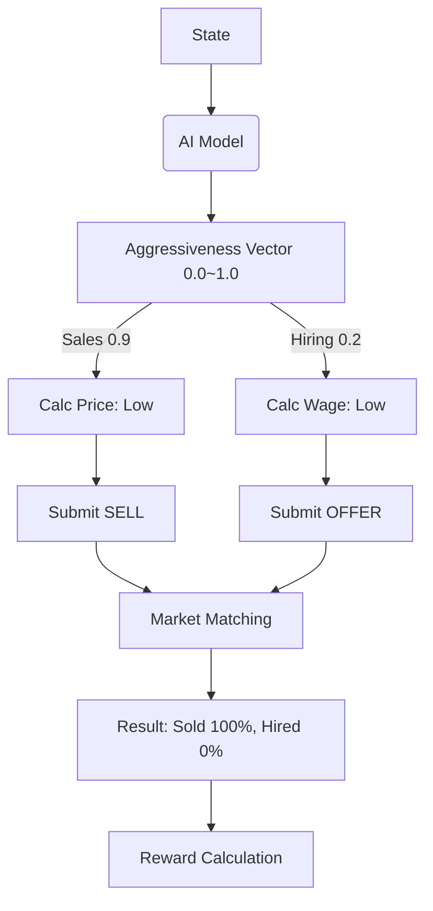

# AI Architecture V2: Aggressiveness-Based Continuous Action

## 1. Core Philosophy (핵심 철학)
- **Continuous Presence**: Agents participate in ALL markets every tick. They don't choose *whether* to act, but *how urgently* to act.
- **Aggressiveness as Pricing Lever**:
    -   **Aggressiveness** represents "Urgency to Transact".
    -   High Aggressiveness $\rightarrow$ Price to Fill (Low Ask, High Bid).
    -   Low Aggressiveness $\rightarrow$ Price for Margin (High Ask, Low Bid).
- **Execution**: All orders are submitted. Whether they trade depends on the market matching.

## 2. Decision Structure (의사결정 구조)

### 2.1 Firm (기업)
Output: `FirmAggressivenessVector` (Values 0.0 to 1.0)

#### A. Sales Urgency (판매 적극성)
- **Input**: Aggressiveness $A_{sell} \in [0, 1]$
- **Logic**:
    -   $Price_{ask} = MarketPrice \times (1 + \text{MarginFactor} \times (0.5 - A_{sell}))$
    -   $A_{sell} \approx 1.0 \rightarrow$ Discount (Dumping)
    -   $A_{sell} \approx 0.0 \rightarrow$ Premium (Luxury/Holding)
- **Action**: Always `SELL` current inventory at $Price_{ask}$.

#### B. Hiring Urgency (고용 적극성)
- **Input**: Aggressiveness $A_{hire} \in [0, 1]$
- **Logic**:
    -   $Wage_{bid} = MarketWage \times (1 + \text{PremiumFactor} \times (A_{hire} - 0.5))$
    -   $A_{hire} \approx 1.0 \rightarrow$ High Wage (Must Hire)
    -   $A_{hire} \approx 0.0 \rightarrow$ Low Wage (Opportunistic Hire)
- **Action**: Always `JOB_OFFER` for target gap at $Wage_{bid}$.

---

### 2.2 Household (가계)
Output: `HouseholdAggressivenessVector`

#### A. Consumption Urgency (소비 적극성 - per Category)
- **Input**: Aggressiveness $A_{buy} \in [0, 1]$
- **Logic**:
    -   $Bid = MarketPrice \times (1 + \text{WillingnessFactor} \times (A_{buy} - 0.5))$
-   **Action**: Always `BUY` needed quantity at $Bid$.

### 3. Learning & Reward (학습 및 보상)

#### Firm Reward
$R = \text{Profit} + \Delta\text{MarketValuation}$
- Even if $A_{sell}$ was Low (Passive), if market bought the goods (high profit margin), the AI learns that "Passive was good in this shortage."

#### Household Reward
$R = \Delta\text{Utility} - \Delta\text{Cash}$
- Buying expensive food ($A_{buy}$ High) is rewarded only if starvation was imminent (High Utility gain). Otherwise, cash loss penalizes the "Panic Buy".

## 4. Data Flow (데이터 흐름)

### 3.1 Vector-to-Order Mapping Logic (벡터-주문 변환 로직)
The relationship is **Deterministic Execution**. The AI decides the *Parameters*, and the code executes the *Formation*.

*   **Sales Vector** (`should_sell=True`, `price=100`, `quantity=10`)
    *   $\rightarrow$ `Order(type="SELL", price=100, quantity=10)`
*   **Production Vector** (`wage=50`, `production_target=200`)
    *   $\rightarrow$ IF `current_inventory < 200`: `Order(type="HIRE", wage=50, count=needed)`

## 4. Implementation Steps (구현 단계)

1.  **Define DTOs**: Create `firm_action_plan.py` and `household_action_plan.py`.
2.  **Refactor AI Engines**:
    -   Remove `Intention` and `Tactic` enums (or repurpose them as internal logic helpers).
    -   Rewrite `decide_and_learn` to return `ActionPlan`.
3.  **Update Rule-Based Engines**:
    -   Ensure `RuleBasedFirmDecisionEngine` populates the full `ActionPlan` deterministically.
4.  **Update Engine Execution (`engine.py`)**:
    -   Iterate through the returned `Order` list (which is now guaranteed to be comprehensive).

## 5. Transition Plan (이행 계획)
- **Phase 1**: Define Action Plan DTOs and update `RuleBased` engines first to prove the concept.
- **Phase 2**: Refactor `AIDriven` engines to output these plans (initially using simple heuristics/rules inside the AI shell).
- **Phase 3**: Train RL models to optimize the parameters of these plans.
