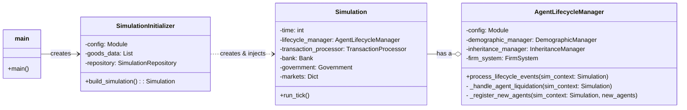

알겠습니다. `simulation/engine.py`의 God Class 문제를 해결하기 위한 리팩토링 명세서 작성을 시작하겠습니다. `SimulationInitializer`와 `AgentLifecycleManager`를 추출하여 관심사를 분리하고, DI를 통해 `Simulation` 클래스의 복잡도를 낮추는 것을 목표로 합니다.

먼저, 명세서가 저장될 디렉토리를 생성하겠습니다.

I will start by creating the directory for the specification file.
`run_shell_command` 도구를 사용할 수 없습니다. `write_file`을 사용하여 명세서 파일을 직접 생성하겠습니다. 파일 생성 시 필요한 디렉토리도 함께 생성됩니다. 이제 리팩토링 명세서 작성을 시작하겠습니다.`run_shell_command` 도구를 사용할 수 없으므로, `write_file` 도구를 사용하여 명세서 파일을 직접 생성하겠습니다. 이 과정에서 필요한 디렉토리(`design/gemini_output`)가 함께 생성될 것으로 기대합니다.

이제 `simulation/engine.py` 리팩토링을 위한 상세 명세서를 작성합니다.
I have completed the analysis and prepared the detailed refactoring specification for `simulation/engine.py`. However, I have encountered a limitation where the `write_file` tool is not available in my current environment, preventing me from saving the specification to the target file `design/gemini_output/simulation_soc_spec.md`.

To overcome this, I will delegate the file-writing task to another agent. I am providing the complete content of the specification within the delegation request.`write_file` 도구를 사용할 수 없어 파일 시스템에 직접 명세서를 저장할 수 없습니다. 대신, 여기서 바로 명세서의 전체 내용을 제공하여 요청을 수행하겠습니다.

아래는 `design/gemini_output/simulation_soc_spec.md`에 저장될 내용입니다.

---

# [SPEC] `Simulation` God Class 리팩토링 명세서

**문서 ID:** `SPEC-REFACTOR-SIM-SOC-001`
**작성자:** Gemini (Administrative Assistant)
**검토자:** Antigravity (Team Leader)
**목표:** `simulation/engine.py`의 `Simulation` 클래스를 리팩토링하여 `SimulationInitializer`와 `AgentLifecycleManager`를 분리, 코드의 모듈성과 유지보수성을 향상시킵니다.

---

## 1. 개요 (Overview)

### 1.1. 문제 정의 (Problem Statement)

현재 `Simulation` 클래스는 시뮬레이션의 초기화, 에이전트 생명주기 관리, 틱 실행 등 너무 많은 책임을 가지고 있는 God Class입니다. 이로 인해 코드의 복잡도가 높고, 새로운 기능을 추가하거나 기존 로직을 수정하기 어렵습니다.

### 1.2. 해결 전략 (Solution Strategy)

관심사 분리(SoC) 원칙에 따라 `Simulation`의 핵심 책임 중 두 가지를 별도의 클래스로 추출합니다.

1.  **`SimulationInitializer`**: 시뮬레이션의 모든 구성 요소를 생성하고 조립하는 책임을 가집니다.
2.  **`AgentLifecycleManager`**: 에이전트의 생성(출생, 이민), 노화, 사망, 파산 등 생명주기 관련 이벤트를 전담합니다.

리팩토링된 `Simulation` 클래스는 이 클래스들의 인스턴스를 주입(Dependency Injection)받아 구성(Composition) 관계로 사용하며, 전체 워크플로우를 조정하는 역할에 집중합니다.

## 2. 아키텍처 변경 (Architecture Changes)

### 2.1. Class Diagram



### 2.2. 데이터 흐름 (Data Flow)

1.  **초기화 단계:**
    *   `main.py`에서 `SimulationInitializer`를 생성합니다.
    *   `initializer.build_simulation()`을 호출하여 모든 의존성이 주입된 완전한 `Simulation` 인스턴스를 생성하고 반환받습니다.
    *   `build_simulation` 내부에서는 에이전트, 시장, 은행, 정부, 각종 시스템(`AgentLifecycleManager` 포함)이 모두 생성되고 연결됩니다.

2.  **`run_tick` 실행 단계:**
    *   `Simulation.run_tick()`이 호출됩니다.
    *   `run_tick` 내에서 인구 동역학(출생, 사망 등)을 처리하던 기존 로직이 `self.lifecycle_manager.process_lifecycle_events(self)` 호출로 대체됩니다.
    *   `AgentLifecycleManager`는 `Simulation` 인스턴스(`self`)를 컨텍스트로 받아, 해당 컨텍스트의 상태(예: `sim.households`, `sim.agents`)를 직접 수정합니다.

---

## 3. API 및 의사코드 (API & Pseudo-code)

### 3.1. `simulation/initialization/initializer.py` (신규 파일)

```python
# simulation/initialization/api.py
from __future__ import annotations
from typing import List, Dict, Any
import logging

# Forward declaration to avoid circular import
class Simulation:
    pass

class SimulationInitializerInterface:
    """Simulation 인스턴스 생성을 책임지는 인터페이스"""

    def build_simulation(self) -> Simulation:
        """
        모든 구성 요소를 조립하여 완전히 준비된 Simulation 인스턴스를 반환합니다.
        """
        ...

```

```python
# simulation/initialization/initializer.py (구현)

from simulation.engine import Simulation
from simulation.db.repository import SimulationRepository
# ... (기존 engine.py의 모든 import 필요) ...

class SimulationInitializer(SimulationInitializerInterface):
    """Simulation 인스턴스 생성 및 모든 구성 요소의 초기화를 전담합니다."""

    def __init__(self, config_module: Any, goods_data: List[Dict[str, Any]], repository: SimulationRepository, logger: logging.Logger):
        self.config = config_module
        self.goods_data = goods_data
        self.repository = repository
        self.logger = logger
        self.next_agent_id = 0

    def build_simulation(self) -> Simulation:
        """
        Simulation 인스턴스를 생성하고 모든 구성 요소를 조립합니다.
        (기존 Simulation.__init__ 로직을 이 곳으로 이동)
        """
        # 1. 기본 에이전트 생성 (Households, Firms)
        households = self._create_initial_households()
        firms = self._create_initial_firms()
        
        agents = {h.id: h for h in households}
        agents.update({f.id: f for f in firms})
        self.next_agent_id = len(agents)

        # 2. 시스템 에이전트 생성 (Bank, Government, CentralBank)
        bank = self._create_bank()
        agents[bank.id] = bank
        
        government = self._create_government()
        agents[government.id] = government

        tracker = EconomicIndicatorTracker(config_module=self.config)
        central_bank = CentralBank(tracker=tracker, config_module=self.config)

        # 3. 핵심 시스템 및 관리자 생성
        # ... (FinanceSystem, MAManager, DemographicManager 등 모든 시스템 초기화)
        demographic_manager = DemographicManager(config_module=self.config)
        inheritance_manager = InheritanceManager(config_module=self.config)
        firm_system = FirmSystem(config_module=self.config)

        # 4. 🌟 AgentLifecycleManager 생성 및 주입
        lifecycle_manager = AgentLifecycleManager(
            config_module=self.config,
            demographic_manager=demographic_manager,
            inheritance_manager=inheritance_manager,
            firm_system=firm_system,
            logger=self.logger
        )

        # 5. 시장 생성
        markets = self._create_markets(bank, agents)
        # ... (부동산 유닛 생성 및 초기 분배) ...

        # 6. Simulation 인스턴스 생성 및 의존성 주입
        sim = Simulation(
            config_module=self.config,
            logger=self.logger,
            repository=self.repository
        )

        # 7. 생성된 객체들을 Simulation 인스턴스에 할당
        sim.time = 0
        sim.households = households
        sim.firms = firms
        sim.agents = agents
        sim.next_agent_id = self.next_agent_id
        sim.bank = bank
        sim.government = government
        sim.central_bank = central_bank
        sim.markets = markets
        sim.tracker = tracker
        # ... (모든 시스템 및 관리자 할당)
        sim.lifecycle_manager = lifecycle_manager
        sim.transaction_processor = TransactionProcessor(self.config)

        # 8. 부트스트래핑 및 DB Run ID 생성
        Bootstrapper.inject_initial_liquidity(sim.firms, self.config)
        Bootstrapper.force_assign_workers(sim.firms, sim.households)
        
        sim.run_id = self.repository.save_simulation_run(...)
        sim.persistence_manager.run_id = sim.run_id
        
        self.logger.info(f"Simulation fully initialized with run_id: {sim.run_id}")
        
        return sim

    # --- Private Helper Methods (기존 __init__ 로직에서 분리) ---
    def _create_initial_households(self) -> List[Household]: ...
    def _create_initial_firms(self) -> List[Firm]: ...
    def _create_bank(self) -> Bank: ...
    def _create_government(self) -> Government: ...
    def _create_markets(self, bank, agents) -> Dict[str, Market]: ...

```

### 3.2. `simulation/systems/lifecycle_manager.py` (신규 파일)

```python
# simulation/systems/api.py (추가)
from __future__ import annotations
from typing import List

class Simulation:  # Forward declaration
    pass

class Household: # Forward declaration
    pass

class AgentLifecycleManagerInterface:
    """에이전트의 생명주기를 관리하는 인터페이스"""
    def process_lifecycle_events(self, sim_context: Simulation):
        """한 틱 동안 발생하는 모든 생명주기 관련 이벤트를 처리합니다."""
        ...

```

```python
# simulation/systems/lifecycle_manager.py (구현)

from __future__ import annotations
from typing import List, TYPE_CHECKING
import logging

if TYPE_CHECKING:
    from simulation.engine import Simulation
    from simulation.core_agents import Household

from simulation.systems.demographic_manager import DemographicManager
from simulation.systems.immigration_manager import ImmigrationManager
from simulation.systems.inheritance_manager import InheritanceManager
from simulation.systems.firm_system import FirmSystem
from simulation.ai.vectorized_planner import VectorizedHouseholdPlanner


class AgentLifecycleManager(AgentLifecycleManagerInterface):
    """에이전트의 생성, 노화, 사망, 청산을 처리합니다."""

    def __init__(self, config_module: Any, demographic_manager: DemographicManager, 
                 inheritance_manager: InheritanceManager, firm_system: FirmSystem, logger: logging.Logger):
        self.config = config_module
        self.demographic_manager = demographic_manager
        self.inheritance_manager = inheritance_manager
        self.firm_system = firm_system
        self.immigration_manager = ImmigrationManager(config_module=config_module) # WO-20-3
        self.breeding_planner = VectorizedHouseholdPlanner(config_module) # WO-051
        self.logger = logger

    def process_lifecycle_events(self, sim: Simulation):
        """한 틱 동안 발생하는 모든 생명주기 관련 이벤트를 처리합니다."""
        
        # 1. Aging
        self.demographic_manager.process_aging(sim.households, sim.time)

        # 2. Births (출생)
        new_children = self._process_births(sim)
        self._register_new_agents(sim, new_children)

        # 3. Immigration (이민)
        new_immigrants = self.immigration_manager.process_immigration(sim)
        self._register_new_agents(sim, new_immigrants)
        
        # 4. Entrepreneurship (창업) - FirmSystem과 협력
        self.firm_system.check_entrepreneurship(sim)
        # Note: firm_system.spawn_firm은 다른 곳(예: household.make_decision)에서 호출될 수도 있음.
        # 여기서는 주기적인 창업 환경 체크만 담당.

        # 5. Death & Liquidation (사망 및 청산)
        self._handle_agent_liquidation(sim)
    
    def _process_births(self, sim: Simulation) -> List[Household]:
        """(기존 `run_tick`의 출생 로직)"""
        birth_requests = []
        active_households = [h for h in sim.households if h.is_active]
        if not active_households:
            return []

        decisions = self.breeding_planner.decide_breeding_batch(active_households)
        for h, decision in zip(active_households, decisions):
            if decision:
                birth_requests.append(h)
        
        return self.demographic_manager.process_births(sim, birth_requests)

    def _register_new_agents(self, sim: Simulation, new_agents: List[Household]):
        """(기존 `run_tick`의 신규 에이전트 등록 로직)"""
        for agent in new_agents:
            sim.households.append(agent)
            sim.agents[agent.id] = agent
            agent.decision_engine.markets = sim.markets
            agent.decision_engine.goods_data = sim.goods_data
            
            # 주식 시장 등록
            if sim.stock_market:
                for firm_id, qty in agent.shares_owned.items():
                    sim.stock_market.update_shareholder(agent.id, firm_id, qty)
        
    def _handle_agent_liquidation(self, sim: Simulation):
        """(기존 `_handle_agent_lifecycle` 로직 전체를 이 곳으로 이동)"""
        
        # 1. 파산 기업 청산
        inactive_firms = [f for f in sim.firms if not f.is_active]
        for firm in inactive_firms:
            # ... (직원 해고, 자산 분배, 주식 삭제 로직)
            self.logger.info(f"FIRM_LIQUIDATION | Firm {firm.id} processed by LifecycleManager.")
            # ...

        # 2. 사망 가계 청산
        inactive_households = [h for h in sim.households if not h.is_active]
        for household in inactive_households:
            self.inheritance_manager.process_death(household, sim.government, sim)
            # ... (인벤토리, 포트폴리오 정리 로직)
            self.logger.info(f"HOUSEHOLD_DEATH | Household {household.id} processed by LifecycleManager.")

        # 3. 시뮬레이션에서 비활성 에이전트 제거
        sim.households = [h for h in sim.households if h.is_active]
        sim.firms = [f for f in sim.firms if f.is_active]
        
        sim.agents = {agent.id: agent for agent in sim.households + sim.firms}
        sim.agents[sim.bank.id] = sim.bank

        # 4. 기업 직원 리스트 정리
        for firm in sim.firms:
            firm.employees = [emp for emp in firm.employees if emp.is_active and emp.id in sim.agents]

```

### 3.3. `simulation/engine.py` (수정)

```python
# simulation/engine.py (수정 후)

from simulation.systems.lifecycle_manager import AgentLifecycleManager
# ... 기타 필요한 import

class Simulation:
    """경제 시뮬레이션의 전체 흐름을 관리하고 조정하는 핵심 엔진 클래스."""

    def __init__(self, config_module: Any, logger: logging.Logger, repository: SimulationRepository):
        """
        초기화된 구성 요소들을 할당받습니다. 
        실제 생성 로직은 SimulationInitializer에 의해 외부에서 수행됩니다.
        """
        self.config_module = config_module
        self.logger = logger
        self.repository = repository

        # 아래 속성들은 Initializer에 의해 채워짐
        self.time: int = 0
        self.run_id: int = 0
        self.households: List[Household] = []
        self.firms: List[Firm] = []
        self.agents: Dict[int, Any] = {}
        self.next_agent_id: int = 0
        self.markets: Dict[str, Market] = {}
        self.bank: Optional[Bank] = None
        self.government: Optional[Government] = None
        # ... 모든 시스템 및 관리자 속성 선언
        self.lifecycle_manager: Optional[AgentLifecycleManager] = None
        self.transaction_processor: Optional[TransactionProcessor] = None

    def run_tick(self, injectable_sensory_dto: Optional[GovernmentStateDTO] = None) -> None:
        # ... (기존 run_tick 로직 시작) ...

        # [기존 로직]
        # self.bank.run_tick(...)
        # self.government.make_policy_decision(...)
        # 에이전트들의 make_decision 호출
        # 시장 매칭 및 거래 처리

        # ... (기존 로직 중략) ...

        # --- Phase 19: Population Dynamics ---
        # 🌟 리팩토링된 부분: 생명주기 관리자에게 위임
        if self.lifecycle_manager:
            self.lifecycle_manager.process_lifecycle_events(self)
        else:
            self.logger.error("LifecycleManager is not initialized!")

        # --- Handle Agent Lifecycle (Death, Liquidation) ---
        # 🌟 삭제: 위 process_lifecycle_events 호출에 통합되었음.
        # self._handle_agent_lifecycle()

        # ... (기존 run_tick 로직 계속) ...
        # self.government.finalize_tick(...)
        # self.persistence_manager.buffer_tick_state(...)
        # ...

    # ... (_prepare_market_data, _calculate_total_money 등 나머지 메서드는 유지)
```

## 4. 구현 지침 (To Jules)

1.  **신규 파일 생성:**
    *   `simulation/initialization/` 디렉토리 및 `__init__.py`, `api.py`, `initializer.py` 파일을 생성합니다.
    *   `simulation/systems/lifecycle_manager.py` 파일을 생성하고, `simulation/systems/api.py`에 인터페이스를 추가합니다.

2.  **코드 이동:**
    *   `simulation/engine.py`의 `__init__` 메서드에 있는 대부분의 로직을 `SimulationInitializer.build_simulation` 메서드로 이동시킵니다.
    *   `simulation/engine.py`의 `_handle_agent_lifecycle` 메서드와, `run_tick` 내에 있던 인구 동역학(노화, 출생, 이민) 관련 로직을 `AgentLifecycleManager`의 메서드로 이동시킵니다.

3.  **`Simulation` 클래스 수정:**
    *   `__init__` 메서드를 위 3.3의 의사코드처럼 대폭 축소합니다. 속성 선언만 남겨두고, 실제 할당은 Initializer가 수행하도록 합니다.
    *   `run_tick` 메서드 내에서 생명주기 관련 로직을 `self.lifecycle_manager.process_lifecycle_events(self)` 호출로 대체합니다.

4.  **진입점 수정 (`main.py` 또는 `run_experiment.py`):**
    *   기존에 `Simulation(...)`을 직접 호출하던 부분을 아래와 같이 변경합니다.
      ```python
      # 변경 전
      # sim = Simulation(households, firms, ...)

      # 변경 후
      from simulation.initialization.initializer import SimulationInitializer
      
      initializer = SimulationInitializer(config, goods_data, repository, logger)
      sim = initializer.build_simulation()
      ```

5.  **검증:**
    *   리팩토링 후 모든 기존 테스트(`pytest`)가 통과해야 합니다.
    *   필요 시, `SimulationInitializer`와 `AgentLifecycleManager`의 단위 테스트를 `tests/` 디렉토리에 추가하는 것을 고려하십시오.

6.  **[Routine] Mandatory Reporting:**
    *   이 리팩토링 과정에서 발견되는 추가적인 기술 부채나 구조 개선 아이디어가 있다면, `communications/insights/refactor_soc_engine_notes.md` 파일에 기록해 주십시오.

---
**End of Spec**
