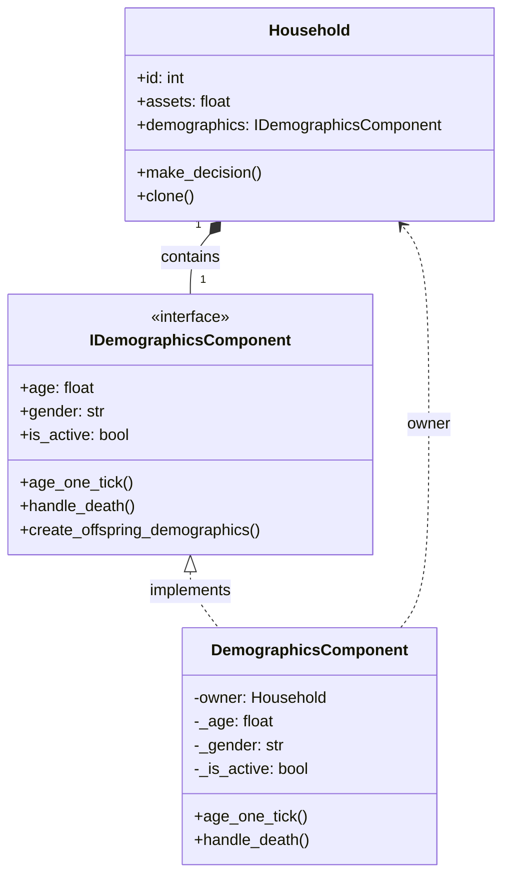

📄 Drafting Spec with instruction: 'Write a Zero-Question Implementation Spec for refactoring the `Household` god class in `simulation/core_agents.py` (TD-044). GOAL: Extract a `DemographicsComponent` to handle aging, reproduction, marriage, and death. IMPLEMENTATION: Use the Component/Delegate pattern. The main `Household` class should delegate all demographic states and methods to this new component. Ensure backward compatibility or clear migration steps for existing simulation tests. Include: Class Architecture Diagram, Data Flow, and detailed Pseudo-code in Korean.'...
📖 Attached context: simulation\core_agents.py
📖 Attached context: reports\inbound\refactor-soc-proposal-9189874180166526174_2026-01-15_refactoring_proposal_soc.md
📖 Attached context: design\TECH_DEBT_LEDGER.md
🚀 [GeminiWorker] Running task with manual: spec_writer.md

✅ Spec Draft Saved: C:\coding\economics\design\drafts\draft_Write_a_Zero_Question_Implemen.md
============================================================

✅ Spec Draft Saved: C:\coding\economics\design\drafts\draft_Write_a_Zero_Question_Implemen.md
============================================================
네, 알겠습니다. `Household` 클래스 리팩토링(TD-044)을 위한 `DemographicsComponent` 추출 작업 명세서를 작성하겠습니다. 이 명세서는 Jules가 추가 질문 없이 즉시 구현할 수 있도록 상세하게 작성될 것입니다.

먼저, 새로운 컴포넌트의 인터페이스 계약(`api.py`) 초안입니다.

'**`modules/simulation/components/api.py`**'

```python
from __future__ import annotations
from typing import Dict, Any, Optional, List, Protocol, TYPE_CHECKING
from dataclasses import dataclass, field
import random

if TYPE_CHECKING:
    from simulation.core_agents import Household

# ===================================================================================
# 1. Data Transfer Objects (DTOs)
# ===================================================================================

@dataclass
class DemographicsDTO:
    """
    가계의 인구통계학적 정보를 담는 데이터 전송 객체입니다.
    """
    age: float
    gender: str
    is_active: bool
    generation: int
    parent_id: Optional[int] = None
    spouse_id: Optional[int] = None
    children_ids: List[int] = field(default_factory=list)
    
    @classmethod
    def from_component(cls, component: "IDemographicsComponent") -> "DemographicsDTO":
        """컴포넌트 인스턴스에서 DTO를 생성합니다."""
        return cls(
            age=component.age,
            gender=component.gender,
            is_active=component.is_active,
            generation=component.generation,
            parent_id=component.parent_id,
            spouse_id=component.spouse_id,
            children_ids=component.children_ids.copy(),
        )


# ===================================================================================
# 2. Component Interfaces (Protocols)
# ===================================================================================

class IDemographicsComponent(Protocol):
    """
    가계의 인구통계학적 속성과 생명주기(탄생, 성장, 결혼, 죽음)를 관리하는
    컴포넌트의 인터페이스입니다. Household 클래스는 이 인터페이스에 정의된
    메서드와 속성을 통해 인구통계학적 기능을 위임합니다.
    """

    # --- Properties (상태 접근) ---
    @property
    def owner(self) -> "Household":
        """이 컴포넌트를 소유한 Household 에이전트입니다."""
        ...

    @property
    def age(self) -> float:
        """가계의 현재 나이입니다."""
        ...

    @property
    def gender(self) -> str:
        """가계의 성별 ('M' 또는 'F') 입니다."""
        ...
        
    @property
    def is_active(self) -> bool:
        """가계의 활성화 상태 (생존 여부) 입니다."""
        ...

    @property
    def generation(self) -> int:
        """가계의 세대입니다 (0부터 시작)."""
        ...

    @property
    def parent_id(self) -> Optional[int]:
        """부모 가계의 ID입니다."""
        ...

    @property
    def spouse_id(self) -> Optional[int]:
        """배우자 가계의 ID입니다."""
        ...

    @property
    def children_ids(self) -> List[int]:
        """자녀 가계 ID 목록입니다."""
        ...
        
    @property
    def children_count(self) -> int:
        """자녀의 수입니다."""
        ...

    # --- Lifecycle Methods (생명주기 관리) ---
    def age_one_tick(self, current_tick: int) -> None:
        """
        한 틱만큼 나이를 증가시키고, 나이와 관련된 상태 변화(예: 사망)를 처리합니다.
        """
        ...

    def handle_death(self, current_tick: int) -> bool:
        """
        사망 조건을 확인하고, 사망 처리 후 결과를 반환합니다.
        
        Returns:
            bool: 사망했으면 True, 아니면 False를 반환합니다.
        """
        ...

    def set_spouse(self, spouse_id: int) -> None:
        """배우자를 설정합니다."""
        ...
        
    def add_child(self, child_id: int) -> None:
        """자녀를 추가합니다."""
        ...
        
    def get_generational_similarity(self, other_demographics: "IDemographicsComponent") -> float:
        """
        다른 가계와의 세대적/유전적 유사도를 계산합니다.
        주로 배우자 선택 시 사용됩니다.
        """
        ...
        
    def create_offspring_demographics(self, new_id: int, current_tick: int) -> Dict[str, Any]:
        """
        자손(offspring)의 초기 인구통계학적 데이터를 생성하여 반환합니다.
        (자손 Household 객체 생성에 사용됨)

        Args:
            new_id (int): 새로 생성될 자손의 ID.
            current_tick (int): 현재 시뮬레이션 틱.
        
        Returns:
            Dict[str, Any]: 자손의 초기 인구통계학적 속성 딕셔너리.
        """
        ...

```

---

다음으로, Jules가 참고할 제로-퀘스천 구현 명세서(`spec.md`)입니다.

'**`design/specs/refactor_household_demographics_spec.md`**'

```markdown
# [SPEC] Household Demographics Component Refactoring (TD-044)

**Version:** 1.0
**Date:** 2026-01-16
**Author:** Gemini (Scribe)
**Target:** `simulation/core_agents.py`

---

## 1. 개요 (Overview)

이 문서는 `Household` "God Class"의 기술 부채(TD-044)를 해결하기 위한 리팩토링 명세입니다.
`Household` 클래스에 혼재된 **인구통계학적 상태와 생명주기 관리 로직**을 별도의 `DemographicsComponent`로 분리하여 위임(Delegate)하는 것을 목표로 합니다.

- **원칙:** 관심사 분리 (Separation of Concerns)
- **패턴:** 컴포넌트/위임 (Component/Delegate)
- **기대 효과:**
  - `Household` 클래스의 복잡도 감소 및 가독성 향상
  - 인구통계 관련 로직의 독립적인 테스트 용이성 확보
  - 향후 결혼, 상속, 인구 정책 등 관련 기능 확장의 유연성 증대

## 2. 클래스 아키텍처 (Class Architecture)

리팩토링 후의 클래스 관계는 다음과 같습니다.



- **`Household`**: `DemographicsComponent` 인스턴스를 `self.demographics`로 소유합니다. 나이(`age`), 성별(`gender`) 등 관련 속성은 `self.demographics`에 접근하는 pass-through 프로퍼티가 됩니다.
- **`DemographicsComponent`**: 실제 인구통계 데이터를 (`_age` 등 private 변수로) 저장하고, 생명주기 로직을 수행합니다. 자신을 소유한 `Household`에 접근해야 할 경우를 대비해 `owner` 참조를 가집니다.

## 3. 데이터 흐름 (Data Flow)

1.  **초기화**: `Household.__init__` 시, `DemographicsComponent`를 생성하고 `age`, `gender` 등의 초기값을 전달합니다. `Household`는 더 이상 이 값들을 직접 저장하지 않습니다.
2.  **상태 접근**: `household.age`를 호출하면, 내부적으로 `household.demographics.age` 프로퍼티를 호출하여 값을 반환합니다.
3.  **로직 위임**: 시뮬레이션 엔진이 `household.age_one_tick()`과 같은 메서드를 호출하면, `Household`는 이를 그대로 `household.demographics.age_one_tick()`에 위임합니다.
4.  **자손 생성 (`clone`)**: `household.clone()` 메서드 실행 시, 부모의 `demographics` 컴포넌트가 `create_offspring_demographics()`를 호출하여 자식의 초기 인구통계 데이터를 생성하고, 이를 새 `Household` 인스턴스 생성에 사용합니다.

## 4. 의사코드 (Pseudo-code)

### 4.1. `simulation/components/demographics_component.py` (신규 파일)

```python
# simulation/components/demographics_component.py

from __future__ import annotations
from typing import Dict, Any, Optional, List, TYPE_CHECKING
import random
import logging

from simulation.components.api import IDemographicsComponent # 가정

if TYPE_CHECKING:
    from simulation.core_agents import Household, Talent
    from config import YourConfigModule # TBD: 실제 설정 모듈 경로로 변경

class DemographicsComponent:
    """Household의 인구통계학적 데이터와 생명주기 로직을 담당합니다."""

    def __init__(self, owner: "Household", initial_age: float, gender: str, generation: int = 0, parent_id: Optional[int] = None, config_module: Any):
        self._owner = owner
        self._age = initial_age
        self._gender = gender
        self._is_active = True
        self._generation = generation
        self._parent_id = parent_id
        self._spouse_id: Optional[int] = None
        self._children_ids: List[int] = []
        
        self.config_module = config_module
        self.logger = owner.logger

    # --- Properties ---
    @property
    def owner(self) -> "Household":
        return self._owner
    
    @property
    def age(self) -> float:
        return self._age

    # ... (gender, is_active, generation, parent_id, spouse_id, children_ids 프로퍼티 구현) ...
    
    @property
    def children_count(self) -> int:
        return len(self._children_ids)

    # --- Methods ---
    def age_one_tick(self, current_tick: int) -> None:
        """나이를 증가시키고 사망 여부를 체크합니다."""
        ticks_per_year = getattr(self.config_module, "TICKS_PER_YEAR", 100)
        self._age += 1.0 / ticks_per_year
        
        if self.handle_death(current_tick):
            self.logger.info(f"DEATH | Household {self.owner.id} has died at age {self._age:.1f}.")

    def handle_death(self, current_tick: int) -> bool:
        """사망 확률에 따라 사망 처리. 사망 시 is_active를 False로 설정."""
        # 기존 Household 클래스의 사망 로직을 그대로 가져옴
        # 예시:
        # death_prob = calculate_death_probability(self._age, self.config_module)
        # if random.random() < death_prob:
        #     self._is_active = False
        #     return True
        # return False
        pass # TBD: Jules가 기존 로직을 이전

    def set_spouse(self, spouse_id: int) -> None:
        self._spouse_id = spouse_id

    def add_child(self, child_id: int) -> None:
        if child_id not in self._children_ids:
            self._children_ids.append(child_id)
            
    def get_generational_similarity(self, other_demographics: "IDemographicsComponent") -> float:
        """기존 Household.get_generational_similarity 로직 이전"""
        # owner의 talent에 접근해야 함
        # talent_diff = abs(self.owner.talent.base_learning_rate - other_demographics.owner.talent.base_learning_rate)
        # return max(0.0, 1.0 - talent_diff)
        pass # TBD: Jules가 기존 로직 이전

    def create_offspring_demographics(self, new_id: int, current_tick: int) -> Dict[str, Any]:
        """자손의 초기 인구통계 속성 생성"""
        return {
            "generation": self._generation + 1,
            "parent_id": self.owner.id,
            "initial_age": 0.0,
            "gender": random.choice(["M", "F"])
        }

```

### 4.2. `simulation/core_agents.py` (리팩토링 대상)

```python
# simulation/core_agents.py

# ... imports ...
from simulation.components.demographics_component import DemographicsComponent

class Household(BaseAgent):

    def __init__(
        self,
        id: int,
        # ... 기존 파라미터들 ...
    ) -> None:
        super().__init__(...)
        
        # ... 다른 초기화 로직 ...
        
        # === DEMOGRAPHICS REFACTORING START ===
        
        # 1. DemographicsComponent 인스턴스화
        # Household 생성자에 age, gender 등의 파라미터가 있다면 전달
        initial_age = random.uniform(20.0, 60.0) # 기존 로직
        gender = random.choice(["M", "F"])     # 기존 로직
        self.demographics = DemographicsComponent(
            owner=self, 
            initial_age=initial_age, 
            gender=gender,
            config_module=self.config_module
        )

        # 2. 기존 인구통계 속성 제거
        # self.age = ...
        # self.gender = ...
        # self.parent_id = ...
        # self.spouse_id = ...
        # self.children_ids = ...
        # self.generation = ...
        
        # === DEMOGRAPHICS REFACTORING END ===
        
        # ... 나머지 초기화 로직 ...

    # --- Pass-through Properties ---
    @property
    def age(self) -> float:
        return self.demographics.age
        
    @property
    def gender(self) -> str:
        return self.demographics.gender

    # ... is_active, parent_id, spouse_id, children_ids, generation, children_count 프로퍼티 위임 구현 ...

    @override
    def clone(self, new_id: int, initial_assets_from_parent: float) -> "Household":
        """
        현재 가계 에이전트의 복제본을 생성합니다 (자손 생성).
        """
        # === DEMOGRAPHICS REFACTORING START ===
        
        # 1. 자손의 인구통계 정보 생성 위임
        offspring_demo_data = self.demographics.create_offspring_demographics(new_id, self.simulation.current_tick) # 가정: current_tick 접근 가능
        
        # 2. 새로운 Household 생성
        cloned_household = Household(
            id=new_id,
            initial_assets=initial_assets_from_parent,
            # ... 다른 파라미터 전달 ...
            # **offspring_demo_data 를 생성자에 직접 전달할 수 있도록 __init__ 수정 필요할 수 있음 **
            logger=self.logger,
        )
        
        # 3. 생성된 자손의 DemographicsComponent에 정보 설정
        # (만약 __init__에서 처리되지 않았다면)
        cloned_household.demographics._age = offspring_demo_data['initial_age']
        cloned_household.demographics._gender = offspring_demo_data['gender']
        cloned_household.demographics._parent_id = offspring_demo_data['parent_id']
        cloned_household.demographics._generation = offspring_demo_data['generation']
        
        # === DEMOGRAPHICS REFACTORING END ===

        # ... 나머지 상속 로직 (aptitude, skills 등) ...
        
        return cloned_household

    def get_generational_similarity(self, other: "Household") -> float:
        """다른 Household의 demographics 컴포넌트에 위임"""
        return self.demographics.get_generational_similarity(other.demographics)
    
    # ... `apply_child_inheritance`는 clone 내부 로직이므로, clone 수정 시 함께 처리
```

## 5. 검증 계획 (Verification Plan)

1.  **신규 유닛 테스트**:
    - `tests/components/test_demographics_component.py` 파일을 신규 생성합니다.
    - `DemographicsComponent`의 각 메서드(`age_one_tick`, `handle_death` 등)를 격리하여 테스트합니다.
    - Mock `Household` 객체를 `owner`로 주입하여 테스트를 수행합니다.

2.  **기존 테스트 유지**:
    - 리팩토링 후, `tests/` 디렉토리의 모든 기존 테스트가 성공해야 합니다.
    - 특히 `Household`의 생명주기와 관련된 테스트들(자손 생성, 사망 후 자산 처리 등)이 정상 동작하는지 집중적으로 확인해야 합니다.

3.  **통합 테스트 (시뮬레이션 실행)**:
    - 소규모 설정으로 전체 시뮬레이션을 실행하여 인구 변화, 평균 연령 등 인구통계 지표가 리팩토링 이전과 유사한 패턴으로 출력되는지 확인합니다.

## 6. ❗ Jules 작업 지침 (Jules's Task)

1.  상기 명세에 따라 `simulation/components/demographics_component.py` 파일을 생성하고 `DemographicsComponent` 클래스를 구현하십시오.
    - `api.py`의 인터페이스를 준수해야 합니다.
    - `Household` 클래스에 있던 기존 인구통계 관련 로직(사망 처리, 자손 생성 등)을 `DemographicsComponent`로 **이전(Move)**하십시오.
2.  `simulation/core_agents.py`의 `Household` 클래스를 리팩토링하여 인구통계 관련 속성과 메서드를 `self.demographics` 컴포넌트에 위임하도록 수정하십시오.
3.  `tests/components/test_demographics_component.py`에 신규 유닛 테스트를 작성하십시오.
4.  `pytest`를 실행하여 **모든 테스트가 통과**하는 것을 최종 확인하십시오.

---
### **[Routine] Mandatory Reporting**
> 작업 완료 후, 이 리팩토링 과정에서 발견한 기술적 부채, 잠재적 리스크, 또는 아키텍처 개선 아이디어가 있다면 `communications/insights/YYYY-MM-DD_refactor_demographics_insight.md` 형식의 파일로 정리하여 보고해주십시오.

```

============================================================
