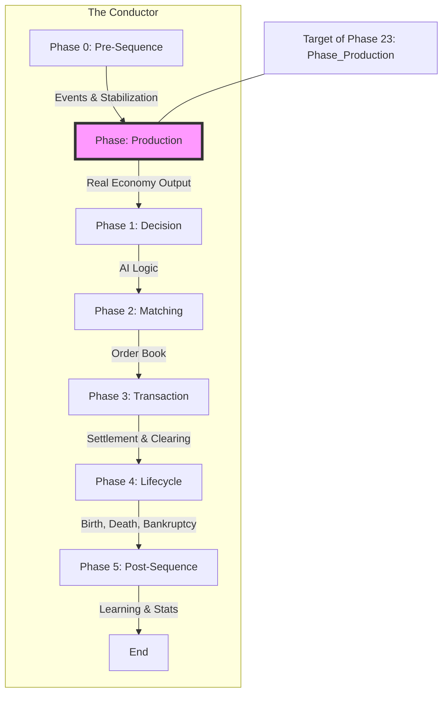

# Platform Architecture & Design Patterns

## 1. 개요
본 시뮬레이션은 Python 기반의 **이산 사건 시뮬레이션(Discrete Event Simulation)** 엔진과 Flask 기반의 **웹 대시보드**로 구성됩니다. 에이전트(가계, 기업, 정부)는 AI 모델(Q-Learning)을 통해 의사결정을 내리며, 모든 데이터는 SQLite 데이터베이스에 기록됩니다.

## 2. 핵심 컴포넌트

### 2.1. Simulation Engine (`simulation/engine.py`)
- **역할**: 시뮬레이션의 시간(`tick`)을 진행시키고 에이전트와 시장의 상호작용을 조율합니다.

### 2.2. Agents
- **Household**: 소비, 노동 공급, 투자 주체.
- **Firm**: 생산, 고용, 판매 주체.
- **Government**: 세금 징수 및 재분배 담당.
- **Bank**: 대출 및 예금 관리.

### 2.3. AI Engine (`simulation/ai/`)
- **구조**: Multi-Channel Aggressiveness Vector 방식.
- **학습**: Q-Table 기반 강화학습. `AITrainingManager`를 통해 주기적으로 우수 에이전트의 전략을 복제/변이합니다.

### 2.4. Data Persistence (`simulation/db/`)
- **SQLite**: 시뮬레이션의 모든 상태(거래, 에이전트 상태, 지표)를 저장합니다.
- **Repository Pattern**: `SimulationRepository`를 통해 DB 접근을 추상화했습니다.

### 2.5. Optimization Layer (WO-051)
- **VectorizedHouseholdPlanner**: `numpy`를 활용한 벡터화된 의사결정 엔진.
- **ETL Pattern**: Agent Data Extract -> Matrix Computation -> Result Inject 패턴을 사용하여 대규모 에이전트 연산을 가속화합니다.

---

## 3. 아키텍처 원칙: 신성한 시퀀스 (The Sacred Sequence)

본 시뮬레이션의 모든 상태 변경은 "오케스트레이션 단계(Phased Orchestration)"라 불리는 8단계 프로세스를 엄격히 준수한다. 이는 상태 변경의 예측 가능성을 보장하고, 제로섬(Zero-Sum) 오류와 타이밍 버그를 방지하기 위함이다.



### Phase 0: 전처리 (Preprocessing)
- **Action**: 시스템 안정화, 이벤트 실행, 초기 상태 스냅샷 저장(학습용).

### Phase 0.5: 생산 (Production)
- **Actor**: `Phase_Production`
- **Action**: 인적 자본 지수(HCI) 계산, 신기술 도입 결정, **실물 재화 생산**.
- **Rationale**: 의사결정(Phase 1) 이전에 시장에 공급될 재화가 확정되어야 함.

### Phase 1: 결정 (Decisions)
- **Actor**: `Agent` (Household, Firm) 및 `System` (Education, Infrastructure)
- **Action**: 현재 상태(`MarketSnapshotDTO`, `GovernmentPolicyDTO`)를 기반으로 행동을 결정하고, `Order` 또는 `Transaction` 객체를 반환한다.
- **Rule**: 이 단계에서는 **절대로** 상태(assets, inventory)를 직접 수정하지 않는다.

### Phase 2: 매칭 (Matching)
- **Actor**: `Market` (Commodity, Labor, Stock)
- **Action**: 생성된 `Order`들을 매칭하여 `Transaction` 객체를 생성한다.

### Phase 3: 처리 (Transactions)
- **Actor**: `TransactionProcessor`
- **Action**: 모든 `Transaction`들을 실행하여 자산 이동 및 세금을 정산한다. 
- **Rule**: 모든 가치 이동은 반드시 이 단계에서 **원자적(Atomic)**으로 일어나야 한다.

### Phase 4: 라이프사이클 (Lifecycle)
- **Actor**: `AgentLifecycleManager`
- **Action**: 에이전트 생성, 파산, 사망, 상속 처리.
- **Rule**: 금융 처리가 끝난 후 구조적 변경을 수행한다.

### Phase 5: 후처리 (Post-Sequence)
- **Actor**: `SystemEffectsManager`, `LearningUpdate`
- **Action**: 학습 보상 계산, 지표 집계, 버퍼 플러시.

---

## 4. 핵심 아키텍처 패턴 (Core Architectural Patterns)

### 4.0 Pre-Viability Bootstrapping
- **원칙**: 시뮬레이션 시작(Tick 0) 시, 모든 에이전트에게 초기 자금과 인력을 먼저 투입(Bootstrapping)한 후에 viability 체크(Liquidation)를 수행한다.
- **효과**: 시작 시점에 자산이 없어 대량으로 파산하는 "Tick 1 Leak" 현상을 방지한다.

### 4.1 Data-Driven Purity (DTOs for Decisions)

- **현상(Phenomenon)**: 의사결정 로직(예: `AIDrivenHouseholdDecisionEngine`)이 `market`과 같은 live 서비스 객체를 직접 참조하면서, 테스트가 복잡해지고 서비스 간 결합도가 높아지는 문제.
- **원인(Cause)**: 엔진이 외부 상태(live object)에 직접 의존하여, 동일 입력에 대해 다른 결과를 낼 수 있는 비결정적 특성을 가짐.
- **해결(Solution)**: 의사결정 엔진은 반드시 `DecisionContext`를 통해 전달되는 정적 데이터(State DTO, Market Data, Config)에만 의존해야 한다. 엔진 내부에서 live 서비스 객체의 메서드를 직접 호출해서는 안 된다. 
- **효과(Effect)**:
    - **순수성**: 의사결정 함수는 Side-Effect를 일으키지 않으며, 동일 입력에 대해 항상 동일 출력을 보장하는 순수 함수(pure function)처럼 동작한다.
    - **테스트 용이성**: 외부 서비스로부터 완전히 분리되어, 다양한 시나리오의 DTO를 통해 행위를 예측 가능하게 검증할 수 있다.
    - **디버깅 용이성**: 특정 시점의 `DecisionContext`를 로깅하여, 의사결정 로직의 동작을 정확히 재현하고 분석할 수 있다.

### 4.2 Two-Phase State Transition (Plan & Finalize)
- **Phenomenon**: Complex logic mixing state reading, decision making, and state mutation in a single function (e.g., deciding consumption and immediately deducting inventory).
- **Principle**: Separate complex state transitions into **Plan** (Phase 1) and **Finalize** (Phase 3/4) phases.
    1.  **Phase 1 (Plan)**: Generate Intents or Transactions based on current state. No state mutation allowed.
    2.  **Phase 2 (Finalize)**: Execute generated Transactions/Intents in a batch to update state.
- **Effect**: Guarantees atomicity and clarity of tracking.

### 4.3 Financial Calculation Integrity (Zero-Sum Distribution)
- **Phenomenon**: Asset leakage or creation due to floating-point precision errors when distributing funds (e.g., Inheritance).
- **Principle**: When distributing assets to N recipients:
    - Distribute `floor(total / N)` to N-1 recipients.
    - Distribute `total - (N-1) * distributed_amount` to the last recipient.
- **Effect**: Guarantees strict Zero-Sum conservation of assets within the system.

### 4.4 Transaction-Based Ledger for Financial Integrity

To ensure absolute financial integrity and prevent "magic money" creation or leaks (zero-sum violations), all transfers of value within the simulation MUST be represented by an immutable `Transaction` object.

**Rationale:**
Direct state modification (e.g., `agent_a.assets -= 100; agent_b.assets += 100`) is prone to errors, hard to debug, and lacks auditability. By creating a `Transaction` DTO that captures the `buyer_id`, `seller_id`, `amount`, and `item_id`, we transform state changes into a verifiable event log.

**Implementation:**
- Functions that initiate value transfer (e.g., `issue_treasury_bonds`, `grant_bailout_loan`) should NOT directly alter agent balances.
- Instead, they MUST generate and return one or more `Transaction` objects representing the intended exchange.
- A dedicated `SettlementSystem` (or equivalent) will be responsible for processing these transactions atomically, ensuring that the assets of the buyer and seller are updated in a single, consistent operation.
- This creates a clear audit trail, simplifies debugging, and enforces the zero-sum principle at an architectural level.

### 4.5 Principle: The Settlement System Mandate

**Context:** In a complex economic simulation, multiple modules may need to transfer assets between agents. If each module implements its own transfer logic (e.g., `buyer.assets -= X`, `seller.assets += X`), it creates a "Shadow Economy" where value can be accidentally created or destroyed (zero-sum violation) and auditing becomes impossible.

**Implementation:** All inter-agent asset transfers **MUST** be processed through the central `SettlementSystem`. Direct mutation of an agent's financial state (e.g., calling `.withdraw()` or `.deposit()` from an outside system like `TransactionProcessor`) is strictly forbidden.

**Rationale:**
1.  **Atomicity & Zero-Sum Integrity:** The `SettlementSystem` guarantees that every transfer is atomic, preventing money leaks or duplications.
2.  **Centralized Auditing:** A single point of settlement provides a clear, auditable ledger for all economic activity, simplifying debugging and analysis.
3.  **System Stability:** Enforcing this pattern at runtime (e.g., via `RuntimeError` if the system is absent) prevents the simulation from running in a corruptible state.

### 4.6 아키텍처 원칙: 정보 순수성 게이트 (Purity Gate)

- **현상 (Phenomenon)**: 과거 AI 에이전트는 의사결정 시 `markets`, `government`와 같은 라이브(live) 시스템 객체에 직접 접근할 수 있었습니다. 이는 에이전트가 의도치 않게 시스템 상태를 변경(side-effect)하거나, 일관되지 않은 데이터를 참조하여 예측 불가능한 버그(TD-117)를 유발하는 원인이 되었습니다.

- **원칙 (Principle)**: **에이전트의 의사결정 로직은 반드시 순수 함수(Pure Function)여야 한다.** 즉, 의사결정은 특정 시점의 월드 상태가 담긴 불변의 데이터 스냅샷(DTOs)만을 입력으로 받고, 의도하는 행동(Orders) 목록을 출력으로 반환해야 합니다. 이 과정에서 시스템의 다른 어떤 부분에도 영향을 주어서는 안 됩니다.

- **결과 (Implication)**: 이 원칙은 '의사결정(Decision)'과 '실행(Execution)'의 책임을 명확히 분리합니다. 에이전트 로직은 테스트가 매우 용이해지고, 상태 변경이 시스템(예: `TransactionProcessor`)을 통해서만 일어나도록 보장하므로 전체 시스템의 예측 가능성과 안정성이 크게 향상됩니다.

- **구현 (Implementation)**:
    - `DecisionContext` 객체는 `markets`, `government` 등 라이브 객체 참조가 모두 제거되었습니다.
    - 모든 외부 정보는 `MarketSnapshotDTO`, `GovernmentPolicyDTO` 와 같은 DTO 형태로만 제공됩니다.

### 4.7 에이전트 아키텍처: Facade-컴포넌트 패턴 (Facade-Component Pattern)

에이전트의 복잡성을 관리하고 테스트 용이성을 극대화하기 위해, `Household`와 같은 거대 에이전트는 반드시 Facade-컴포넌트 패턴을 준수해야 합니다.

**1. 핵심 원칙 (Principles)**:
- **상태와 행위의 분리**: 에이전트의 데이터(State)와 비즈니스 로직(Behavior)을 엄격히 분리합니다.
- **상태 없는 컴포넌트 (Stateless Components)**: 로직은 `BioComponent`, `EconComponent` 등의 컴포넌트 클래스에 구현됩니다. 이들은 인스턴스 멤버 변수를 가지지 않으며, 오직 입력받은 데이터에만 의존하는 순수 함수적 구조를 가집니다.
- **상태 DTO (State DTOs)**: 에이전트의 모든 데이터는 `EconStateDTO`와 같은 전용 DTO 객체에 담깁니다.
- **Facade 클래스**: 기존의 에이전트 클래스(예: `Household`)는 Facade 역할을 수행합니다. 내부적으로 상태 DTO를 소유하고 컴포넌트를 호출하여 상태를 갱신합니다.

**2. 상태 갱신 흐름 (State Transition Flow)**:
에이전트의 상태 변화는 항상 명시적이고 함수적이어야 합니다. Facade는 컴포넌트가 반환한 새로운 DTO를 자신의 내부 변수에 다시 할당(Re-assignment)하여 상태를 확정합니다.

```python
# 올바른 예시: 반환된 DTO를 변수에 재할당하여 상태 확정
self._econ_state = self.econ_component.update_skills(self._econ_state, context)
```

이 패턴을 통해 에이전트의 내부 로직은 외부 환경(Simulation 객체 등)으로부터 완전히 독립되어 개별적으로 테스트 및 디버깅이 가능해집니다.

### 4.8 트랜잭션 처리 아키텍처 (Transaction Processing Architecture)

기존의 단일 `TransactionProcessor`는 명확한 역할 분담을 가진 6개의 독립적인 시스템으로 구성된 파이프라인 아키텍처로 대체되었습니다.

**1. 오케스트레이션 계층 (`TransactionManager`)**:
- 전체 트랜잭션 처리 흐름을 관장하며, 트랜잭션 타입에 따라 적절한 시스템으로 작업을 라우팅합니다.

**2. 금융 처리 계층 (Financial Layer)**:
- **`SettlementSystem`**: 일반적인 모든 자산(현금, 주식 등)의 이동을 처리하며, **제로섬(Zero-Sum) 원칙**을 강제합니다. (A의 자산 감소 = B의 자산 증가)
- **`CentralBankSystem`**: 중앙은행 전용 시스템으로, 화폐 발행(Minting) 및 소각(Burning)과 같은 **논제로섬(Non-Zero-Sum)** 트랜잭션을 독점적으로 처리합니다.

**3. 상태 확정 계층 (State Commitment Layer)**:
금융 처리가 성공적으로 완료된 후에만 데이터가 갱신됩니다.
- **`Registry`**: 자산의 소유권, 재고, 고용 계약 등 **비금융적 상태** 변경을 원자적으로 기록합니다.
- **`AccountingSystem`**: 기업의 수익, 비용, 가계의 소득 등 **금융 원장**을 업데이트합니다. 이 시스템은 자산을 직접 이동시키지 않고 오직 기록만 담당합니다.

**4. 특수 요건 핸들러**:
- **`InheritanceHandler`**: 상속과 같이 복잡한 자산 분배 로직이 필요한 경우 `TransactionManager`에 의해 호출됩니다.

이 구조를 통해 시뮬레이션은 대규모 트랜잭션 환경에서도 데이터의 실시간 무결성과 아키텍처의 확장성을 동시에 확보합니다.

### 4.9 시스템 인터페이스와 프로토콜 (Protocols and API-Driven Development)

모듈 간의 결합도를 낮추고 유지보수성을 높이기 위해, 핵심 시스템은 인터페이스(Protocol)를 통한 추상화와 DTO기반의 데이터 교환을 원칙으로 합니다.

**1. 추상화 원칙 (Dependency Inversion)**:
- **추상화 의존**: 모듈(예: 가계, 기업)은 다른 시스템의 구체 클래스(Bank)가 아닌, `modules/<name>/api.py`에 정의된 인터페이스(`IBankService`)에 의존해야 합니다.
- **Protocol 사용**: Python의 `typing.Protocol`을 사용하여 구조적 서브타이핑을 구현함으로써, 구현체와 공통 인터페이스 간의 명시적인 상속 관계 없이도 코드의 일관성을 검증합니다.

**2. 데이터 계약 (Data Contracts)**:
- **DTO 중심**: 인터페이스 메서드는 원격 객체나 복잡한 클래스 인스턴스 대신, 명확하게 정의된 DTO(TypedDict 또는 Dataclass)를 인자로 받고 반환해야 합니다.
- **독립성**: 이 패턴을 통해 내부 로직의 변경이 외부 인터페이스에 미치는 영향을 최소화하며, 특정 시스템(예: 은행)의 목(Mock) 객체를 생성하여 독립적인 단위 테스트가 가능해집니다.

### 4.10 Anti-Pattern: The Reflux Sink (No Mysterious Funds)

- **Phenomenon**: Funds from fees, bankruptcy, or leaks collecting in a temporary "sink" (e.g., `EconomicRefluxSystem`) before valid redistribution.
- **Problem**: Breaks zero-sum auditability. Money "disappears" into the sink and "reappears" later, often leaking or violating conservation laws.
- **Principle**: **Automatic Escheatment**. Any asset without a clear owner (e.g., unowned firm assets, homeless penalties) MUST be immediately transferred to a rigorous sovereign entity (Government) via `SettlementSystem`.
- **Implementation**:
    - `RefluxSystem` is strictly **forbidden**.
    - All penalties/fees -> Transfer to `Government`.
    - Bankrupt assets -> Liquidate to `Government` (if no shareholders).

---

## 5. 웹 인터페이스 (`app.py`, `static/`)
- **Backend**: Flask API (`/api/simulation/tick`, `/api/simulation/update`).
- **Frontend**: Vanilla JS + Chart.js.
- **통신**: `API.js`를 통해 백엔드와 통신하며, `ui.js`가 대시보드를 렌더링합니다.
