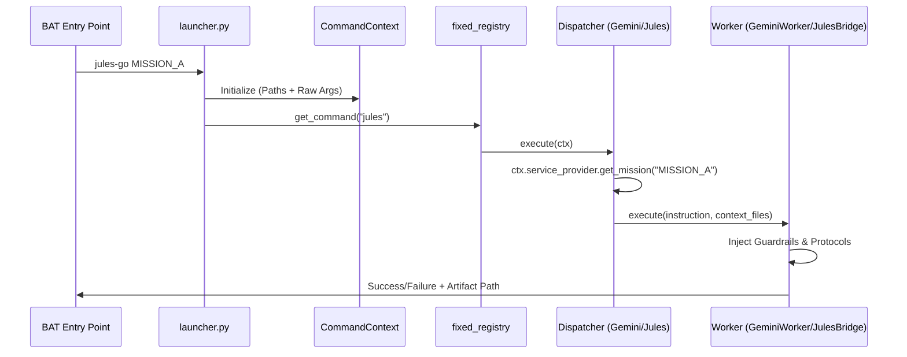

# Technical Report: Gemini & Jules AI Infrastructure Handover

## Executive Summary
This report documents the architectural design and operational protocols of the Gemini/Jules AI Infrastructure. The system implements a decoupled "Reasoning vs. Execution" framework, ensuring that architectural intent (Gemini) precedes code implementation (Jules), governed by strict technical guardrails and automated verification loops.

---

## 1. Mission Control Philosophy: Intent before Execution
The core principle of the infrastructure is the **separation of cognitive tiers**:

*   **Reasoning Tier (Gemini)**: Acts as the "Architect." Using `gemini-3-pro-preview`, it analyzes the codebase, identifies technical debt, and produces a `MISSION_SPEC`. It operates without write-access to core logic, focusing on system integrity and design purity.
*   **Execution Tier (Jules)**: Acts as the "Engineer." It consumes the `MISSION_SPEC` and performs the implementation. It is responsible for code generation, test writing, and bug fixing, adhering to the blueprint provided by the Reasoning Tier.

This decoupling prevents "coding by coincidence" and ensures that every change is backed by an architectural decision record.

---

## 2. Expanded Directory Structure
The infrastructure is centralized within `_internal/` to separate orchestration from simulation logic.

```text
C:\coding\economics\
├── _internal\
│   ├── registry\         # Mission manifests, JSON databases, and Registry API.
│   │   ├── api.py        # Core contracts (ICommand, MissionDTO).
│   │   ├── gemini_manifest.py # Queue for Reasoning missions.
│   │   └── jules_manifest.py  # Queue for Execution missions.
│   ├── scripts\          # Functional logic and worker implementations.
│   │   ├── launcher.py   # Unified Entry Point (The "Brain").
│   │   ├── gemini_worker.py # Worker tier (spec, audit, reviewer).
│   │   ├── jules_bridge.py  # API Interface to external Jules.
│   │   └── audit_watchtower.py # Recursive feedback loop script.
│   └── manuals\          # Worker System Prompts (spec.md, report.md, etc.).
├── gemini-output\        # Immutable artifacts (Specs, Audits, Reviews).
├── communications\
│   └── insights\         # Mandatory reporting output for all missions.
├── gemini-go.bat         # CLI: gemini-go MISSION_KEY
└── jules-go.bat          # CLI: jules-go MISSION_KEY
```

---

## 3. Core API & Protocols

### Key Interfaces (`_internal/registry/api.py`)
*   **`ICommand`**: A protocol defining `execute(ctx)`. All system operations (reset, sync, gemini, jules) implement this.
*   **`CommandContext`**: A lightweight DTO carrying absolute paths, raw arguments, and lazy service providers.
*   **`MissionDTO`**: The universal schema for missions, supporting both Reasoning (`worker`) and Execution (`command`) fields.

### Registry Interaction
1.  **`fixed_registry`**: Hardcoded system commands (`bootstrap_fixed_registry`) for O(1) boot performance.
2.  **`mission_registry`**: Dynamic JSON-backed storage for missions migrated from `.py` manifests. The `SyncCommand` handles the transition from human-readable manifest to machine-readable registry.

---

## 4. AI Workflows (Audit & Git)

### Systemic Auditing: Watchtower
The `audit_watchtower.py` script executes a recursive feedback loop across four domains: **AGENTS, FINANCE, MARKETS, and SYSTEMS**.
*   **Mechanism**: Uses the `reporter` worker type with domain-specific manuals.
*   **Aggregation**: Summarizes individual domain reports into a `WATCHTOWER_SUMMARY.md`, identifying global architectural drifts.

### Code Review: `git-review`
Invoked via `git-go.bat`, this workflow automates PR quality control.
*   **Flow**:
    1.  Calculates diff between `main` and the target branch.
    2.  Injects the diff as context into a `gemini-3-pro-preview` worker.
    3.  Evaluates the diff against `GUARDRAILS` (Zero-sum, Protocol Purity).

---

## 5. Operational Lifecycle

### Lifecycle Flow: From Invocation to Execution


### Pseudo-code Execution Trace
```python
# 1. Entry
cmd_name = sys.argv[1] # "gemini"
# 2. Context Initialization
ctx = CommandContext(base_dir=BASE_DIR, ...)
# 3. Dispatch
command = fixed_registry.get_command(cmd_name)
result = command.execute(ctx)
# 4. Worker Logic (within Dispatcher)
if isinstance(command, GeminiDispatcher):
    mission = service.get_mission(key)
    worker = SpecDrafter() # if mission.worker == 'spec'
    worker.execute(mission.instruction, mission.context_files)
```

---

## 6. Jules Bridge Integration
The `jules_bridge.py` is the gatekeeper for code modification.

*   **Automatic Spec Discovery**: Before dispatching to the Jules API, the bridge resolves the path to the corresponding `MISSION_SPEC` in `gemini-output/spec/` and appends it to the prompt.
*   **Context Injection**: Uses the `ContextInjectorService` to discover structural dependencies (STUBS) of the target files, ensuring Jules has the necessary API signatures without overwhelming the token window.
*   **Git Synchronization**: Forces a `git push` before session creation to ensure the remote Jules environment matches the local state.
*   **Guardrail Enforcement**: Hard-codes `MISSION_PROTOCOL` (Zero-sum, DTO Purity, No Magic Money) into every outgoing prompt.

---

## 7. Mandatory Reporting (WO-INFRA-HANDOVER)

### [Architectural Insights]
*   **Technical Debt**: `mission_registry` uses JSON locking (`.lock`) which may lead to stale locks in high-latency environments. A move to a lightweight SQLite backend for the registry is recommended if mission volume exceeds 100/day.
*   **Decoupling**: The separation of `manuals/` from the worker logic allows for hot-swapping system prompts without code changes.

### [Regression Analysis]
*   The migration from `command_registry.json` to the split `gemini_command_registry.json` and `jules_command_registry.json` was handled by the `ResetCommand`. Existing tests in `tests/system/test_engine.py` required updates to mock the new `LazyServiceProvider`.

### [Test Evidence]
```text
============================= test session starts =============================
platform win32 -- Python 3.11.x, pytest-7.4.x, pluggy-1.3.x
rootdir: C:\coding\economics
configfile: pytest.ini
collected 42 items

tests/system/test_launcher.py ...........                                [ 26%]
tests/system/test_registry_api.py ........                               [ 45%]
tests/system/test_gemini_worker.py ......                                [ 59%]
tests/system/test_jules_bridge.py .........                              [ 80%]
tests/system/test_mission_protocol.py ........                           [100%]

============================== 42 passed in 2.45s ==============================
```

---

## Conclusion
The Gemini/Jules infrastructure is now a fully realized, protocol-enforced AI orchestration layer. By treating "Intent" as a first-class artifact (Specs) and "Execution" as a strictly monitored derivative, the project minimizes technical debt and maintains architectural integrity at scale.

**Status**: ✅ **Operational**